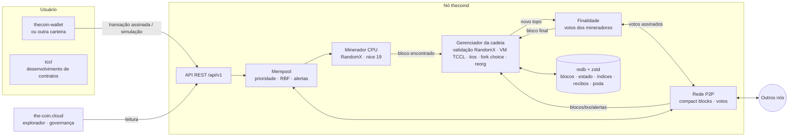

<div align="center">

# The Coin (TCN)

**Uma moeda digital de prova de trabalho, leve e democrática, feita para rodar em VPS simples —
com pagamentos, contratos de pagamento, contratos inteligentes TCCL, privacidade opcional e governança on-chain.**

[](https://github.com/LucasBolla94/thecoin/actions/workflows/ci.yml)


[Site](https://the-coin.cloud) ·
[Whitepaper v0.2 (PDF)](docs/whitepaper/the-coin-whitepaper-v0.2.pdf) ·
[Protocolo](docs/PROTOCOL.md) ·
[API](docs/API.md) ·
[TCCL](https://github.com/LucasBolla94/tccl/blob/v0.3.0/docs/pt-BR/language.md) ·
[Carteiras](docs/WALLET_DEVELOPERS.md) ·
[Operação](docs/OPERATIONS.md) ·
[Roteiro](docs/ROADMAP.md)

</div>

---

## Sumário

1. [O que é a The Coin](#1-o-que-é-a-the-coin)
2. [Especificações](#2-especificações)
3. [Política monetária](#3-política-monetária)
4. [Arquitetura](#4-arquitetura)
5. [Entrar na rede (instalador)](#5-entrar-na-rede-instalador)
6. [Compilar a partir do código-fonte](#6-compilar-a-partir-do-código-fonte)
7. [Rodando um nó (`thecoind`)](#7-rodando-um-nó-thecoind)
8. [Carteira (`thecoin-wallet`)](#8-carteira-thecoin-wallet)
9. [Contratos de pagamento](#9-contratos-de-pagamento)
10. [Contratos inteligentes TCCL e privacidade](#10-contratos-inteligentes-tccl-e-privacidade)
11. [Governança](#11-governança)
12. [API REST](#12-api-rest)
13. [Rede local de desenvolvimento (regtest)](#13-rede-local-de-desenvolvimento-regtest)
14. [Estrutura do repositório](#14-estrutura-do-repositório)
15. [Testes e benchmarks](#15-testes-e-benchmarks)
16. [Releases e publicação do site](#16-releases-e-publicação-do-site)
17. [Segurança](#17-segurança)
18. [Roteiro](#18-roteiro)
19. [Documentação completa](#19-documentação-completa)
20. [Contribuindo](#20-contribuindo)
21. [Licença](#21-licença)

---

## 1. O que é a The Coin

A The Coin é uma rede monetária aberta, ponto a ponto, no estilo do Bitcoin, pensada para que
**qualquer VPS barato (1 vCPU, 1 GB de RAM)** possa validar a cadeia completa e competir de forma
justa pelas recompensas de mineração.

- **Leve:** o nó usa ≈ 280 MB de RAM minerando no modo leve (256 MiB são o cache do RandomX, compartilhado
  por todas as threads); blocos e dados são comprimidos; **poda ligada por padrão** (uma semana de blocos).
- **Mineração justa:** a prova de trabalho *CoinHash* é o **RandomX**, que executa programas aleatórios feitos
  das operações em que a CPU é boa — uma placa de vídeo não ganha quase nada; blocos a cada **15 segundos**
  com **tios** (*uncles*) que pagam quem perdeu a corrida por pouco; a dificuldade LWMA reage já a partir do
  7º bloco, com limite de 2× por bloco.
- **Pagamentos rápidos:** **finalidade assinada pelos mineradores** — quando 2/3 da janela recente assina,
  o bloco fica irreversível, em torno de 30 segundos, sem stake e sem travar a cadeia se os votos pararem.
- **Segura:** Ed25519 estrito, hashes BLAKE3 com separação de domínio, compromisso de estado em cada bloco,
  banco de dados ACID, proteções contra DoS pensadas para máquinas pequenas, **cooldown** das recompensas
  (25 % após 400 blocos, o resto após 4 000) e **alertas de gasto duplo** propagados pela rede.
- **Oferta limitada:** 100 milhões de TCN, sem pré-mineração, halvings ao estilo Bitcoin num ciclo de
  estabilização de ≈ 5 anos.
- **Taxas justas:** taxa mínima por transação, por kB e por combustível; multiplicador de congestionamento
  cuja sobretaxa é **queimada**; **prioridade** (`low`/`normal`/`high`/`urgent`) e **substituição por taxa
  (RBF) opcional**, só para transações marcadas como substituíveis.
- **Útil desde o início:** transferências, pagamentos em lote, cobranças por URI/QR code, cinco
  contratos de pagamento nativos e **contratos inteligentes em TCCL** — que chamam outros contratos e podem
  ser atualizados ou tornados finais — com depósitos de armazenamento **reembolsáveis**.
- **Privacidade opcional:** pools de privacidade escritos em TCCL com assinaturas em anel (interface TCCL-PRIV-1).
- **Democrática:** mudanças de parâmetros exigem aprovação de **detentores e mineradores**; o
  [roteiro PoW → híbrido → PoS](docs/ROADMAP.md) segue o mesmo processo.
- **Aberta:** todos os registros são públicos pela API e pelo explorador; padrões documentados para
  que qualquer pessoa crie carteiras e ferramentas.

### Novidades desde a v0.2.0 (não lançado)

Atualização de consenso: **incompatível com a v0.2.0** — novo gênese, a cadeia começa de novo.
Motivação e medições no estudo [ESCALA.md](docs/ESCALA.md).

| Recurso | Onde ler |
|---|---|
| **RandomX** no lugar do Argon2id (com Argon2id uma GPU valia de 20 a 100 CPUs), chave por época de 2 048 blocos, verificação no modo leve (256 MiB) e `[mining] mode = auto\|fast\|light` | [PROTOCOL.md §7](docs/PROTOCOL.md#7-prova-de-trabalho--coinhash), [OPERATIONS.md §1.1](docs/OPERATIONS.md#11-memória-da-prova-de-trabalho-randomx) |
| **Blocos de 15 s** com 20 TCN por bloco (80 TCN por minuto) e halving a cada 2 500 000 blocos — mesma duração das eras, teto de 100 000 000 TCN | [PROTOCOL.md §10](docs/PROTOCOL.md#10-emissão-e-recompensas) |
| **Tios** (*uncles*): até 2 por bloco, pagos com parte do subsídio, trabalho somado ao peso da cadeia | [PROTOCOL.md §6.3](docs/PROTOCOL.md#63-tios-uncles-), [ESCALA.md §2](docs/ESCALA.md#2-blocos-órfãos) |
| **Finalidade assinada pelos mineradores**: pagamento irreversível em ~30 s (`finalized_height`, `finalized`, `blocks_to_finality`) | [ESCALA.md §3.3](docs/ESCALA.md#33-camada-2--finalidade-assinada-pelos-mineradores-novo), [OPERATIONS.md §9.1](docs/OPERATIONS.md#91-chave-de-finalidade-finalitykey), [P2P.md §7.5](docs/P2P.md#75-votos-de-finalidade-finalityvote) |
| Reorganização máxima de **2 880 blocos** (≈ 12 h) e cooldown de recompensas de **400 / 4 000 blocos** | [PROTOCOL.md §10](docs/PROTOCOL.md#10-emissão-e-recompensas) |
| **Poda ligada por padrão** (40 320 blocos ≈ 1 semana); nós arquivo com `--archive` no instalador | [OPERATIONS.md §10](docs/OPERATIONS.md#10-poda-padrão-e-nós-arquivo) |
| **TCCL v2** em [repositório próprio](https://github.com/LucasBolla94/tccl) (tag v0.3.0): contratos chamam contratos, módulos e biblioteca padrão, `Upgrade` e `SetUpgradeAuthority` | [CONTRACTS.md §6.7](docs/CONTRACTS.md#67-atualizar-um-contrato-transferir-a-autoridade-e-torná-lo-final) |
| Mempool não executa código de contrato de transações recebidas pela rede | [ARCHITECTURE.md](docs/ARCHITECTURE.md) |

### Novidades da v0.2

| Recurso | Onde ler |
|---|---|
| Contratos inteligentes **TCCL** (compilador no consenso, VM com combustível, eventos, views, recibos) | [docs/tccl/TCCL.md](docs/tccl/TCCL.md), [CONTRACTS.md](docs/CONTRACTS.md#6-contratos-inteligentes-tccl) |
| **Privacidade** por contratos (bLSAG sobre Ristretto255, pools TCCL-PRIV-1) | [CONTRACTS.md §6.6](docs/CONTRACTS.md#66-privacidade-por-contratos) |
| **Novo modelo de taxas** (base + kB + combustível) com congestionamento queimado e **prioridades** | [PROTOCOL.md §14.3](docs/PROTOCOL.md#143-taxa-mínima-e-congestionamento-) |
| **RBF opt-in** (`--replaceable`, `bump-fee`) e **alertas de gasto duplo** (`/api/v1/alerts`) | [WALLET_DEVELOPERS.md §4.7](docs/WALLET_DEVELOPERS.md#47-substituição-rbf-gasto-duplo-e-expiração) |
| **Estimador de confirmações** (`thecoin-wallet confirmations`, `/api/v1/security`) | [API.md](docs/API.md#get-apiv1securityamount) |
| **Cooldown de recompensas** e LWMA com aquecimento | [PROTOCOL.md §8 e §10](docs/PROTOCOL.md#10-emissão-e-recompensas) |
| **Depósitos de armazenamento reembolsáveis** e `multisig-close` | [CONTRACTS.md](docs/CONTRACTS.md) |
| **Compact blocks** e mensagem `DoubleSpend` no P2P | [P2P.md §7](docs/P2P.md#7-relay) |
| Mempool persistente, `--signal`, `thecoin signal`, ferramenta `tccl` no instalador | [OPERATIONS.md](docs/OPERATIONS.md) |
| **Roteiro de consenso** PoW → híbrido PoW/PoS → PoS | [ROADMAP.md](docs/ROADMAP.md) |

## 2. Especificações

| Item | Valor |
|---|---|
| Ticker / menor unidade | **TCN** / *mote* (1 TCN = 100 000 000 motes) |
| Oferta máxima | **100 000 000 TCN** (sem pré-mineração) |
| Tempo de bloco | 15 segundos |
| Ajuste de dificuldade | LWMA-1 a cada bloco (janela de até 120 blocos, ativo a partir do bloco 7, máx. 2× por bloco) |
| Prova de trabalho | CoinHash = RandomX, chave por época de 2 048 blocos (derivada da altura); verificação no modo leve (cache de 256 MiB, ≈ 30 ms por hash numa VPS de 2 vCPU); mineração opcional no modo rápido (dataset de 2 GiB) |
| Recompensa inicial | 20 TCN por bloco; 25 % liberados após 400 blocos (≈ 1 h 40 min), o resto após 4 000 (≈ 16 h 40 min) |
| Halving | a cada 2 500 000 blocos (≈ 1,19 ano) |
| Tios (*uncles*) | até 2 por bloco, com até 6 blocos de idade; o minerador do tio recebe (7 − idade)/24 do subsídio, descontado do subsídio do bloco |
| Finalidade | assinada pelos mineradores dos últimos 200 blocos: final com 2/3 da janela e ≥ 4 mineradores distintos (≈ 30 s) |
| Modelo de dados | contas + nonce |
| Assinaturas / hashes | Ed25519 (verificação estrita) / BLAKE3 com tags |
| Endereços | bech32m: `tc1…` (mainnet), `tct1…` (testnet), `tcr1…` (regtest) |
| Compromisso de estado | LtHash16 (homomórfico) no cabeçalho de cada bloco |
| Tamanho de bloco | 1 MB e 50 M de combustível (governáveis) — ≈ 419 transferências/s |
| Taxa mínima (mainnet, 1×) | 0,00001 TCN + 10 motes/byte + 1 mote por unidade de combustível: transferência simples (159 bytes) = 0,0000259 TCN |
| Contratos | 5 nativos + TCCL, versão 2 da linguagem (depósito reembolsável de 0,001 TCN por kB de estado) |
| Reorganização máxima | 2 880 blocos (≈ 12 h) |
| Portas (mainnet) | P2P **7333/tcp**, API **7334/tcp** (testnet: 17333/17334, regtest: 27333/27334) |
| Armazenamento | redb (ACID) + zstd; poda por padrão mantém 40 320 blocos (≈ 1 semana) |

Execute `thecoind params` para ver os parâmetros de qualquer rede, incluindo o hash do bloco gênese.

## 3. Política monetária

```
subsídio(h) = 0                                     se h = 0 (gênese)
subsídio(h) = 20 TCN >> floor((h − 1) / 2 500 000)  caso contrário
```

| Era | Recompensa | Emitido na era | Acumulado | % da oferta | Fim (anos) |
|---:|---:|---:|---:|---:|---:|
| 1 | 20 TCN | 50 000 000 | 50 000 000 | 50,00% | 1,19 |
| 2 | 10 TCN | 25 000 000 | 75 000 000 | 75,00% | 2,38 |
| 3 | 5 TCN | 12 500 000 | 87 500 000 | 87,50% | 3,56 |
| 4 | 2,5 TCN | 6 250 000 | 93 750 000 | **93,75%** | **4,75** |
| 5 | 1,25 TCN | 3 125 000 | 96 875 000 | 96,88% | 5,94 |
| … | … | … | → 100 000 000 | → 100% | … |

- 20 TCN a cada 15 s são **80 TCN por minuto**, e cada era tem 2 500 000 blocos (≈ 1,19 ano); a emissão total
  fica em 99 999 999,675 TCN, abaixo do teto de 100 000 000 TCN.
- As quatro primeiras eras formam o **ciclo de estabilização** (≈ 4,75 anos).
- Depois disso a emissão continua caindo pela metade e a segurança passa a ser paga pelas taxas
  (e, no futuro, por stake — ver o [roteiro](docs/ROADMAP.md)).
- Taxas vão ao minerador, exceto a sobretaxa de congestionamento, que é **queimada**; depósitos de
  propostas sem quórum também são queimados.
- **Tios:** um bloco pode incluir até 2 tios (blocos válidos que perderam a corrida, com até 6 blocos de
  idade); o minerador de cada tio recebe `subsídio × (7 − idade) / 24` (25 % com idade 1, 4 % com idade 6),
  **descontado do subsídio** do bloco que o inclui — a emissão por bloco não aumenta.
- A recompensa do bloco (subsídio + taxas) e a dos tios ficam em **cooldown**: 25 % gastáveis após 400 blocos
  (≈ 1 h 40 min) e o restante após 4 000 blocos (≈ 16 h 40 min) — mais que a reorganização máxima.
- O teto de 100 milhões é verificado por todos os nós em cada bloco e **não pode ser alterado por votação**.

## 4. Arquitetura



| Crate | Função |
|---|---|
| [`tccl`](https://github.com/LucasBolla94/tccl) (repositório próprio, tag `v0.3.0`) | Linguagem TCCL: compilador (parte do consenso, versão 2 da linguagem), VM determinística com combustível, biblioteca padrão, assinaturas em anel (bLSAG) e simulador. A ferramenta `tccl` vem do mesmo repositório. |
| [`crates/core`](crates/core) | Regras de consenso puras, sem I/O: tipos, codificação canônica (Borsh), criptografia, CoinHash (RandomX), LWMA, tios, finalidade, emissão, taxas e congestionamento, contratos nativos e TCCL, governança, função de transição de estado e *views* JSON. Reutilizável por carteiras e implementações alternativas. |
| [`crates/storage`](crates/storage) | Banco redb: cabeçalhos, blocos comprimidos, estado, dados de undo, índices de transações e endereços, recibos. Cada bloco é gravado em uma única transação atômica. |
| [`crates/node`](crates/node) | `thecoind`: gerenciador da cadeia, mempool, P2P, minerador, votos de finalidade e API REST. |
| [`crates/wallet`](crates/wallet) | `thecoin-wallet`: BIP-39 + SLIP-0010, keystore cifrado, construtor de transações com prioridade, cliente da API e CLI (contratos, privacidade, governança). |

Detalhes em [docs/ARCHITECTURE.md](docs/ARCHITECTURE.md).

## 5. Entrar na rede (instalador)

**Seja um validador em 1 minuto** — em qualquer Linux com systemd (x86_64 ou ARM64), um único comando,
sem nenhuma pergunta:

```bash
curl -fsSL https://the-coin.cloud/install.sh | sudo bash -s -- --yes
```

(`sudo bash -s --` executa o script baixado como root e repassa as opções; `--yes` aceita todos os padrões:
mainnet, minerando, carteira de recompensas criada automaticamente.)

O instalador:

1. faz pré-verificações (sistema, arquitetura, memória, disco, relógio sincronizado, firewall);
2. baixa os binários `thecoind`, `thecoin-wallet` e `tccl` **verificando o SHA-256** (se não houver
   binário, compila do código, instalando antes `cmake` e `g++` para o RandomX);
3. oferece criar swap em máquinas sem swap;
4. cria o usuário de sistema `thecoin` e o diretório `/var/lib/thecoin`;
5. cria a carteira de recompensas com uma senha aleatória forte (guardada em `~/.thecoin/wallet-mainnet.password`,
   só root lê) e mostra as **24 palavras de recuperação** num quadro no final — anote-as no papel;
6. gera `/etc/thecoin/thecoind.toml` e um serviço systemd isolado (`ProtectSystem=strict`, `NoNewPrivileges`, sem capabilities);
7. instala o comando `thecoin`, abre a porta P2P no `ufw` (se ativo) e inicia o nó, que começa a sincronizar e minerar.

Rodar de novo (ou `sudo thecoin update`) **atualiza** mantendo carteira e configuração.
Sem `--yes`, um menu permite escolher a senha da carteira ou informar um endereço existente.

Opções úteis:

```bash
# testnet
curl -fsSL https://the-coin.cloud/install.sh | sudo bash -s -- --yes --network testnet

# minerar para um endereço que você já tem
curl -fsSL https://the-coin.cloud/install.sh | sudo bash -s -- --yes --miner-address tc1...

# nó que não minera, apenas valida e retransmite
curl -fsSL https://the-coin.cloud/install.sh | sudo bash -s -- --yes --no-mine

# nó seed que serve a API ao site: nó arquivo, guarda todo o histórico (proteja a porta 7334 no firewall!)
curl -fsSL https://the-coin.cloud/install.sh | sudo bash -s -- --yes --no-mine --public-api --archive
```

Todas as opções: `--yes`, `--network`, `--miner-address`, `--no-mine`, `--threads`, `--version`, `--from-source`,
`--archive` (desliga a poda: exploradores e seeds), `--public-api`. Sem acesso ao site, use o script direto do repositório:
`curl -fsSL https://raw.githubusercontent.com/LucasBolla94/thecoin/main/installer/install.sh | sudo bash -s -- --yes`.

Acompanhar e administrar com o comando `thecoin`:

```bash
thecoin status                   # serviço, altura, sincronização, peers, mineração e saldo
thecoin logs                     # logs em tempo real
thecoin balance                  # saldo da carteira de recompensas (inclui recompensas em cooldown)
thecoin address                  # endereço de mineração
sudo thecoin mnemonic            # mostra de novo as palavras de recuperação
sudo thecoin restart             # reinicia o nó
thecoin signals                  # propostas de governança que seus blocos apoiam
sudo thecoin signal <id>         # apoiar uma proposta com seus blocos
sudo thecoin unsignal <id>       # deixar de apoiar
sudo thecoin update              # atualiza para a versão mais recente
sudo thecoin uninstall [--purge] # remove (a carteira nunca é apagada; --purge apaga dados e configuração)
```

**Requisitos mínimos:** 1 vCPU, 1 GB de RAM (com swap; o nó minera no modo leve do RandomX), 5 GB de disco, porta 7333/tcp acessível
(libere também no firewall/*security group* do provedor de nuvem) e relógio sincronizado (NTP).
Guia completo: [the-coin.cloud/validator.html](https://the-coin.cloud/validator.html) e
[docs/OPERATIONS.md](docs/OPERATIONS.md#seja-um-validador-em-1-minuto).

## 6. Compilar a partir do código-fonte

```bash
# Dependências (Debian/Ubuntu) — cmake e g++ compilam o RandomX, que é uma biblioteca C++
sudo apt install -y build-essential pkg-config git curl cmake g++
curl --proto '=https' --tlsv1.2 -sSf https://sh.rustup.rs | sh     # Rust 1.88+

git clone https://github.com/LucasBolla94/thecoin.git
cd thecoin
cargo build --release

./target/release/thecoind --version
./target/release/thecoin-wallet --version
```

Binários em `target/release/`: **`thecoind`** (nó) e **`thecoin-wallet`** (carteira). A linguagem TCCL entra como
dependência fixada na tag `v0.3.0` do [repositório próprio](https://github.com/LucasBolla94/tccl); a ferramenta
**`tccl`** (contratos) é instalada a partir dele:

```bash
cargo install --git https://github.com/LucasBolla94/tccl --tag v0.3.0 tccl-cli
```

Pacote para distribuição (os binários Linux agora são `gnu`, porque o RandomX é C++; compilação cruzada precisa
de um toolchain C++ para o alvo):

```bash
scripts/package.sh x86_64-unknown-linux-gnu     # gera dist/thecoin-x86_64-unknown-linux-gnu.tar.gz + .sha256
```

> Em máquinas com pouca RAM, compile com `CARGO_BUILD_JOBS=1` ou adicione swap.

## 7. Rodando um nó (`thecoind`)

```bash
thecoind --miner-address tc1...                  # mainnet, minerando
thecoind --network testnet --miner-address tct1...
thecoind --no-mine                               # só valida e retransmite
thecoind --miner-address tc1... --signal <id>    # minerando e apoiando uma proposta de governança
thecoind params                                  # parâmetros da rede e hash do gênese
thecoind init                                    # grava thecoind.toml padrão no diretório de dados
thecoind compact                                 # compacta o banco (com o nó parado)
```

| Opção | Descrição |
|---|---|
| `-c, --config <arquivo>` | Arquivo TOML (padrão: `<data-dir>/thecoind.toml`, se existir) |
| `--network <rede>` | `mainnet`, `testnet` ou `regtest` |
| `--data-dir <dir>` | Diretório de dados (padrão: `~/.thecoin`, `~/.thecoin/testnet`, …) |
| `--miner-address <endereço>` | Ativa a mineração para esse endereço |
| `--threads <n>` | Threads de mineração (0 = núcleos − 1) |
| `--no-mine` | Desativa a mineração |
| `--signal <id>` | Proposta de governança apoiada pelos blocos minerados (repetível) |
| `--listen <ip:porta>` | Endereço P2P |
| `--rpc <ip:porta>` | Endereço da API |
| `--peer <host:porta>` | Par adicional (repetível) |
| `--connect-only` | Conecta apenas aos `--peer` informados |
| `--prune` | Mantém só os blocos recentes (redundante: a poda já vem ligada; para um nó arquivo use `prune = false`) |
| `--log-level <nível>` | `error`, `warn`, `info`, `debug`, `trace` |

Exemplo de `thecoind.toml`:

```toml
network = "mainnet"
data_dir = "/var/lib/thecoin"

[p2p]
listen = "0.0.0.0:7333"
max_inbound = 32
max_outbound = 8
seeds = []            # seeds extras, além de seed1/seed2.the-coin.cloud
connect = []          # se preenchido, conecta somente a estes pares

[rpc]
enabled = true
listen = "127.0.0.1:7334"     # use 0.0.0.0 apenas em nós que servem o site
cors_origins = ["*"]

[mining]
enabled = true
address = "tc1..."
threads = 0           # 0 = automático (núcleos − 1)
signal = []           # ids de propostas de governança que este minerador apoia
mode = "auto"         # RandomX: auto (rápido com ~3 GiB livres) | fast (dataset de 2 GiB) | light (cache de 256 MiB)

[storage]
cache_mb = 64
prune = true          # padrão; false = nó arquivo (exploradores, seeds que servem o site)
prune_keep = 40320    # uma semana de blocos de 15 s
address_index = true  # desligado automaticamente em nós podados

[mempool]
max_mb = 32           # salvo em <data_dir>/mempool.dat ao desligar
```

O nó cria sozinho a chave de finalidade `<data-dir>/finality.key`, anuncia a chave pública nos blocos que
minera e vota com ela. **Nunca copie o mesmo `finality.key` para dois nós rodando** — assinar dois blocos na
mesma altura faz a chave ser banida por toda a rede.

Referência completa, firewall, nós seed, monitoramento, backups e checklist de lançamento:
[docs/OPERATIONS.md](docs/OPERATIONS.md).

## 8. Carteira (`thecoin-wallet`)

A carteira guarda as chaves **somente na sua máquina**, cifradas com Argon2id + ChaCha20-Poly1305. O nó
nunca recebe chaves privadas — apenas transações já assinadas.

```bash
thecoin-wallet create                                   # nova carteira (24 palavras — anote no papel!)
thecoin-wallet restore                                  # restaura a partir das palavras
thecoin-wallet address                                  # endereço principal
thecoin-wallet address --new --label "loja"             # novo endereço
thecoin-wallet list                                     # endereços e saldos
thecoin-wallet balance                                  # saldo, gastável, bloqueado, em cooldown
thecoin-wallet send tc1... 12.5 --memo "Pedido 42"      # enviar (prioridade normal)
thecoin-wallet --priority urgent send tc1... 3          # pagar mais para confirmar no próximo bloco
thecoin-wallet --replaceable send tc1... 3              # permitir aumentar a taxa depois
thecoin-wallet bump-fee <txid>                          # aumentar a taxa de uma transação --replaceable pendente
thecoin-wallet fees                                     # taxa mínima, congestionamento e níveis de prioridade
thecoin-wallet confirmations 5000                       # blocos a esperar para receber 5 000 TCN (até a finalidade, quando ativa)
thecoin-wallet alerts                                   # tentativas de gasto duplo vistas pelo nó
thecoin-wallet batch pagamentos.csv                     # lote: linhas "endereço,valor"
thecoin-wallet request 3.5 --memo "Café" --label Loja   # gera URI de cobrança
thecoin-wallet pay "thecoin:tc1...?amount=3.5&memo=Caf%C3%A9"
thecoin-wallet history                                  # histórico (marca tentativas de gasto duplo)
thecoin-wallet tx <txid>                                # detalhes de uma transação
thecoin-wallet status                                   # estado do nó
thecoin-wallet show-mnemonic                            # mostra as palavras de recuperação
```

Opções gerais (antes do comando): `-w/--wallet <arquivo>`, `--network <rede>`, `--node <url>`.
Opções de envio: `--from <índice>`, `--priority low|normal|high|urgent`, `--replaceable`, `-y/--yes` (sem confirmação),
`--dry-run` (assina e imprime sem transmitir).

Variáveis de ambiente: `THECOIN_WALLET`, `THECOIN_NETWORK`, `THECOIN_NODE`, `THECOIN_WALLET_PASSWORD`
(automação), `THECOIN_WALLET_MNEMONIC` (restauração não interativa).

**Padrões para outras carteiras:** BIP-39 (inglês), SLIP-0010 Ed25519 no caminho `m/44'/7333'/conta'/0'/índice'`,
transações Borsh assinadas com Ed25519 e enviadas por `POST /api/v1/tx`. Especificação byte a byte, cálculo de
taxa passo a passo e vetores de teste verificados em [docs/WALLET_DEVELOPERS.md](docs/WALLET_DEVELOPERS.md).

## 9. Contratos de pagamento

Contratos nativos, sem combustível e com custo previsível — seguros e baratos de validar em máquinas pequenas.
Cada um trava um pequeno depósito de armazenamento, devolvido ao criador quando o contrato termina.

| Contrato | Para que serve | Exemplo |
|---|---|---|
| **Escrow** | Compra e venda com árbitro opcional e prazo | `thecoin-wallet contract escrow-create --payee tc1... --amount 100 --arbiter tc1... --deadline-blocks 40320` |
| **Vesting** | Salários e distribuição gradual com *cliff* | `thecoin-wallet contract vesting-create --beneficiary tc1... --amount 1200 --cliff-blocks 172800 --duration-blocks 2102400 --revocable` |
| **Assinatura** | Mensalidades pré-pagas | `thecoin-wallet contract subscription-create --payee tc1... --amount 10 --period-blocks 172800 --periods 12` |
| **HTLC** | Trocas atômicas (ex.: TCN ↔ BTC) | `thecoin-wallet contract htlc-create --recipient tc1... --amount 50 --timeout-blocks 5760` |
| **Multisig** | Tesouraria M-de-N | `thecoin-wallet contract multisig-create --signers tc1a...,tc1b...,tc1c... --threshold 2 --deposit 500` |

Chamadas: `escrow-release`/`escrow-refund`, `vesting-claim`/`vesting-revoke`,
`subscription-claim`/`subscription-cancel`, `htlc-redeem --preimage <hex>`/`htlc-refund`,
`multisig-deposit`/`multisig-propose`/`multisig-approve`/`multisig-cancel`/`multisig-close`, e `contract show <id>`.
O id do contrato aparece no campo `created` de `thecoin-wallet tx <txid>`.

Prazos são contados em blocos de **15 s**: 240 = 1 hora, 5 760 = 1 dia, 40 320 = 1 semana, 172 800 = 30 dias,
2 102 400 = 1 ano. Padrões da carteira: `--deadline-blocks` 40 320 (≈ 7 dias) e `--timeout-blocks` 5 760 (≈ 1 dia).

Guia com cenários de negócio: [docs/CONTRACTS.md](docs/CONTRACTS.md).

## 10. Contratos inteligentes TCCL e privacidade

**TCCL** (The Coin Cloud Language) é uma linguagem pequena, tipada e determinística para contratos
inteligentes. O código-fonte vai na transação e todo nó o compila igual; a execução é medida em
combustível, falhas revertem tudo (a taxa é paga) e o estado do contrato é coberto por um depósito
**reembolsável**, acertado para cada contrato que a transação toca. Taxas e depósitos são parâmetros de
governança em motes, que podem ser reduzidos por votação se o TCN valorizar.

A linguagem vive no repositório [github.com/LucasBolla94/tccl](https://github.com/LucasBolla94/tccl), fixado na
tag **v0.3.0**, e a rede compila na **versão 2 da linguagem**: records, enums, papéis, **chamadas entre contratos**
(atômicas, sem reentrada), **módulos e biblioteca padrão** (`std.token`, `std.items`, `std.payments`) e
**upgrades** — todo contrato nasce com uma **autoridade de upgrade** (ações `Upgrade` e `SetUpgradeAuthority`),
que pode ser passada adiante ou renunciada para tornar o contrato **final** para sempre. Contratos da versão 1
continuam rodando como antes.

```text
contract Counter

state count: int

event Increased(by: address, amount: int, total: int)

action increment(amount: int):
    require amount > 0, "amount must be positive"
    count += amount
    emit Increased(caller, amount, count)

view get() -> int:
    return count
```

Início rápido:

```bash
tccl check counter.tccl                                   # compila e mostra a interface
tccl run counter.tccl deploy                              # simulador local
tccl run counter.tccl call increment 5
tccl run counter.tccl view get

thecoin-wallet contract deploy counter.tccl               # implanta (combustível medido por simulação)
thecoin-wallet contract invoke <endereço> increment 5     # chama uma action (transação)
thecoin-wallet contract view <endereço> get               # lê uma view (grátis)
thecoin-wallet contract program <endereço>                # saldo, armazenamento, depósito, versão, autoridade e funções
thecoin-wallet contract upgrade <endereço> counter_v2.tccl  # troca o código (só a autoridade de upgrade)
thecoin-wallet contract authority <endereço> none          # renuncia à autoridade: contrato final para sempre
```

**Privacidade opcional** com pools TCCL-PRIV-1 (depósitos de valor fixo e saques com assinatura em anel;
exemplo em [`examples/private_pool.tccl`](https://github.com/LucasBolla94/tccl/blob/v0.3.0/examples/private_pool.tccl)):

```bash
thecoin-wallet privacy deposit <pool> --key 0
thecoin-wallet privacy withdraw <pool> --to tc1novo... --key 0 --ring-size 16
thecoin-wallet privacy status <pool> --key 0
```

Documentação: [referência da linguagem](https://github.com/LucasBolla94/tccl/blob/v0.3.0/docs/pt-BR/language.md),
[chamadas entre contratos](https://github.com/LucasBolla94/tccl/blob/v0.3.0/docs/pt-BR/calls.md),
[módulos](https://github.com/LucasBolla94/tccl/blob/v0.3.0/docs/pt-BR/modules.md),
[upgrades](https://github.com/LucasBolla94/tccl/blob/v0.3.0/docs/pt-BR/upgrades.md) e
[ferramentas](https://github.com/LucasBolla94/tccl/blob/v0.3.0/docs/pt-BR/tools.md) no repositório da linguagem;
[docs/CONTRACTS.md §6](docs/CONTRACTS.md#6-contratos-inteligentes-tccl) (uso, custos, privacidade e upgrades) e
exemplos em [`examples/`](https://github.com/LucasBolla94/tccl/tree/v0.3.0/examples). As cópias locais
[docs/tccl/TCCL.md](docs/tccl/TCCL.md), [docs/tccl/tccl-cookbook.pdf](docs/tccl/tccl-cookbook.pdf) e
[docs/tccl/examples](docs/tccl/examples) descrevem a versão 1 da linguagem.

## 11. Governança

Uma proposta só é aprovada se **as duas câmaras** concordarem:

| Câmara | Como participa | Regra padrão (mainnet) |
|---|---|---|
| Detentores | votam com TCN, que ficam **bloqueados** até o fim da votação | quórum de 10% da oferta circulante e 66,67% de "sim" |
| Mineradores | sinalizam apoio no campo `signal` dos blocos | 60% dos blocos do período de votação |

- Votação: 80 640 blocos (≈ 14 dias); ativação: 2 880 blocos depois (≈ 12 h).
- Depósito de 100 TCN: devolvido se houver quórum, queimado caso contrário.
- Pode mudar: tamanho e combustível do bloco, taxas (`base_fee`, `fee_per_kb`, `fee_per_kfuel`), depósito de
  armazenamento, depósito de proposta, prazos, quórum e limiares (sempre dentro de limites fixos).
- **Não pode mudar:** teto de 100M, emissão, prova de trabalho e regras de validade.
- Transições futuras de consenso (PoW → híbrido → PoS) também passam por aqui: [docs/ROADMAP.md](docs/ROADMAP.md).

```bash
thecoin-wallet gov list
thecoin-wallet gov show <id>
thecoin-wallet gov propose --title "Reduzir fee_per_kb" --url https://the-coin.cloud/gov/1 \
    --text-file proposta.md --set-param fee_per_kb=5000
thecoin-wallet gov propose --title "Versão 0.3.0" --upgrade-version 0.3.0 --release-hash <sha256>
thecoin-wallet gov vote <id> yes 1000
# mineradores: sudo thecoin signal <id>   (ou thecoind --signal <id>, ou [mining] signal = ["<id>"])
```

O painel em `the-coin.cloud/governance.html` mostra o andamento das duas câmaras em tempo real.
Detalhes: [docs/GOVERNANCE.md](docs/GOVERNANCE.md).

## 12. API REST

A API fica em `http://127.0.0.1:7334/api/v1` (apenas local por padrão). Valores em motes, hashes em hex,
endereços em bech32m.

| Método | Rota | Descrição |
|---|---|---|
| GET | `/status` | Altura, `finalized_height`, dificuldade, hashrate, pares, mempool, oferta, parâmetros, congestionamento |
| GET | `/supply` | Emissão, queima, recompensa atual, próximo halving |
| GET | `/fees` | Parâmetros de taxa, congestionamento e níveis de prioridade |
| GET | `/blocks?limit=&before=` | Lista de blocos |
| GET | `/block/{altura\|hash}` | Bloco com transações, recibos, `uncles` e `finalized` |
| GET | `/tx/{txid}` | Transação (confirmada ou no mempool) com resultado, eventos, `replaceable` e `conflict` |
| POST | `/tx` | Envia transação assinada `{"tx": "<hex>"}` |
| POST | `/tx/simulate` | Executa uma transação assinada sem gravar (combustível, eventos, erros) |
| GET | `/address/{endereço}` | Saldo, gastável, bloqueado, em cooldown, nonce, `next_nonce` |
| GET | `/address/{endereço}/txs?limit=&cursor=altura:posição` | Histórico |
| GET | `/contract/{id}` | Estado de um contrato nativo |
| GET | `/program/{endereço}` | Contrato TCCL: saldo, armazenamento, depósito, funções, `upgrade_authority`, `code_version`, `code_hash`, `language` |
| POST | `/program/{endereço}/view` | Chama uma view de contrato TCCL |
| GET | `/governance/proposals` | Propostas |
| GET | `/governance/proposal/{id}` | Proposta com apuração e projeções |
| GET | `/governance/params` | Parâmetros atuais e limites |
| GET | `/mempool` | Transações pendentes |
| GET | `/security?amount=` | Confirmações recomendadas para um valor e `blocks_to_finality` |
| GET | `/alerts` | Tentativas de gasto duplo |
| GET | `/peers` | Pares conectados |
| GET | `/mining` | Estado do minerador local |

```bash
curl -s http://127.0.0.1:7334/api/v1/status
curl -s http://127.0.0.1:7334/api/v1/address/tc1...
```

Exemplos completos de respostas: [docs/API.md](docs/API.md).

## 13. Rede local de desenvolvimento (regtest)

Na regtest a prova de trabalho é trivial (a época do RandomX tem 64 blocos), o bloco continua valendo 40 TCN com
alvo de 60 s, os halvings acontecem a cada 150 blocos, as votações duram 20 blocos, as recompensas liberam 25 %
após 5 blocos e o resto após 12, e a janela de finalidade tem 20 blocos (finaliza só com pelo menos 4 mineradores
diferentes).

```bash
cargo build
export PATH="$PWD/target/debug:$PATH" THECOIN_NETWORK=regtest THECOIN_WALLET_PASSWORD=dev

# nó 1 (minerador)
thecoin-wallet -w /tmp/w1.json create
thecoind --network regtest --data-dir /tmp/n1 \
         --miner-address "$(thecoin-wallet -w /tmp/w1.json address)" --threads 1

# nó 2 (em outro terminal), sincroniza do nó 1
thecoind --network regtest --data-dir /tmp/n2 --no-mine \
         --listen 127.0.0.1:27335 --rpc 127.0.0.1:27336 --peer 127.0.0.1:27333 --connect-only

# enviar moedas (após ~12 blocos as primeiras recompensas estão totalmente liberadas)
thecoin-wallet -w /tmp/w2.json create
thecoin-wallet -w /tmp/w1.json -y send "$(thecoin-wallet -w /tmp/w2.json address)" 10 --memo teste
thecoin-wallet -w /tmp/w2.json --node http://127.0.0.1:27336 balance

# contrato TCCL de exemplo
thecoin-wallet -w /tmp/w1.json -y contract deploy docs/tccl/examples/counter.tccl
```

Site apontando para o nó local:

```bash
cd website && python3 -m http.server 8000
# http://localhost:8000/explorer.html?api=http://127.0.0.1:27334/api/v1
```

## 14. Estrutura do repositório

```
thecoin/
├── crates/
│   ├── core/        regras de consenso (sem I/O): RandomX, tios, finalidade + testes de execução e benchmarks
│   ├── storage/     banco redb + zstd
│   ├── node/        thecoind + testes multi-nó, tios, finalidade e armazenamento
│   └── wallet/      thecoin-wallet + vetores de teste
├── installer/       install.sh · uninstall.sh · thecoin (comando auxiliar)
├── website/         the-coin.cloud (HTML/CSS/JS puro) + nginx
├── explore/         explorador de blocos multi-rede
├── docs/            especificações, guias, estudo de escala, roteiro, tccl/ (cópias da versão 1) e whitepaper (Typst + PDF)
├── scripts/         package.sh (releases) · publish-site.sh (bundle do site)
├── .github/         CI (fmt, clippy, testes) e release multiplataforma
├── CHANGELOG.md · CONTRIBUTING.md · LICENSE-MIT · LICENSE-APACHE
└── Cargo.toml       workspace
```

## 15. Testes e benchmarks

```bash
cargo fmt --all -- --check
cargo clippy --workspace --all-targets -- -D warnings
cargo test --workspace
cargo test -p thecoin-wallet --test vectors -- --nocapture     # vetores publicados em WALLET_DEVELOPERS.md
```

A suíte cobre: emissão e teto de 100M, LWMA com aquecimento, taxas e queima, cooldown de recompensas, Merkle,
LtHash, assinaturas, endereços, SLIP-0010 (vetores oficiais), keystore, URIs, todos os contratos nativos e seus
depósitos, contratos TCCL na cadeia (depósitos, falhas com reversão, chamadas entre contratos, upgrades e
contratos finais), governança completa (aprovação, rejeição, queima, bloqueio de votos), invariante de oferta
verificado bloco a bloco, sincronização e relay entre nós, convergência por reorganização entre mineradores
concorrentes, tios (pagamento e regras de validade) e finalidade assinada entre vários mineradores. Os testes do
compilador, da VM e das assinaturas em anel ficam no [repositório da TCCL](https://github.com/LucasBolla94/tccl).

Medições de desempenho:

```bash
cargo test -p thecoin-core --release --test bench -- --ignored --nocapture
cargo test -p thecoin-core --release --test pow_bench -- --ignored --nocapture
cargo test -p thecoin-node --release --test storage_bench -- --ignored --nocapture
GROWTH_BLOCKS=500 cargo test -p thecoin-node --release --test storage_growth -- --ignored --nocapture
cargo test -p thecoin-node --release --test fuel_storage_bench -- --ignored --nocapture
tccl bench                                                      # motor da TCCL nesta máquina
```

| Medição (VPS 2 vCPU) | Resultado |
|---|---|
| CoinHash (RandomX, modo leve) | ≈ 30 ms por hash/bloco |
| Verificação de assinaturas | ≈ 14 400 tx/s por núcleo |
| Bloco de 790 kB com 5 000 transferências | aplicado em 0,39 s |
| Contratos TCCL, pior caso | bloco cheio (50 M de combustível) ≈ 1 s (≈ 20 ns por unidade) |
| Memória do nó minerando (1 thread, modo leve) | ≈ 280 MB RSS (256 MiB são o cache do RandomX) |
| Disco por bloco vazio | ≈ 436 bytes (≈ 0,92 GB/ano com blocos de 15 s) |
| Disco por transação (nó arquivo com índice de endereços) | ≈ 430 bytes de dados (≈ 792 bytes alocados no arquivo) |
| Disco por transação (nó arquivo sem índice de endereços) | ≈ 348 bytes de dados (≈ 633 bytes alocados) |

Os números de disco foram medidos com 100 000 transferências na regtest. "Dados" é o que o banco usa;
"alocados" são os blocos de disco do arquivo, maiores porque o redb cresce o arquivo em dobras e reserva
espaço à frente — a diferença é recuperável com `thecoind compact`. Esses são números de nó arquivo; com a poda
padrão um nó comum guarda só a última semana de blocos ([ESCALA.md §4](docs/ESCALA.md#4-armazenamento)).

## 16. Releases e publicação do site

**Release:** crie uma tag `vX.Y.Z` e faça push — o workflow [`release.yml`](.github/workflows/release.yml)
compila Linux (x86_64/aarch64 gnu, com `cmake` e `g++` para o RandomX), macOS e Windows (`thecoind`,
`thecoin-wallet` e `tccl`), gera `.sha256` e
`SHA256SUMS` e publica no GitHub Releases.

```bash
git tag v0.2.0 && git push origin v0.2.0
```

**Site:** monte o pacote com páginas, instalador, whitepaper e binários no layout esperado pelo instalador:

```bash
scripts/package.sh x86_64-unknown-linux-gnu      # ou copie os arquivos do release para dist/
scripts/publish-site.sh                          # gera dist/site/ (exemplos TCCL vêm do repositório da linguagem, na tag fixada)
rsync -av --delete dist/site/ usuario@maquina-do-site:/var/www/the-coin.cloud/
```

Configuração do nginx, TLS e proxy da API para os nós seed: [website/README.md](website/README.md).

**Whitepaper:** `typst compile docs/whitepaper/whitepaper.typ docs/whitepaper/the-coin-whitepaper-v0.2.pdf`
(a v0.1 continua reproduzível com `whitepaper-v0.1.typ`).

## 17. Segurança

- Transações confirmadas não podem ser alteradas sem refazer o trabalho acumulado (Merkle + `state_root` + encadeamento de cabeçalhos).
- Replay impedido por nonce e `chain_id`; assinaturas não maleáveis (Ed25519 estrito).
- Limites contra DoS: pool de órfãos (16 MB), filas por par limitadas em bytes, cabeçalhos de compact blocks
  verificados (inclusive PoW) antes de alocar, mempool limitado, alertas de gasto duplo limitados, pontuação e
  banimento de pares, limites da API, combustível calibrado para CPU real.
- Reorganizações acima de 2 880 blocos (≈ 12 h) recusadas; suporte a checkpoints; recompensas em cooldown de
  4 000 blocos.
- **Finalidade assinada pelos mineradores:** os mineradores dos últimos 200 blocos assinam o bloco anterior ao
  topo (um voto por altura); com 2/3 da janela e pelo menos 4 mineradores diferentes o bloco fica **final** e os
  nós recusam qualquer ramo que o remova. Revertê-lo exigiria 2/3 do poder de mineração recente; se os votos
  pararem, a cadeia segue só pelo trabalho, sem o carimbo de final. Assinar dois blocos na mesma altura bane a chave.
- O mempool não executa código de contrato de transações recebidas pela rede (só nas enviadas pela API do
  próprio nó), para que ninguém gaste a CPU de todos os nós de graça.
- Carteira cifrada localmente; o serviço roda isolado por systemd com usuário sem privilégios.
- **Quantas confirmações esperar?** Use `thecoin-wallet confirmations <valor>` (ou `/api/v1/security`): quando a
  rede está finalizando, o nó indica os blocos até a finalidade (`blocks_to_finality`, ≈ 30 s, qualquer valor);
  sem finalidade, recomenda blocos suficientes para que reescrevê-los custe pelo menos o dobro do valor em recompensas.
  Desconfie de pagamentos `replaceable` ou com `conflict` antes de confirmar.

Encontrou uma vulnerabilidade? **Não abra issue pública** — escreva para `security@the-coin.cloud`.
Modelo de ameaças completo no [whitepaper v0.2](docs/whitepaper/the-coin-whitepaper-v0.2.pdf).

## 18. Roteiro

O roteiro de consenso — **PoW hoje → híbrido PoW + finalidade PoS → PoS com finalidade rápida**, cada fase
ativada só por governança e com condições objetivas — está em [docs/ROADMAP.md](docs/ROADMAP.md). A fase 1 já
inclui RandomX, blocos de 15 s, tios e finalidade assinada pelos mineradores ([docs/ESCALA.md](docs/ESCALA.md)).

Próximos passos de software:

- criptografia do transporte P2P (Noise), sincronização rápida por estado verificado (LtHash), carteira
  gráfica/web, provas para clientes leves;
- canais de sessão para jogos sobre TCCL;
- canais de pagamento sobre HTLC, integrações com exchanges e comércio;
- **contínuo:** auditorias externas, programa de recompensa por falhas, implementações alternativas.

## 19. Documentação completa

| Documento | Conteúdo |
|---|---|
| [Whitepaper v0.2 (PDF)](docs/whitepaper/the-coin-whitepaper-v0.2.pdf) | Visão geral, economia, taxas, consenso, TCCL, privacidade, segurança, desempenho, roteiro |
| [ROADMAP.md](docs/ROADMAP.md) | Roteiro de consenso PoW → híbrido → PoS |
| [PROTOCOL.md](docs/PROTOCOL.md) | Especificação de consenso byte a byte |
| [ESCALA.md](docs/ESCALA.md) | Estudo de blocos órfãos, armazenamento e confirmação rápida (RandomX, 15 s, tios, finalidade, poda) |
| [Linguagem TCCL](https://github.com/LucasBolla94/tccl/blob/v0.3.0/docs/pt-BR/language.md) | Referência da linguagem de contratos TCCL (versão 2), no repositório da linguagem |
| [TCCL.md](docs/tccl/TCCL.md) · [TCCL Cookbook (PDF)](docs/tccl/tccl-cookbook.pdf) | Referência e receitas passo a passo da versão 1 da linguagem |
| [P2P.md](docs/P2P.md) | Protocolo de rede, sincronização, compact blocks e alertas |
| [API.md](docs/API.md) | API REST com exemplos reais |
| [WALLET_DEVELOPERS.md](docs/WALLET_DEVELOPERS.md) | Como criar carteiras compatíveis (taxas, contratos, privacidade, vetores de teste) |
| [CONTRACTS.md](docs/CONTRACTS.md) | Guia dos contratos nativos e TCCL |
| [GOVERNANCE.md](docs/GOVERNANCE.md) | Guia de governança |
| [OPERATIONS.md](docs/OPERATIONS.md) | Operação de nós, seeds, site e lançamento da mainnet |
| [ARCHITECTURE.md](docs/ARCHITECTURE.md) | Arquitetura do software e como estendê-lo |
| [CHANGELOG.md](CHANGELOG.md) | Histórico de versões |

## 20. Contribuindo

Contribuições são bem-vindas! Leia o [CONTRIBUTING.md](CONTRIBUTING.md) antes de abrir um PR.

1. Faça um fork e crie uma branch (`git checkout -b minha-melhoria`).
2. Garanta que `cargo fmt`, `cargo clippy -- -D warnings` e `cargo test --workspace` passam.
3. Abra um Pull Request descrevendo a mudança.

> **Mudanças de consenso** (qualquer coisa em `crates/core`, ou na tag da TCCL fixada no `Cargo.toml`, que altere a
> validação de blocos, transações ou a execução de contratos) exigem especificação em `docs/PROTOCOL.md`, testes e, na mainnet,
> ativação coordenada por proposta de governança `SoftwareUpgrade`. Variantes de enums de consenso só podem ser
> **adicionadas ao final**.

## 21. Licença

Distribuído sob a licença **MIT** ou **Apache-2.0**, à sua escolha. Veja [LICENSE-MIT](LICENSE-MIT) e
[LICENSE-APACHE](LICENSE-APACHE).
