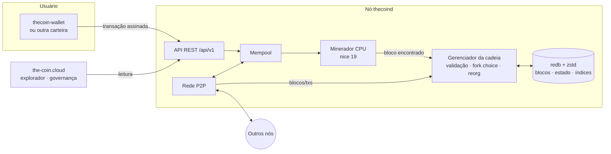

<div align="center">

# The Coin (TCN)

**Uma moeda digital de prova de trabalho, leve e democrática, feita para rodar em VPS simples —
com pagamentos, contratos de pagamento e governança on-chain.**

[](https://github.com/LucasBolla94/thecoin/actions/workflows/ci.yml)


[Site](https://the-coin.cloud) ·
[Whitepaper (PDF)](docs/whitepaper/the-coin-whitepaper-v0.1.pdf) ·
[Protocolo](docs/PROTOCOL.md) ·
[API](docs/API.md) ·
[Carteiras](docs/WALLET_DEVELOPERS.md) ·
[Operação](docs/OPERATIONS.md)

</div>

---

## Sumário

1. [O que é a The Coin](#1-o-que-é-a-the-coin)
2. [Especificações](#2-especificações)
3. [Política monetária](#3-política-monetária)
4. [Arquitetura](#4-arquitetura)
5. [Entrar na rede (instalador)](#5-entrar-na-rede-instalador)
6. [Compilar a partir do código-fonte](#6-compilar-a-partir-do-código-fonte)
7. [Rodando um nó (`thecoind`)](#7-rodando-um-nó-thecoind)
8. [Carteira (`thecoin-wallet`)](#8-carteira-thecoin-wallet)
9. [Contratos de pagamento](#9-contratos-de-pagamento)
10. [Governança](#10-governança)
11. [API REST](#11-api-rest)
12. [Rede local de desenvolvimento (regtest)](#12-rede-local-de-desenvolvimento-regtest)
13. [Estrutura do repositório](#13-estrutura-do-repositório)
14. [Testes e benchmarks](#14-testes-e-benchmarks)
15. [Releases e publicação do site](#15-releases-e-publicação-do-site)
16. [Segurança](#16-segurança)
17. [Roteiro](#17-roteiro)
18. [Documentação completa](#18-documentação-completa)
19. [Contribuindo](#19-contribuindo)
20. [Licença](#20-licença)

---

## 1. O que é a The Coin

A The Coin é uma rede monetária aberta, ponto a ponto, no estilo do Bitcoin, pensada para que
**qualquer VPS barato (1 vCPU, 1 GB de RAM)** possa validar a cadeia completa e competir de forma
justa pelas recompensas de mineração.

- **Leve:** o nó usa ≈ 42 MB de RAM minerando; blocos e dados são comprimidos; poda opcional.
- **Mineração justa:** a prova de trabalho *CoinHash* (Argon2id, 16 MiB) é *memory-hard* e favorece CPUs comuns.
- **Segura:** Ed25519 estrito, hashes BLAKE3 com separação de domínio, compromisso de estado em cada bloco,
  banco de dados ACID, proteções contra DoS pensadas para máquinas pequenas.
- **Oferta limitada:** 50 milhões de TCN, sem pré-mineração, halvings ao estilo Bitcoin num ciclo de
  estabilização de ≈ 5 anos.
- **Útil desde o início:** transferências, pagamentos em lote, cobranças por URI/QR code e cinco
  contratos de pagamento (escrow, vesting, assinatura, HTLC, multisig).
- **Democrática:** mudanças de parâmetros exigem aprovação de **detentores e mineradores**.
- **Aberta:** todos os registros são públicos pela API e pelo explorador; padrões documentados para
  que qualquer pessoa crie carteiras e ferramentas.

## 2. Especificações

| Item | Valor |
|---|---|
| Ticker / menor unidade | **TCN** / *mote* (1 TCN = 100 000 000 motes) |
| Oferta máxima | **50 000 000 TCN** (sem pré-mineração) |
| Tempo de bloco | 60 segundos |
| Ajuste de dificuldade | LWMA-1 a cada bloco (janela de 60 blocos) |
| Prova de trabalho | CoinHash = Argon2id, 16 MiB, 1 passe (≈ 83 H/s por núcleo em VPS comum) |
| Recompensa inicial | 40 TCN por bloco, maturação de 100 blocos |
| Halving | a cada 625 000 blocos (≈ 1,19 ano) |
| Modelo de dados | contas + nonce |
| Assinaturas / hashes | Ed25519 (verificação estrita) / BLAKE3 com tags |
| Endereços | bech32m: `tc1…` (mainnet), `tct1…` (testnet), `tcr1…` (regtest) |
| Compromisso de estado | LtHash16 (homomórfico) no cabeçalho de cada bloco |
| Tamanho de bloco | 1 MB (governável entre 250 kB e 8 MB) — ≈ 105 transações/s |
| Transferência simples | 158 bytes |
| Reorganização máxima | 720 blocos (≈ 12 h) |
| Portas (mainnet) | P2P **7333/tcp**, API **7334/tcp** (testnet: 17333/17334, regtest: 27333/27334) |
| Armazenamento | redb (ACID) + zstd |

Execute `thecoind params` para ver os parâmetros de qualquer rede, incluindo o hash do bloco gênese.

## 3. Política monetária

```
subsídio(h) = 0                                   se h = 0 (gênese)
subsídio(h) = 40 TCN >> floor((h − 1) / 625 000)  caso contrário
```

| Era | Recompensa | Emitido na era | Acumulado | % da oferta | Fim (anos) |
|---:|---:|---:|---:|---:|---:|
| 1 | 40 TCN | 25 000 000 | 25 000 000 | 50,00% | 1,19 |
| 2 | 20 TCN | 12 500 000 | 37 500 000 | 75,00% | 2,38 |
| 3 | 10 TCN | 6 250 000 | 43 750 000 | 87,50% | 3,56 |
| 4 | 5 TCN | 3 125 000 | 46 875 000 | **93,75%** | **4,75** |
| 5 | 2,5 TCN | 1 562 500 | 48 437 500 | 96,88% | 5,94 |
| … | … | … | → 50 000 000 | → 100% | … |

- As quatro primeiras eras formam o **ciclo de estabilização** (≈ 4,75 anos).
- Depois disso a emissão continua caindo pela metade e a segurança passa a ser paga pelas taxas.
- Taxas vão ao minerador; depósitos de propostas sem quórum são queimados.
- O teto de 50 milhões é verificado por todos os nós em cada bloco e **não pode ser alterado por votação**.

## 4. Arquitetura



| Crate | Função |
|---|---|
| [`crates/core`](crates/core) | Regras de consenso puras, sem I/O: tipos, codificação canônica (Borsh), criptografia, CoinHash, LWMA, emissão, contratos, governança, função de transição de estado e *views* JSON. Reutilizável por carteiras e implementações alternativas. |
| [`crates/storage`](crates/storage) | Banco redb: cabeçalhos, blocos comprimidos, estado, dados de undo, índices de transações e endereços. Cada bloco é gravado em uma única transação atômica. |
| [`crates/node`](crates/node) | `thecoind`: gerenciador da cadeia, mempool, P2P, minerador e API REST. |
| [`crates/wallet`](crates/wallet) | `thecoin-wallet`: BIP-39 + SLIP-0010, keystore cifrado, construtor de transações, cliente da API e CLI. |

Detalhes em [docs/ARCHITECTURE.md](docs/ARCHITECTURE.md).

## 5. Entrar na rede (instalador)

**Seja um validador em 1 minuto** — em qualquer Linux com systemd (x86_64 ou ARM64), um único comando,
sem nenhuma pergunta:

```bash
curl -fsSL https://the-coin.cloud/install.sh | sudo bash -s -- --yes
```

O instalador:

1. faz pré-verificações (sistema, arquitetura, memória, disco, relógio sincronizado, firewall);
2. baixa os binários estáticos **verificando o SHA-256** (se não houver binário, compila do código);
3. oferece criar swap em máquinas sem swap;
4. cria o usuário de sistema `thecoin` e o diretório `/var/lib/thecoin`;
5. cria a carteira de recompensas com uma senha aleatória forte (guardada em `~/.thecoin/wallet-mainnet.password`,
   só root lê) e mostra as **24 palavras de recuperação** num quadro no final — anote-as no papel;
6. gera `/etc/thecoin/thecoind.toml` e um serviço systemd isolado (`ProtectSystem=strict`, `NoNewPrivileges`, sem capabilities);
7. instala o comando `thecoin`, abre a porta P2P no `ufw` (se ativo) e inicia o nó, que começa a sincronizar e minerar.

Rodar de novo (ou `sudo thecoin update`) **atualiza** mantendo carteira e configuração.
Sem `--yes`, um menu permite escolher a senha da carteira ou informar um endereço existente.

Opções úteis:

```bash
# testnet
curl -fsSL https://the-coin.cloud/install.sh | sudo bash -s -- --yes --network testnet

# minerar para um endereço que você já tem
curl -fsSL https://the-coin.cloud/install.sh | sudo bash -s -- --yes --miner-address tc1...

# nó que não minera, apenas valida e retransmite
curl -fsSL https://the-coin.cloud/install.sh | sudo bash -s -- --yes --no-mine

# nó seed que serve a API ao site (proteja a porta 7334 no firewall!)
curl -fsSL https://the-coin.cloud/install.sh | sudo bash -s -- --yes --no-mine --public-api
```

Todas as opções: `--yes`, `--network`, `--miner-address`, `--no-mine`, `--threads`, `--version`, `--from-source`,
`--public-api`. Sem acesso ao site, use o script direto do repositório:
`curl -fsSL https://raw.githubusercontent.com/LucasBolla94/thecoin/main/installer/install.sh | sudo bash -s -- --yes`.

Acompanhar e administrar com o comando `thecoin`:

```bash
thecoin status                   # serviço, altura, sincronização, peers, mineração e saldo
thecoin logs                     # logs em tempo real
thecoin balance                  # saldo da carteira de recompensas
thecoin address                  # endereço de mineração
sudo thecoin mnemonic            # mostra de novo as palavras de recuperação
sudo thecoin restart             # reinicia o nó
sudo thecoin update              # atualiza para a versão mais recente
sudo thecoin uninstall [--purge] # remove (a carteira nunca é apagada; --purge apaga dados e configuração)
```

**Requisitos mínimos:** 1 vCPU, 1 GB de RAM (com swap), 5 GB de disco, porta 7333/tcp acessível
(libere também no firewall/*security group* do provedor de nuvem) e relógio sincronizado (NTP).
Guia completo: [the-coin.cloud/validator.html](https://the-coin.cloud/validator.html) e
[docs/OPERATIONS.md](docs/OPERATIONS.md#seja-um-validador-em-1-minuto).

## 6. Compilar a partir do código-fonte

```bash
# Dependências (Debian/Ubuntu)
sudo apt install -y build-essential pkg-config git curl
curl --proto '=https' --tlsv1.2 -sSf https://sh.rustup.rs | sh     # Rust 1.88+

git clone https://github.com/LucasBolla94/thecoin.git
cd thecoin
cargo build --release

./target/release/thecoind --version
./target/release/thecoin-wallet --version
```

Binários em `target/release/`: **`thecoind`** (nó) e **`thecoin-wallet`** (carteira).

Binário estático (roda em qualquer distribuição Linux):

```bash
sudo apt install -y musl-tools
rustup target add x86_64-unknown-linux-musl
scripts/package.sh x86_64-unknown-linux-musl     # gera dist/thecoin-x86_64-unknown-linux-musl.tar.gz + .sha256
```

> Em máquinas com pouca RAM, compile com `CARGO_BUILD_JOBS=1` ou adicione swap.

## 7. Rodando um nó (`thecoind`)

```bash
thecoind --miner-address tc1...                  # mainnet, minerando
thecoind --network testnet --miner-address tct1...
thecoind --no-mine                               # só valida e retransmite
thecoind params                                  # parâmetros da rede e hash do gênese
thecoind init                                    # grava thecoind.toml padrão no diretório de dados
thecoind compact                                 # compacta o banco (com o nó parado)
```

| Opção | Descrição |
|---|---|
| `-c, --config <arquivo>` | Arquivo TOML (padrão: `<data-dir>/thecoind.toml`, se existir) |
| `--network <rede>` | `mainnet`, `testnet` ou `regtest` |
| `--data-dir <dir>` | Diretório de dados (padrão: `~/.thecoin`, `~/.thecoin/testnet`, …) |
| `--miner-address <endereço>` | Ativa a mineração para esse endereço |
| `--threads <n>` | Threads de mineração (0 = núcleos − 1) |
| `--no-mine` | Desativa a mineração |
| `--listen <ip:porta>` | Endereço P2P |
| `--rpc <ip:porta>` | Endereço da API |
| `--peer <host:porta>` | Par adicional (repetível) |
| `--connect-only` | Conecta apenas aos `--peer` informados |
| `--prune` | Mantém só os blocos recentes |
| `--log-level <nível>` | `error`, `warn`, `info`, `debug`, `trace` |

Exemplo de `thecoind.toml`:

```toml
network = "mainnet"
data_dir = "/var/lib/thecoin"

[p2p]
listen = "0.0.0.0:7333"
max_inbound = 32
max_outbound = 8
seeds = []            # seeds extras, além de seed1/seed2.the-coin.cloud
connect = []          # se preenchido, conecta somente a estes pares

[rpc]
enabled = true
listen = "127.0.0.1:7334"     # use 0.0.0.0 apenas em nós que servem o site
cors_origins = ["*"]

[mining]
enabled = true
address = "tc1..."
threads = 0           # 0 = automático (núcleos − 1)
signal = []           # ids de propostas de governança que este minerador apoia

[storage]
cache_mb = 64
prune = false
prune_keep = 10000
address_index = true

[mempool]
max_mb = 32
```

Referência completa, firewall, nós seed, monitoramento, backups e checklist de lançamento:
[docs/OPERATIONS.md](docs/OPERATIONS.md).

## 8. Carteira (`thecoin-wallet`)

A carteira guarda as chaves **somente na sua máquina**, cifradas com Argon2id + ChaCha20-Poly1305. O nó
nunca recebe chaves privadas — apenas transações já assinadas.

```bash
thecoin-wallet create                                   # nova carteira (24 palavras — anote no papel!)
thecoin-wallet restore                                  # restaura a partir das palavras
thecoin-wallet address                                  # endereço principal
thecoin-wallet address --new --label "loja"             # novo endereço
thecoin-wallet list                                     # endereços e saldos
thecoin-wallet balance                                  # saldo, gastável, bloqueado, imaturo
thecoin-wallet send tc1... 12.5 --memo "Pedido 42"      # enviar
thecoin-wallet batch pagamentos.csv                     # lote: linhas "endereço,valor"
thecoin-wallet request 3.5 --memo "Café" --label Loja   # gera URI de cobrança
thecoin-wallet pay "thecoin:tc1...?amount=3.5&memo=Caf%C3%A9"
thecoin-wallet history                                  # histórico
thecoin-wallet tx <txid>                                # detalhes de uma transação
thecoin-wallet status                                   # estado do nó
thecoin-wallet show-mnemonic                            # mostra as palavras de recuperação
```

Opções gerais (antes do comando): `-w/--wallet <arquivo>`, `--network <rede>`, `--node <url>`.
Opções de envio: `--from <índice>`, `-y/--yes` (sem confirmação), `--dry-run` (assina e imprime sem transmitir).

Variáveis de ambiente: `THECOIN_WALLET`, `THECOIN_NETWORK`, `THECOIN_NODE`, `THECOIN_WALLET_PASSWORD`
(automação), `THECOIN_WALLET_MNEMONIC` (restauração não interativa).

**Padrões para outras carteiras:** BIP-39 (inglês), SLIP-0010 Ed25519 no caminho `m/44'/7333'/conta'/0'/índice'`,
transações Borsh assinadas com Ed25519 e enviadas por `POST /api/v1/tx`. Especificação byte a byte e vetores de
teste em [docs/WALLET_DEVELOPERS.md](docs/WALLET_DEVELOPERS.md).

## 9. Contratos de pagamento

Contratos nativos, sem gás e com custo fixo — seguros e baratos de validar em máquinas pequenas.

| Contrato | Para que serve | Exemplo |
|---|---|---|
| **Escrow** | Compra e venda com árbitro opcional e prazo | `thecoin-wallet contract escrow-create --payee tc1... --amount 100 --arbiter tc1... --deadline-blocks 10080` |
| **Vesting** | Salários e distribuição gradual com *cliff* | `thecoin-wallet contract vesting-create --beneficiary tc1... --amount 1200 --cliff-blocks 43200 --duration-blocks 525960 --revocable` |
| **Assinatura** | Mensalidades pré-pagas | `thecoin-wallet contract subscription-create --payee tc1... --amount 10 --period-blocks 43200 --periods 12` |
| **HTLC** | Trocas atômicas (ex.: TCN ↔ BTC) | `thecoin-wallet contract htlc-create --recipient tc1... --amount 50 --timeout-blocks 1440` |
| **Multisig** | Tesouraria M-de-N | `thecoin-wallet contract multisig-create --signers tc1a...,tc1b...,tc1c... --threshold 2 --deposit 500` |

Chamadas: `escrow-release`/`escrow-refund`, `vesting-claim`/`vesting-revoke`,
`subscription-claim`/`subscription-cancel`, `htlc-redeem --preimage <hex>`/`htlc-refund`,
`multisig-deposit`/`multisig-propose`/`multisig-approve`/`multisig-cancel`, e `contract show <id>`.
O id do contrato aparece no campo `created` de `thecoin-wallet tx <txid>`.

Guia com cenários de negócio: [docs/CONTRACTS.md](docs/CONTRACTS.md).

## 10. Governança

Uma proposta só é aprovada se **as duas câmaras** concordarem:

| Câmara | Como participa | Regra padrão (mainnet) |
|---|---|---|
| Detentores | votam com TCN, que ficam **bloqueados** até o fim da votação | quórum de 10% da oferta circulante e 66,67% de "sim" |
| Mineradores | sinalizam apoio no campo `signal` dos blocos | 60% dos blocos do período de votação |

- Votação: 20 160 blocos (≈ 14 dias); ativação: 2 880 blocos depois (≈ 2 dias).
- Depósito de 100 TCN: devolvido se houver quórum, queimado caso contrário.
- Pode mudar: tamanho de bloco, taxa mínima, depósito, prazos, quórum e limiares (sempre dentro de limites fixos).
- **Não pode mudar:** teto de 50M, emissão, prova de trabalho e regras de validade.

```bash
thecoin-wallet gov list
thecoin-wallet gov show <id>
thecoin-wallet gov propose --title "Aumentar taxa mínima" --url https://the-coin.cloud/gov/1 \
    --text-file proposta.md --set-param min_fee_per_byte=20
thecoin-wallet gov propose --title "Versão 0.2.0" --upgrade-version 0.2.0 --release-hash <sha256>
thecoin-wallet gov vote <id> yes 1000
# mineradores: adicionar o id em [mining] signal = ["<id>"] no thecoind.toml
```

O painel em `the-coin.cloud/governance.html` mostra o andamento das duas câmaras em tempo real.
Detalhes: [docs/GOVERNANCE.md](docs/GOVERNANCE.md).

## 11. API REST

A API fica em `http://127.0.0.1:7334/api/v1` (apenas local por padrão). Valores em motes, hashes em hex,
endereços em bech32m.

| Método | Rota | Descrição |
|---|---|---|
| GET | `/status` | Altura, dificuldade, hashrate, pares, mempool, oferta, parâmetros |
| GET | `/supply` | Emissão, queima, recompensa atual, próximo halving |
| GET | `/fees` | Taxa mínima e sugerida por byte |
| GET | `/blocks?limit=&before=` | Lista de blocos |
| GET | `/block/{altura\|hash}` | Bloco com transações |
| GET | `/tx/{txid}` | Transação (confirmada ou no mempool) |
| POST | `/tx` | Envia transação assinada `{"tx": "<hex>"}` |
| GET | `/address/{endereço}` | Saldo, gastável, bloqueado, imaturo, nonce, `next_nonce` |
| GET | `/address/{endereço}/txs?limit=&cursor=altura:posição` | Histórico |
| GET | `/contract/{id}` | Estado de um contrato |
| GET | `/governance/proposals` | Propostas |
| GET | `/governance/proposal/{id}` | Proposta com apuração e projeções |
| GET | `/governance/params` | Parâmetros atuais e limites |
| GET | `/mempool` | Transações pendentes |
| GET | `/peers` | Pares conectados |
| GET | `/mining` | Estado do minerador local |

```bash
curl -s http://127.0.0.1:7334/api/v1/status
curl -s http://127.0.0.1:7334/api/v1/address/tc1...
```

Exemplos completos de respostas: [docs/API.md](docs/API.md).

## 12. Rede local de desenvolvimento (regtest)

Na regtest a prova de trabalho é trivial, os halvings acontecem a cada 150 blocos e as votações duram 20 blocos.

```bash
cargo build
export PATH="$PWD/target/debug:$PATH" THECOIN_NETWORK=regtest THECOIN_WALLET_PASSWORD=dev

# nó 1 (minerador)
thecoin-wallet -w /tmp/w1.json create
thecoind --network regtest --data-dir /tmp/n1 \
         --miner-address "$(thecoin-wallet -w /tmp/w1.json address)" --threads 1

# nó 2 (em outro terminal), sincroniza do nó 1
thecoind --network regtest --data-dir /tmp/n2 --no-mine \
         --listen 127.0.0.1:27335 --rpc 127.0.0.1:27336 --peer 127.0.0.1:27333 --connect-only

# enviar moedas (após ~6 blocos as recompensas amadurecem)
thecoin-wallet -w /tmp/w2.json create
thecoin-wallet -w /tmp/w1.json -y send "$(thecoin-wallet -w /tmp/w2.json address)" 10 --memo teste
thecoin-wallet -w /tmp/w2.json --node http://127.0.0.1:27336 balance
```

Site apontando para o nó local:

```bash
cd website && python3 -m http.server 8000
# http://localhost:8000/explorer.html?api=http://127.0.0.1:27334/api/v1
```

## 13. Estrutura do repositório

```
thecoin/
├── crates/
│   ├── core/        regras de consenso (sem I/O) + testes de execução e benchmark
│   ├── storage/     banco redb + zstd
│   ├── node/        thecoind + testes multi-nó
│   └── wallet/      thecoin-wallet
├── installer/       install.sh · uninstall.sh
├── website/         the-coin.cloud (HTML/CSS/JS puro) + nginx
├── docs/            especificações, guias e whitepaper (Typst + PDF)
├── scripts/         package.sh (releases) · publish-site.sh (bundle do site)
├── .github/         CI (fmt, clippy, testes) e release multiplataforma
├── CHANGELOG.md · CONTRIBUTING.md · LICENSE-MIT · LICENSE-APACHE
└── Cargo.toml       workspace
```

## 14. Testes e benchmarks

```bash
cargo fmt --all -- --check
cargo clippy --workspace --all-targets -- -D warnings
cargo test --workspace
```

A suíte cobre: emissão e teto de 50M, LWMA, Merkle, LtHash, assinaturas, endereços, SLIP-0010 (vetores
oficiais), keystore, URIs, todos os contratos, governança completa (aprovação, rejeição, queima, bloqueio de
votos), invariante de oferta verificado bloco a bloco, sincronização e relay entre nós e convergência por
reorganização entre mineradores concorrentes.

Medições de desempenho:

```bash
cargo test -p thecoin-core --release --test bench -- --ignored --nocapture
cargo test -p thecoin-node --release --test storage_bench -- --ignored --nocapture
cargo test -p thecoin-node --release --test storage_growth -- --ignored --nocapture
cargo test -p thecoin-core --release -- --ignored bench_pow --nocapture
```

| Medição (VPS 2 vCPU) | Resultado |
|---|---|
| CoinHash por tentativa | 12 ms (83–87 H/s por thread) |
| Verificação de assinaturas | ≈ 14 400 tx/s por núcleo |
| Bloco de 790 kB com 5 000 transferências | aplicado em 0,39 s |
| Memória do nó minerando | ≈ 42 MB |
| Disco por bloco vazio | ≈ 765 bytes (≈ 400 MB/ano) |
| Disco por transação (nó arquivo com índice de endereços) | ≈ 886 bytes |
| Disco por transação (nó arquivo sem índice de endereços) | ≈ 437 bytes |

## 15. Releases e publicação do site

**Release:** crie uma tag `vX.Y.Z` e faça push — o workflow [`release.yml`](.github/workflows/release.yml)
compila Linux (x86_64/aarch64 musl), macOS e Windows, gera `.sha256` e `SHA256SUMS` e publica no GitHub Releases.

```bash
git tag v0.1.0 && git push origin v0.1.0
```

**Site:** monte o pacote com páginas, instalador, whitepaper e binários no layout esperado pelo instalador:

```bash
scripts/package.sh x86_64-unknown-linux-musl     # ou copie os arquivos do release para dist/
scripts/publish-site.sh                          # gera dist/site/
rsync -av --delete dist/site/ usuario@maquina-do-site:/var/www/the-coin.cloud/
```

Configuração do nginx, TLS e proxy da API para os nós seed: [website/README.md](website/README.md).

**Whitepaper:** `typst compile docs/whitepaper/whitepaper.typ docs/whitepaper/the-coin-whitepaper-v0.1.pdf`.

## 16. Segurança

- Transações confirmadas não podem ser alteradas sem refazer o trabalho acumulado (Merkle + `state_root` + encadeamento de cabeçalhos).
- Replay impedido por nonce e `chain_id`; assinaturas não maleáveis (Ed25519 estrito).
- Limites contra DoS: pool de órfãos (16 MB), filas por par limitadas em bytes, mempool limitado, pontuação e banimento de pares, limites da API.
- Reorganizações acima de 720 blocos recusadas; suporte a checkpoints.
- Carteira cifrada localmente; o serviço roda isolado por systemd com usuário sem privilégios.
- Recomenda-se aguardar **10 confirmações** para valores comuns e **60+** para valores altos.

Encontrou uma vulnerabilidade? **Não abra issue pública** — escreva para `security@the-coin.cloud`.
Modelo de ameaças completo no [whitepaper](docs/whitepaper/the-coin-whitepaper-v0.1.pdf).

## 17. Roteiro

- **v0.2** — criptografia do transporte P2P (Noise), sincronização rápida por snapshot de estado, carteira gráfica/web, provas para clientes leves.
- **v0.3** — VM WebAssembly com medição de custo para contratos gerais (ativada por governança), novos modelos de pagamento.
- **v0.4** — canais de pagamento sobre HTLC, integrações com exchanges e comércio.
- **Contínuo** — auditorias externas, programa de recompensa por falhas, implementações alternativas.

## 18. Documentação completa

| Documento | Conteúdo |
|---|---|
| [Whitepaper v0.1 (PDF)](docs/whitepaper/the-coin-whitepaper-v0.1.pdf) | Visão geral, economia, consenso, segurança, desempenho |
| [PROTOCOL.md](docs/PROTOCOL.md) | Especificação de consenso byte a byte |
| [P2P.md](docs/P2P.md) | Protocolo de rede e sincronização |
| [API.md](docs/API.md) | API REST com exemplos reais |
| [WALLET_DEVELOPERS.md](docs/WALLET_DEVELOPERS.md) | Como criar carteiras compatíveis (com vetores de teste) |
| [CONTRACTS.md](docs/CONTRACTS.md) | Guia dos contratos de pagamento |
| [GOVERNANCE.md](docs/GOVERNANCE.md) | Guia de governança |
| [OPERATIONS.md](docs/OPERATIONS.md) | Operação de nós, seeds, site e lançamento da mainnet |
| [ARCHITECTURE.md](docs/ARCHITECTURE.md) | Arquitetura do software e como estendê-lo |
| [CHANGELOG.md](CHANGELOG.md) | Histórico de versões |

## 19. Contribuindo

Contribuições são bem-vindas! Leia o [CONTRIBUTING.md](CONTRIBUTING.md) antes de abrir um PR.

1. Faça um fork e crie uma branch (`git checkout -b minha-melhoria`).
2. Garanta que `cargo fmt`, `cargo clippy -- -D warnings` e `cargo test --workspace` passam.
3. Abra um Pull Request descrevendo a mudança.

> **Mudanças de consenso** (qualquer coisa em `crates/core` que altere a validação de blocos ou transações)
> exigem especificação em `docs/PROTOCOL.md`, testes e, na mainnet, ativação coordenada por proposta de
> governança `SoftwareUpgrade`. Variantes de enums de consenso só podem ser **adicionadas ao final**.

## 20. Licença

Distribuído sob a licença **MIT** ou **Apache-2.0**, à sua escolha. Veja [LICENSE-MIT](LICENSE-MIT) e
[LICENSE-APACHE](LICENSE-APACHE).
