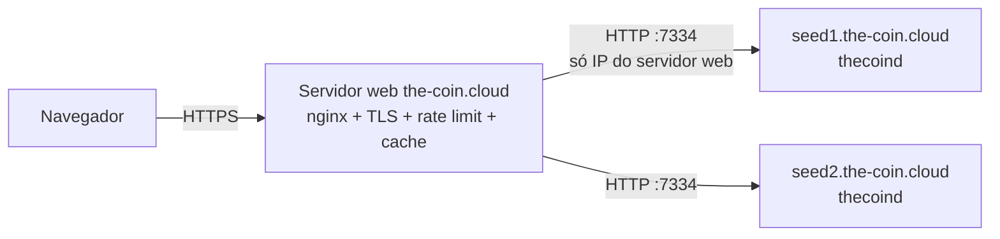

# The Coin — API REST do nó (`/api/v1`)

Todo `thecoind` expõe uma API HTTP/JSON (`crates/node/src/rpc.rs`) usada pela
carteira de referência, pelo explorador e pelo site the-coin.cloud. Os tipos
JSON estão em `crates/core/src/api.rs` e podem ser reutilizados por clientes Rust.

* Endereço padrão: `http://127.0.0.1:7334` (mainnet), `:17334` (testnet), `:27334` (regtest). Configurável em `[rpc] listen`.
* Todos os exemplos abaixo são **respostas reais** de um nó regtest v0.1.

## Convenções

| Item | Formato |
|---|---|
| Valores | inteiros em **motes** (1 TCN = 100 000 000). O supply máximo (5·10¹⁵) cabe em inteiro seguro de JavaScript |
| Hashes / ids | hex minúsculo, 64 caracteres |
| Endereços | bech32m (`tc1…`, `tct1…`, `tcr1…`) — endereços de outra rede são rejeitados |
| Memos | `memo_hex` sempre; `memo_text` quando é UTF‑8 válido e não vazio |
| Erros | status HTTP + `{"error": "mensagem"}` |

| Status | Quando |
|---|---|
| 200 | sucesso |
| 400 | parâmetro inválido, transação rejeitada |
| 404 | objeto não encontrado (ou corpo de bloco podado) |
| 408 | requisição passou de 20 s |
| 500 | erro interno/armazenamento |

### Proteções embutidas

* timeout de 20 s por requisição (→ 408);
* corpo máximo de 64 KiB;
* limite global de concorrência `rpc.max_concurrency` (padrão 64);
* CORS: métodos `GET, POST, OPTIONS`, qualquer cabeçalho; origens em `rpc.cors_origins` (padrão `["*"]`).

O nó **nunca guarda chaves privadas de usuários**: a única escrita é o envio de
transações já assinadas.

---

## Índice de endpoints

| Método | Caminho | Descrição |
|---|---|---|
| GET | `/` | identificação do nó |
| GET | `/api/v1/status` | estado geral da cadeia e do nó |
| GET | `/api/v1/supply` | emissão e supply |
| GET | `/api/v1/fees` | taxas mínima e sugerida |
| GET | `/api/v1/blocks` | lista de blocos recentes |
| GET | `/api/v1/block/{altura\|hash}` | bloco completo com transações |
| GET | `/api/v1/tx/{txid}` | transação (confirmada ou no mempool) |
| POST | `/api/v1/tx` | envia transação assinada |
| GET | `/api/v1/address/{addr}` | saldo, nonce, bloqueios |
| GET | `/api/v1/address/{addr}/txs` | histórico do endereço |
| GET | `/api/v1/contract/{id}` | contrato de pagamento |
| GET | `/api/v1/governance/proposals` | todas as propostas |
| GET | `/api/v1/governance/proposal/{id}` | uma proposta |
| GET | `/api/v1/governance/params` | parâmetros atuais e limites |
| GET | `/api/v1/mempool` | resumo do mempool |
| GET | `/api/v1/peers` | peers conectados |
| GET | `/api/v1/mining` | estado do minerador local |

---

## `GET /`

```bash
curl http://127.0.0.1:7334/
```

```json
{
  "docs": "https://the-coin.cloud/docs/api",
  "name": "The Coin node",
  "network": "regtest",
  "protocol": 1,
  "version": "0.1.0"
}
```

## `GET /api/v1/status`

```bash
curl http://127.0.0.1:7334/api/v1/status
```

```json
{
  "network": "regtest",
  "version": "0.1.0",
  "genesis": "d4c9b8039d2cffefcfd6fe6d362bda992d149d47107dd73346e00e8f59e56c8b",
  "height": 62,
  "tip": "e21128a26c1554b6ad6a81a7ad608ac7226f47ab37d0b38b72f9bb4dba67ff73",
  "tip_timestamp": 1789265118,
  "chainwork": "3f",
  "difficulty": 1.0,
  "next_target": "ffffffffffffffffffffffffffffffffffffffffffffffffffffffffffffffff",
  "hashrate_estimate": 1.8484848484848484,
  "peers": 0,
  "mempool_txs": 1,
  "mempool_bytes": 170,
  "syncing": false,
  "supply": {
    "max_supply": 5000000000000000,
    "emitted": 248000000000,
    "burned": 100000000,
    "circulating": 247900000000,
    "current_block_reward": 4000000000,
    "era": 0,
    "next_halving_height": 151,
    "halving_interval": 150,
    "target_block_time": 60
  },
  "params": {
    "max_block_bytes": 1000000,
    "min_fee_per_byte": 1,
    "proposal_deposit": 100000000,
    "vote_period": 20,
    "quorum_bp": 1000,
    "approval_bp": 6667,
    "miner_approval_bp": 5000,
    "activation_delay": 5
  },
  "software_upgrade_required": null
}
```

| Campo | Significado |
|---|---|
| `chainwork` | trabalho acumulado do tip (hex, sem zeros à esquerda) |
| `difficulty` | `work(target)` do tip (hashes esperados por bloco) |
| `next_target` | alvo exigido para o próximo bloco (hex 64) |
| `hashrate_estimate` | H/s estimado pelos últimos 120 blocos |
| `syncing` | `true` se algum peer anuncia altura > local + 1 |
| `supply.current_block_reward` / `era` / `next_halving_height` | referentes ao **próximo** bloco |
| `params` | parâmetros de governança em vigor |
| `software_upgrade_required` | versão de uma proposta `SoftwareUpgrade` ativada mais nova que este nó, ou `null` |

## `GET /api/v1/supply`

Mesmo objeto `supply` do `/status`.

```json
{
  "max_supply": 5000000000000000,
  "emitted": 248000000000,
  "burned": 100000000,
  "circulating": 247900000000,
  "current_block_reward": 4000000000,
  "era": 0,
  "next_halving_height": 151,
  "halving_interval": 150,
  "target_block_time": 60
}
```

`circulating = emitted − burned` (inclui recompensas ainda imaturas e saldos de contratos).

## `GET /api/v1/fees`

```json
{
  "min_fee_per_byte": 1,
  "suggested_fee_per_byte": 1,
  "typical_transfer_bytes": 170
}
```

`suggested_fee_per_byte` é o mínimo enquanto o mempool está abaixo de 10 % da
capacidade; acima disso, a mediana das taxas por byte no mempool (nunca menor
que o mínimo). Taxa final de uma transação = `tamanho × taxa_por_byte`.

## `GET /api/v1/blocks`

| Query | Padrão | Descrição |
|---|---|---|
| `limit` | 20 | 1–100 |
| `before` | tip+1 | lista blocos com altura `< before` |

```bash
curl "http://127.0.0.1:7334/api/v1/blocks?limit=2"
curl "http://127.0.0.1:7334/api/v1/blocks?limit=20&before=41"   # página seguinte
```

```json
[
  {
    "height": 63,
    "hash": "8f0d5585fd52c779745749ed27b477240565af6082a64927efef9c0fb9b72898",
    "prev_hash": "e21128a26c1554b6ad6a81a7ad608ac7226f47ab37d0b38b72f9bb4dba67ff73",
    "timestamp": 1789265118,
    "tx_count": 0,
    "size": 184,
    "miner": "tcr1d9zd0zyrhql2xutfv6dyg0rvqnq8skcp32uxcr",
    "difficulty": 1.0,
    "signal": 0
  },
  {
    "height": 62,
    "hash": "e21128a26c1554b6ad6a81a7ad608ac7226f47ab37d0b38b72f9bb4dba67ff73",
    "prev_hash": "db44fd37169e7ab01b4c8eea9e42ac11d04f24aaf293ad0af26dc69e944bf518",
    "timestamp": 1789265118,
    "tx_count": 0,
    "size": 184,
    "miner": "tcr1d9zd0zyrhql2xutfv6dyg0rvqnq8skcp32uxcr",
    "difficulty": 1.0,
    "signal": 0
  }
]
```

## `GET /api/v1/block/{id}`

`{id}` = altura (cadeia principal) ou hash (qualquer bloco armazenado).

```bash
curl http://127.0.0.1:7334/api/v1/block/26
```

```json
{
  "height": 26,
  "hash": "edc4a5c777c33e750231875c3f86b0a9b9330189786d3d52c8378ba120f1ee35",
  "prev_hash": "74bfb6daba9de4f395458096f945c2aac37cb47cbcf98cdf4cd747844bb830bf",
  "timestamp": 1789265099,
  "tx_count": 1,
  "size": 353,
  "miner": "tcr1d9zd0zyrhql2xutfv6dyg0rvqnq8skcp32uxcr",
  "difficulty": 1.0,
  "signal": 0,
  "version": 1,
  "tx_root": "0472a908a6fecca4be1bd761c6793086fc63458f51927a65e436ee26ecf44903",
  "state_root": "ef9434338209c497c5bfe605720a3c5b1bcfa4b52c74e18a20330621e84abcbf",
  "target": "ffffffffffffffffffffffffffffffffffffffffffffffffffffffffffffffff",
  "nonce": "7381520017383630049",
  "confirmations": 38,
  "subsidy": 4000000000,
  "fees": 169,
  "txs": [
    {
      "txid": "e581ee5b19e22fbf4a67e1d066f12afa662f980942522a684b9027edde15235a",
      "sender": "tcr1d9zd0zyrhql2xutfv6dyg0rvqnq8skcp32uxcr",
      "nonce": 0,
      "fee": 169,
      "expiry_height": 0,
      "size": 169,
      "action": {
        "type": "transfer",
        "to": "tcr16ntq7jxlpcdgtp6zt22zwgfcuhlq4t9cg8exxl",
        "amount": 2500000000,
        "memo_hex": "50656469646f2031303031",
        "memo_text": "Pedido 1001"
      },
      "block_height": 26,
      "block_hash": "edc4a5c777c33e750231875c3f86b0a9b9330189786d3d52c8378ba120f1ee35",
      "position": 0,
      "confirmations": 38,
      "in_mempool": false,
      "created": null
    }
  ]
}
```

> `nonce` do cabeçalho é enviado como **string decimal**: é um `u64` e pode
> passar do maior inteiro seguro de JavaScript (2⁵³).

`confirmations` = 0 para blocos fora da cadeia principal. Em nó podado, blocos
antigos retornam 404 `"block body pruned on this node"`.

## `GET /api/v1/tx/{txid}`

Procura primeiro no mempool, depois na cadeia principal.

```bash
curl http://127.0.0.1:7334/api/v1/tx/e581ee5b19e22fbf4a67e1d066f12afa662f980942522a684b9027edde15235a
```

```json
{
  "txid": "e581ee5b19e22fbf4a67e1d066f12afa662f980942522a684b9027edde15235a",
  "sender": "tcr1d9zd0zyrhql2xutfv6dyg0rvqnq8skcp32uxcr",
  "nonce": 0,
  "fee": 169,
  "expiry_height": 0,
  "size": 169,
  "action": {
    "type": "transfer",
    "to": "tcr16ntq7jxlpcdgtp6zt22zwgfcuhlq4t9cg8exxl",
    "amount": 2500000000,
    "memo_hex": "50656469646f2031303031",
    "memo_text": "Pedido 1001"
  },
  "block_height": 26,
  "block_hash": "edc4a5c777c33e750231875c3f86b0a9b9330189786d3d52c8378ba120f1ee35",
  "position": 0,
  "confirmations": 38,
  "in_mempool": false,
  "created": null
}
```

`position` é o índice da transação dentro do bloco (`null` no mempool).
`created` traz o id do contrato ou da proposta criado pela transação (também
para transações ainda no mempool — o id é determinístico).

### Formatos de `action`

`type` é um de `transfer`, `batch_transfer`, `create_contract`,
`call_contract`, `propose`, `vote`:

```json
{ "type": "batch_transfer", "outputs": [{"to": "tc1…", "amount": 100}], "total": 100, "memo_hex": "", "memo_text": null }
{ "type": "create_contract", "spec": { "kind": "escrow", "payee": "tcr16ntq7jxlpcdgtp6zt22zwgfcuhlq4t9cg8exxl", "arbiter": null, "amount": 1000000000, "deadline_height": 125 } }
{ "type": "call_contract", "contract": "07ac…", "call": { "call": "htlc_redeem", "preimage_hex": "…" } }
{ "type": "propose", "title": "…", "url": "…", "content_hash": "00…", "action": { "type": "set_param", "param": "min_fee_per_byte", "value": 2 } }
{ "type": "vote", "proposal": "32ed…", "choice": "yes", "weight": 10000000000 }
```

`spec.kind`: `escrow`, `vesting`, `subscription`, `htlc`, `multisig`.
`call.call`: `escrow_release`, `escrow_refund`, `vesting_claim`,
`vesting_revoke`, `subscription_claim`, `subscription_cancel`, `htlc_redeem`,
`htlc_refund`, `multisig_deposit`, `multisig_propose` (com `to`, `amount`,
`memo_hex`, `memo_text`), `multisig_approve`, `multisig_cancel`. Proposta `action.type`: `text`, `set_param`, `software_upgrade`.

## `POST /api/v1/tx`

Corpo: `{"tx": "<Transaction em Borsh, hex>"}`. A transação é validada
completamente contra o estado (assinatura, nonce, saldo, taxa, regras do
contrato/governança), entra no mempool e é propagada.

```bash
curl -X POST http://127.0.0.1:7334/api/v1/tx \
  -H 'content-type: application/json' \
  -d '{"tx":"010300435404000000000000009e00000000000000000000000000000000d4d60f48df0e1a8587425a94272138e5fe0aacb800c2eb0b0000000000000000995c3d4c826cd5f74919633dbd45b2cdbfd6bc52e204e21e0a81e7fa78da7c3dadb8cd5b86b7db2aaa1c59026844bec42e8675d38b3c184b9e33a57f095bd6af904d5d04aa5902e50c280bc4818b8e22810092eb265eb2f13898d22cd4fa8c04"}'
```

```json
{"txid":"ac30b6d7d8c12880ddde57e710e96e565f09da99fada31a4db13b93a839ea0cf"}
```

Erros típicos (HTTP 400):

```json
{"error":"malformed transaction: Unexpected length of input"}
{"error":"transaction already in mempool"}
{"error":"invalid transaction: bad nonce: expected 4, got 3"}
{"error":"invalid transaction: fee too low: minimum 1690, got 169"}
{"error":"invalid transaction: insufficient funds: need 2500000169, spendable 100"}
{"error":"invalid transaction: governance error: proposal is not open for voting"}   (votação encerrada)
{"error":"replacement needs a fee at least 25% higher"}
{"error":"too many pending transactions from this sender"}
{"error":"mempool full and fee rate too low"}
```

Regras do mempool: até 32 transações pendentes por remetente; *replace-by-fee*
com mesmo remetente+nonce exige taxa ≥ 125 % da anterior; expiração em 72 h;
limite de memória `mempool.max_mb` (32 MiB) com expulsão das de menor taxa por byte.

## `GET /api/v1/address/{addr}`

```bash
curl http://127.0.0.1:7334/api/v1/address/tcr1d9zd0zyrhql2xutfv6dyg0rvqnq8skcp32uxcr
```

```json
{
  "address": "tcr1d9zd0zyrhql2xutfv6dyg0rvqnq8skcp32uxcr",
  "balance": 411949999770,
  "spendable": 411949999770,
  "locked": 0,
  "locked_until": 0,
  "nonce": 6,
  "next_nonce": 6,
  "immature": 20000000230,
  "mempool_txs": 0
}
```

| Campo | Significado |
|---|---|
| `balance` | saldo total (inclui `locked`) |
| `spendable` | gastável no **próximo** bloco |
| `locked`, `locked_until` | moedas bloqueadas por voto e altura final do bloqueio |
| `nonce` | transações confirmadas enviadas |
| `next_nonce` | nonce a usar na próxima transação, contando as pendentes no mempool |
| `immature` | recompensas de mineração ainda não maturadas (não incluídas em `balance`) |
| `mempool_txs` | transações deste remetente no mempool |

Endereços nunca usados retornam zeros (não 404).

## `GET /api/v1/address/{addr}/txs`

Histórico (mais recente primeiro) de transações que **tocam** o endereço: enviadas,
recebidas, contratos em que ele é parte e chamadas que lhe pagam.
Requer `storage.address_index = true` (padrão); senão 400.

| Query | Padrão | Descrição |
|---|---|---|
| `limit` | 25 | 1–100 |
| `cursor` | — | `altura:posição`; retorna entradas estritamente anteriores a esse ponto |

Sem `cursor`, a resposta começa pelas transações **enviadas** pelo endereço que
estão no mempool (`in_mempool: true`).

```bash
curl "http://127.0.0.1:7334/api/v1/address/tcr16ntq7jxlpcdgtp6zt22zwgfcuhlq4t9cg8exxl/txs?limit=5"
```

```json
[
  {
    "txid": "0cc5a7f6570116e074fbf08eb6ceb35fc52da19ff5d9e2e3d60ed89a01fc8467",
    "sender": "tcr1d9zd0zyrhql2xutfv6dyg0rvqnq8skcp32uxcr",
    "nonce": 1,
    "fee": 164,
    "expiry_height": 0,
    "size": 164,
    "action": {
      "type": "create_contract",
      "spec": {
        "kind": "escrow",
        "payee": "tcr16ntq7jxlpcdgtp6zt22zwgfcuhlq4t9cg8exxl",
        "arbiter": null,
        "amount": 1000000000,
        "deadline_height": 125
      }
    },
    "block_height": 28,
    "block_hash": "cbdf54d3c25309d15ff41883e6c415b75d66fabe85f777ed64f66445bccf4b13",
    "position": 0,
    "confirmations": 36,
    "in_mempool": false,
    "created": "07acfa4198a55563940ceb8e188aef4a602a54b9bcaa69bf1dc7411fe87350ae"
  },
  {
    "txid": "e581ee5b19e22fbf4a67e1d066f12afa662f980942522a684b9027edde15235a",
    "sender": "tcr1d9zd0zyrhql2xutfv6dyg0rvqnq8skcp32uxcr",
    "nonce": 0,
    "fee": 169,
    "expiry_height": 0,
    "size": 169,
    "action": {
      "type": "transfer",
      "to": "tcr16ntq7jxlpcdgtp6zt22zwgfcuhlq4t9cg8exxl",
      "amount": 2500000000,
      "memo_hex": "50656469646f2031303031",
      "memo_text": "Pedido 1001"
    },
    "block_height": 26,
    "block_hash": "edc4a5c777c33e750231875c3f86b0a9b9330189786d3d52c8378ba120f1ee35",
    "position": 0,
    "confirmations": 38,
    "in_mempool": false,
    "created": null
  }
]
```

> **Paginação:** para a próxima página use
> `cursor=<block_height>:<position>` da **última** entrada recebida
> (ex.: `?limit=25&cursor=26:0`). Entradas de mempool não têm `position` e só
> aparecem na primeira página.

## `GET /api/v1/contract/{id}`

```bash
curl http://127.0.0.1:7334/api/v1/contract/07acfa4198a55563940ceb8e188aef4a602a54b9bcaa69bf1dc7411fe87350ae
```

```json
{
  "id": "07acfa4198a55563940ceb8e188aef4a602a54b9bcaa69bf1dc7411fe87350ae",
  "creator": "tcr1d9zd0zyrhql2xutfv6dyg0rvqnq8skcp32uxcr",
  "created_height": 28,
  "balance": 1000000000,
  "state": {
    "kind": "escrow",
    "payer": "tcr1d9zd0zyrhql2xutfv6dyg0rvqnq8skcp32uxcr",
    "payee": "tcr16ntq7jxlpcdgtp6zt22zwgfcuhlq4t9cg8exxl",
    "arbiter": null,
    "deadline_height": 125
  }
}
```

Formatos de `state` para os outros tipos:

```json
{ "kind": "vesting", "beneficiary": "…", "total": 0, "claimed": 0, "vested_now": 0, "start_height": 0, "cliff_height": 0, "end_height": 0, "revocable": false }
{ "kind": "subscription", "payer": "…", "payee": "…", "amount_per_period": 0, "period_blocks": 0, "max_periods": 0, "start_height": 0, "claimed_periods": 0, "claimable_periods_now": 0 }
{ "kind": "htlc", "sender": "…", "recipient": "…", "hash_lock": "…", "timeout_height": 0 }
{ "kind": "multisig", "signers": ["…"], "threshold": 2, "next_spend_id": 1,
  "pending": [{ "id": 0, "to": "…", "amount": 0, "memo_hex": "", "approvals": ["…"], "created_height": 0 }] }
```

`vested_now` e `claimable_periods_now` são calculados para a altura `tip + 1`.
Contratos finalizados são removidos do estado → 404
`"contract not found (it may have been completed)"`; o histórico continua
disponível pelas transações.

## `GET /api/v1/governance/proposals`

Lista todas as propostas (mais recentes primeiro). Cada item tem o formato de
`/governance/proposal/{id}`.

## `GET /api/v1/governance/proposal/{id}`

Proposta em votação:

```json
{
  "id": "7b8818aa9d00cf589963ce3386d93fc9a0873fbdea6f6ebd71ebbf45d8891eb4",
  "proposer": "tcr1d9zd0zyrhql2xutfv6dyg0rvqnq8skcp32uxcr",
  "title": "Roadmap v0.2: WASM contracts",
  "url": "https://the-coin.cloud/governance/2",
  "content_hash": "0000000000000000000000000000000000000000000000000000000000000000",
  "action": { "type": "text" },
  "deposit": 100000000,
  "created_height": 108,
  "end_height": 128,
  "signal_bit": 0,
  "status": "voting",
  "activation_height": null,
  "tally": {
    "yes": 0,
    "no": 0,
    "abstain": 0,
    "voters": 0,
    "miner_yes_blocks": 0,
    "miner_total_blocks": 1
  },
  "outcome": null,
  "projection": {
    "quorum_needed": 43590000000,
    "quorum_progress_bp": 0,
    "approval_bp": 0,
    "approval_needed_bp": 6667,
    "miner_approval_bp": 0,
    "miner_approval_needed_bp": 5000,
    "blocks_left": 19
  }
}
```

Proposta encerrada (rejeitada por falta de quórum — depósito queimado):

```json
{
  "id": "32ed5bf794aa77ea7a28ea1378fe213876393dacb374425860d4422e05582b4d",
  "title": "Aumentar taxa minima para 2 motes/byte",
  "action": { "type": "set_param", "param": "min_fee_per_byte", "value": 2 },
  "deposit": 100000000,
  "created_height": 32,
  "end_height": 52,
  "signal_bit": 0,
  "status": "rejected",
  "activation_height": null,
  "tally": { "yes": 0, "no": 0, "abstain": 0, "voters": 0, "miner_yes_blocks": 0, "miner_total_blocks": 20 },
  "outcome": {
    "quorum_reached": false,
    "holders_approved": false,
    "miners_approved": false,
    "circulating_at_end": 204000000000,
    "deposit_refunded": false
  },
  "projection": null
}
```

| Campo | Significado |
|---|---|
| `status` | `voting`, `approved`, `rejected`, `activated` |
| `activation_height` | para `approved`: altura prevista; para `activated`: altura em que ativou |
| `signal_bit` | bit que mineradores ligam em `header.signal` para apoiar |
| `projection` | só em `voting`: progresso em pontos-base (10 000 = 100 %) comparado aos limiares atuais; `quorum_progress_bp` é limitado a 10 000 |

## `GET /api/v1/governance/params`

```json
{
  "current": {
    "activation_delay": 5,
    "approval_bp": 6667,
    "max_block_bytes": 1000000,
    "min_fee_per_byte": 1,
    "miner_approval_bp": 5000,
    "proposal_deposit": 100000000,
    "quorum_bp": 1000,
    "vote_period": 20
  },
  "bounds": {
    "activation_delay": [1, 43200],
    "approval_bp": [5001, 10000],
    "max_block_bytes": [10000, 8000000],
    "min_fee_per_byte": [0, 100000],
    "miner_approval_bp": [0, 10000],
    "proposal_deposit": [0, 100000000000000],
    "quorum_bp": [0, 10000],
    "vote_period": [5, 201600]
  },
  "pending_activations": 0,
  "voting_proposals": 0
}
```

(Limites acima são os de regtest; ver [PROTOCOL.md §19](PROTOCOL.md#19-parâmetros-por-rede).)

## `GET /api/v1/mempool`

Até 100 transações, ordenadas por taxa por byte.

```json
{
  "bytes": 170,
  "count": 1,
  "txs": [
    {
      "action": {
        "amount": 150000000,
        "memo_hex": "6d656d706f6f6c2064656d6f",
        "memo_text": "mempool demo",
        "to": "tcr16ntq7jxlpcdgtp6zt22zwgfcuhlq4t9cg8exxl",
        "type": "transfer"
      },
      "block_hash": null,
      "block_height": null,
      "position": null,
      "confirmations": 0,
      "created": null,
      "expiry_height": 0,
      "fee": 170,
      "in_mempool": true,
      "nonce": 3,
      "sender": "tcr1d9zd0zyrhql2xutfv6dyg0rvqnq8skcp32uxcr",
      "size": 170,
      "txid": "826345fba49a0222189c076bbe2d13472d82f1813c1bc65c923d35cefdbb64fd"
    }
  ]
}
```

## `GET /api/v1/peers`

```json
[
  { "addr": "203.0.113.10:7333", "inbound": false, "height": 1520, "user_agent": "/thecoind:0.1.0/", "connected_secs": 3605 }
]
```

(`height` é a maior altura conhecida do peer: anunciada no handshake ou vista em blocos recebidos dele.)

## `GET /api/v1/mining`

```json
{
  "enabled": true,
  "threads": 1,
  "address": "tcr1d9zd0zyrhql2xutfv6dyg0rvqnq8skcp32uxcr",
  "hashrate": 1.9997212250631498,
  "blocks_found": 63,
  "signal_proposals": []
}
```

`hashrate` = H/s do minerador local (média de 10 s). `blocks_found` conta blocos
locais que viraram tip.

---

## Expondo a API publicamente

A API escuta em `127.0.0.1` por padrão. Arquitetura recomendada para o site:



1. Nos nós seed, em `/etc/thecoin/thecoind.toml`:
   ```toml
   [rpc]
   listen = "0.0.0.0:7334"
   cors_origins = ["https://the-coin.cloud"]
   ```
2. Firewall liberando 7334 **apenas** para o IP do servidor web:
   ```bash
   sudo ufw allow from <IP_DO_SITE> to any port 7334 proto tcp
   ```
3. No servidor web use o `upstream` com os dois seeds e `location /api/` com
   `limit_req` (ex.: 10 req/s para leitura, 1 req/s para `POST /api/v1/tx`),
   `client_max_body_size 64k` e cache curto de GETs. Uma configuração completa
   está em `website/nginx/the-coin.cloud.conf`.

Nunca exponha a API sem TLS diretamente para navegadores: a página HTTPS não
consegue chamar HTTP (mixed content) e o tráfego ficaria sem proteção.
