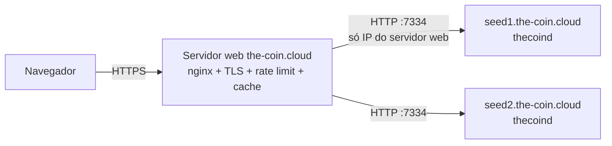

# The Coin — API REST do nó (`/api/v1`)

Todo `thecoind` expõe uma API HTTP/JSON (`crates/node/src/rpc.rs`) usada pela
carteira de referência, pelo explorador e pelo site the-coin.cloud. Os tipos
JSON estão em `crates/core/src/api.rs` e podem ser reutilizados por clientes Rust.

* Endereço padrão: `http://127.0.0.1:7334` (mainnet), `:17334` (testnet), `:27334` (regtest). Configurável em `[rpc] listen`.
* Salvo indicação, os exemplos são respostas de um nó **regtest** v0.2 (os
  comandos usam a porta da mainnet por clareza). A regtest **não** acompanhou a
  mudança para blocos de 15 s: continua com blocos de 60 s, recompensa de 40 TCN,
  halving a cada 150 blocos, cooldown de recompensas de 5/12 blocos, reorganização
  máxima de 720 blocos e parâmetros de taxa 10× menores.
* Exemplos marcados **testnet** ou **mainnet** usam os parâmetros de consenso
  atuais dessas redes: blocos de **15 s**, recompensa de **10 TCN**, halving a
  cada 2 500 000 blocos, cooldown de **400/4 000** blocos e reorganização máxima
  de **2 880** blocos (≈ 12 h). Ver [PROTOCOL.md §10](PROTOCOL.md#10-emissão-e-recompensas).

## Convenções

| Item | Formato |
|---|---|
| Valores | inteiros em **motes** (1 TCN = 100 000 000). O supply máximo (5·10¹⁵) cabe em inteiro seguro de JavaScript |
| Hashes / ids | hex minúsculo, 64 caracteres |
| Endereços | bech32m (`tc1…`, `tct1…`, `tcr1…`) — endereços de outra rede são rejeitados |
| Memos | `memo_hex` sempre; `memo_text` quando é UTF‑8 válido e não vazio |
| Valores TCCL | texto: inteiros em decimal, `bytes` como `0x…`, endereços bech32m, listas `[a, b]`, texto entre aspas em `init_args`/`args` |
| Erros | status HTTP + `{"error": "mensagem"}` (exceção: parâmetros de *query string* com tipo errado em `/blocks` e `/address/{addr}/txs`, ex. `limit=abc`, recebem a mensagem de texto simples do framework) |

| Status | Quando |
|---|---|
| 200 | sucesso |
| 400 | parâmetro inválido, transação rejeitada |
| 404 | objeto não encontrado (ou corpo de bloco podado, ver abaixo) |
| 408 | requisição passou de 20 s |
| 500 | erro interno/armazenamento |

### Proteções embutidas

* timeout de 20 s por requisição (→ 408);
* corpo máximo de 256 KiB (cabe um `Deploy` de 64 kB em hex);
* limite global de concorrência `rpc.max_concurrency` (padrão 64);
* CORS: métodos `GET, POST, OPTIONS`, qualquer cabeçalho; origens em `rpc.cors_origins` (padrão `["*"]`).

O nó **nunca guarda chaves privadas de usuários**: a única escrita é o envio de
transações já assinadas (`POST /api/v1/tx`). `POST /api/v1/tx/simulate` e
`POST /api/v1/program/{addr}/view` são leituras.

### Nós podados (padrão) e nós arquivo

O nó **poda por padrão** (`[storage] prune = true`):
guarda os corpos dos últimos `prune_keep` blocos (padrão 40 320 ≈ uma semana;
valores abaixo de 1 000 são elevados a 1 000) e apaga dos mais antigos o
corpo, as entradas do índice de transações e os recibos. Cabeçalhos e o estado
completo são sempre mantidos. Um **nó arquivo** (`prune = false`, instalador
com `--archive`) guarda tudo. Diferenças na API:

| Endpoint | Nó podado | Nó arquivo |
|---|---|---|
| `GET /api/v1/blocks` | completo (só usa cabeçalhos) | completo |
| `GET /api/v1/block/{id}` | blocos antigos → 404 `"block body pruned on this node"` | completo |
| `GET /api/v1/tx/{txid}` | transação em bloco podado → 404 `"transaction not found"` (o índice foi apagado junto com o corpo) | completo |
| `GET /api/v1/address/{addr}/txs` | **sempre** 400 `"address index disabled on this node (pruned nodes do not keep it)"` — o índice de endereços é desligado ao abrir o banco | completo (com `address_index = true`) |
| demais (estado, contratos, governança, mempool, `security`…) | completos | completos |

Exploradores, carteiras leves e o site devem consultar **nós arquivo**
(ver [OPERATIONS.md](OPERATIONS.md)).

---

## Índice de endpoints

| Método | Caminho | Descrição |
|---|---|---|
| GET | `/` | identificação do nó |
| GET | `/api/v1/status` | estado geral da cadeia e do nó (inclui a altura final) |
| GET | `/api/v1/supply` | emissão e supply |
| GET | `/api/v1/fees` | parâmetros de taxa, congestionamento e prioridades |
| GET | `/api/v1/blocks` | lista de blocos recentes |
| GET | `/api/v1/block/{altura\|hash}` | bloco completo com tios, finalidade, transações e recibos |
| GET | `/api/v1/tx/{txid}` | transação (confirmada ou no mempool) com recibo |
| POST | `/api/v1/tx` | envia transação assinada |
| POST | `/api/v1/tx/simulate` | executa uma transação assinada sem gravar (combustível, eventos, erros) |
| GET | `/api/v1/address/{addr}` | saldo, nonce, bloqueios, recompensas em cooldown |
| GET | `/api/v1/address/{addr}/txs` | histórico do endereço (só nós arquivo) |
| GET | `/api/v1/contract/{id}` | contrato de pagamento nativo |
| GET | `/api/v1/program/{addr}` | contrato TCCL: metadados, código/atualização, saldo, depósito e interface |
| POST | `/api/v1/program/{addr}/view` | chama uma `view` de um contrato TCCL |
| GET | `/api/v1/governance/proposals` | todas as propostas |
| GET | `/api/v1/governance/proposal/{id}` | uma proposta |
| GET | `/api/v1/governance/params` | parâmetros atuais e limites |
| GET | `/api/v1/mempool` | resumo do mempool |
| GET | `/api/v1/security?amount=` | confirmações recomendadas para um valor (considera a finalidade) |
| GET | `/api/v1/alerts` | tentativas de gasto duplo vistas pelo nó |
| GET | `/api/v1/peers` | peers conectados |
| GET | `/api/v1/mining` | estado do minerador local |

---

## `GET /`

```bash
curl http://127.0.0.1:7334/
```

```json
{
  "docs": "https://the-coin.cloud/docs/api",
  "name": "The Coin node",
  "network": "regtest",
  "protocol": 1,
  "version": "0.2.0"
}
```

## `GET /api/v1/status`

```bash
curl http://127.0.0.1:7334/api/v1/status
```

```json
{
  "network": "regtest",
  "version": "0.2.0",
  "genesis": "7022c9deda5f997eed99a09ca77ad4c48dcb1f5a8ab892adc0a4a180c19622cd",
  "height": 92,
  "tip": "0c29a1ed55f564d266b4fe81993c62a184329956c71bc3d1a544528c1cc18203",
  "tip_timestamp": 1789308546,
  "chainwork": "5d",
  "difficulty": 1.0,
  "next_target": "ffffffffffffffffffffffffffffffffffffffffffffffffffffffffffffffff",
  "hashrate_estimate": 1.467741935483871,
  "peers": 0,
  "mempool_txs": 3,
  "mempool_bytes": 553,
  "syncing": false,
  "supply": {
    "max_supply": 5000000000000000,
    "emitted": 368000000000,
    "burned": 0,
    "circulating": 368000000000,
    "current_block_reward": 4000000000,
    "era": 0,
    "next_halving_height": 151,
    "halving_interval": 150,
    "target_block_time": 60
  },
  "params": {
    "max_block_bytes": 1000000,
    "max_block_fuel": 50000000,
    "base_fee": 100,
    "fee_per_kb": 1000,
    "fee_per_kfuel": 100,
    "storage_deposit_per_kb": 10000,
    "proposal_deposit": 100000000,
    "vote_period": 20,
    "quorum_bp": 1000,
    "approval_bp": 6667,
    "miner_approval_bp": 5000,
    "activation_delay": 5
  },
  "congestion_bp": 10000,
  "finalized_height": 0,
  "software_upgrade_required": null
}
```

| Campo | Significado |
|---|---|
| `chainwork` | trabalho acumulado do tip, incluindo o trabalho dos tios (hex, sem zeros à esquerda) |
| `difficulty` | `work(target)` do tip (hashes esperados por bloco) |
| `next_target` | alvo exigido para o próximo bloco (hex 64) |
| `hashrate_estimate` | H/s estimado pelos últimos 120 blocos |
| `syncing` | `true` durante a sincronização com um peer que está à frente |
| `supply.current_block_reward` / `era` / `next_halving_height` | referentes ao **próximo** bloco |
| `params` | parâmetros de governança em vigor ([PROTOCOL.md §20](PROTOCOL.md#20-parâmetros-por-rede)) |
| `congestion_bp` | multiplicador de congestionamento das taxas (10 000 = 1,0×) |
| `finalized_height` | altura do último bloco **finalizado pelos votos assinados dos mineradores**; blocos até essa altura são irreversíveis. `0` = nenhum ainda (ex.: rede com menos de 4 mineradores diferentes na janela, como esta regtest de um minerador só). Ver [`/security`](#get-apiv1securityamount) |
| `software_upgrade_required` | versão de uma proposta `SoftwareUpgrade` ativada mais nova que este nó, ou `null` |

## `GET /api/v1/supply`

Mesmo objeto `supply` do `/status`. Regtest:

```json
{
  "max_supply": 5000000000000000,
  "emitted": 432000000000,
  "burned": 0,
  "circulating": 432000000000,
  "current_block_reward": 4000000000,
  "era": 0,
  "next_halving_height": 151,
  "halving_interval": 150,
  "target_block_time": 60
}
```

Testnet (mesma emissão da mainnet: 10 TCN a cada 15 s = os mesmos 40 TCN por
minuto do antigo bloco de 60 s, com halving 4× mais espaçado em blocos):

```json
{
  "max_supply": 5000000000000000,
  "emitted": 1456000000000,
  "burned": 0,
  "circulating": 1456000000000,
  "current_block_reward": 1000000000,
  "era": 0,
  "next_halving_height": 2500001,
  "halving_interval": 2500000,
  "target_block_time": 15
}
```

`circulating = emitted − burned`. `burned` soma depósitos de propostas sem
quórum e sobretaxas de congestionamento. `circulating` inclui recompensas em
cooldown (de mineradores e de tios), depósitos de armazenamento e saldos de contratos.
`current_block_reward` é o subsídio inteiro da altura; quando o bloco carrega
tios, a parte deles sai desse valor (ver [`/block/{id}`](#get-apiv1blockid)).

## `GET /api/v1/fees`

```bash
curl http://127.0.0.1:7334/api/v1/fees
```

```json
{
  "base_fee": 100,
  "fee_per_kb": 1000,
  "fee_per_kfuel": 100,
  "storage_deposit_per_kb": 10000,
  "congestion_bp": 10000,
  "typical_transfer_fee": 260,
  "priority": { "low_bp": 10000, "normal_bp": 12500, "high_bp": 20000, "urgent_bp": 122500 },
  "mempool_txs": 5,
  "mempool_bytes": 1125
}
```

(Resposta com cinco chamadas de contrato de 10 000 000 de combustível no mempool, por isso `urgent_bp` alto.)

| Campo | Significado |
|---|---|
| `base_fee`, `fee_per_kb`, `fee_per_kfuel` | parâmetros de governança da taxa mínima |
| `storage_deposit_per_kb` | depósito reembolsável por kB de estado de contrato |
| `congestion_bp` | multiplicador atual; a parte acima de 1× é queimada |
| `typical_transfer_fee` | taxa mínima atual de uma transferência de 160 bytes |
| `priority` | multiplicadores (pontos-base) **sobre a taxa mínima** por nível |
| `mempool_txs`, `mempool_bytes` | tamanho do mempool |

Taxa de uma transação:

```
mínima = ceil((base_fee + ceil(size × fee_per_kb / 1000) + ceil(max_fuel × fee_per_kfuel / 1000)) × congestion_bp / 10000)
taxa   = ceil(mínima × priority_bp / 10000)
```

`low_bp = 10 000` e `normal_bp = 12 500` são fixos. `high_bp` =
`max(multiplicador necessário para entrar num bloco cheio de pendentes + 1 000, 20 000)`;
`urgent_bp` = `max(multiplicador para o primeiro quarto do bloco + 2 500, 2 × high_bp)`.
Exemplos e passo a passo: [WALLET_DEVELOPERS.md §4.4](WALLET_DEVELOPERS.md#44-calcular-a-taxa).

## `GET /api/v1/blocks`

| Query | Padrão | Descrição |
|---|---|---|
| `limit` | 20 | 1–100 |
| `before` | tip+1 | lista blocos com altura `< before` |

```bash
curl "http://127.0.0.1:7334/api/v1/blocks?limit=2&before=107"
curl "http://127.0.0.1:7334/api/v1/blocks?limit=2&before=105"    # página seguinte
```

```json
[
  {
    "height": 106,
    "hash": "9ab90d977596b12978da48f5d6e4145e6fd6ef6d1c52f105d103c31e7d717766",
    "prev_hash": "61274ea5fb564c42870419322e79dcbc5b360e046ce42a20efc183384bdd8312",
    "timestamp": 1789308559,
    "tx_count": 2,
    "size": 727,
    "miner": "tcr1fgy8fh9zunze8ctehqh695g79hyxna260ylvyh",
    "difficulty": 1.0,
    "signal": 2
  },
  {
    "height": 105,
    "hash": "61274ea5fb564c42870419322e79dcbc5b360e046ce42a20efc183384bdd8312",
    "prev_hash": "16bcf3faa8f291b41a827d7ba32e11b8577d016f24d21703219e4d9194fc0af6",
    "timestamp": 1789308556,
    "tx_count": 0,
    "size": 252,
    "miner": "tcr1fgy8fh9zunze8ctehqh695g79hyxna260ylvyh",
    "difficulty": 1.0,
    "signal": 2
  }
]
```

Cada item é um resumo (só o cabeçalho): `size` é o tamanho Borsh do bloco
inteiro (cabeçalho de 244 bytes + transações + tios; um bloco vazio tem 252
bytes). Tios e finalidade só aparecem em [`/block/{id}`](#get-apiv1blockid).
Funciona igual em nós podados.

## `GET /api/v1/block/{id}`

`{id}` = altura (cadeia principal) ou hash (qualquer bloco armazenado). Bloco
real com duas chamadas de contrato no mesmo bloco — a segunda **falhou**
porque a primeira zerou a permissão (`allowance`) que ela usaria. O campo
`signal: 2` mostra o minerador apoiando a proposta com `signal_bit` 1:

```bash
curl http://127.0.0.1:7334/api/v1/block/106
```

```json
{
  "height": 106,
  "hash": "9ab90d977596b12978da48f5d6e4145e6fd6ef6d1c52f105d103c31e7d717766",
  "prev_hash": "61274ea5fb564c42870419322e79dcbc5b360e046ce42a20efc183384bdd8312",
  "timestamp": 1789308559,
  "tx_count": 2,
  "size": 727,
  "miner": "tcr1fgy8fh9zunze8ctehqh695g79hyxna260ylvyh",
  "difficulty": 1.0,
  "signal": 2,
  "version": 1,
  "tx_root": "1b7a72054a5d3cd5134a2a2013a5eb96b4719b2ff4d3986523aca5aa88e6d0df",
  "state_root": "27f1fbc9bc1076915d367ff567456487011c9c69c3d8f8f44cfd6dc16cae9df9",
  "target": "ffffffffffffffffffffffffffffffffffffffffffffffffffffffffffffffff",
  "nonce": "8687394620914278246",
  "confirmations": 3,
  "finalized": false,
  "subsidy": 4000000000,
  "fees": 5069,
  "uncles": [],
  "txs": [
    {
      "txid": "f8efe16f3e07abce40a046b31fab3aca4b2f9d59e413b2e16d9e09e706b4cc9b",
      "sender": "tcr1fgy8fh9zunze8ctehqh695g79hyxna260ylvyh",
      "nonce": 15,
      "fee": 3780,
      "expiry_height": 0,
      "size": 224,
      "action": {
        "type": "invoke",
        "contract": "tcr1nlak75fjnu8ez5g4c54yprf22ez02l7rn2ahqh",
        "function": "approve",
        "args": ["tcr1fexczggrd9s5af9fgu2dje00v5v8s6au7l8s8r", "0"],
        "value": 0,
        "max_fuel": 6201,
        "max_deposit": 100000000
      },
      "block_height": 106,
      "block_hash": "9ab90d977596b12978da48f5d6e4145e6fd6ef6d1c52f105d103c31e7d717766",
      "position": 0,
      "confirmations": 3,
      "in_mempool": false,
      "created": null,
      "replaceable": false,
      "success": true,
      "error": null,
      "fuel_used": 924,
      "burned": 0,
      "logs": [
        {
          "contract": "tcr1nlak75fjnu8ez5g4c54yprf22ez02l7rn2ahqh",
          "event": "Approval",
          "fields": [
            ["holder", "tcr1fgy8fh9zunze8ctehqh695g79hyxna260ylvyh"],
            ["spender", "tcr1fexczggrd9s5af9fgu2dje00v5v8s6au7l8s8r"],
            ["amount", "0"]
          ]
        }
      ],
      "program": null,
      "return_value": null,
      "conflict": null
    },
    {
      "txid": "4df1c69956d72a5f393febe21ebb22b49851cea2ee247b2c51da9a11fe57a670",
      "sender": "tcr1fexczggrd9s5af9fgu2dje00v5v8s6au7l8s8r",
      "nonce": 0,
      "fee": 1289,
      "expiry_height": 0,
      "size": 251,
      "action": {
        "type": "invoke",
        "contract": "tcr1nlak75fjnu8ez5g4c54yprf22ez02l7rn2ahqh",
        "function": "transfer_from",
        "args": ["tcr1fgy8fh9zunze8ctehqh695g79hyxna260ylvyh", "tcr1fexczggrd9s5af9fgu2dje00v5v8s6au7l8s8r", "100"],
        "value": 0,
        "max_fuel": 9378,
        "max_deposit": 100000000
      },
      "block_height": 106,
      "block_hash": "9ab90d977596b12978da48f5d6e4145e6fd6ef6d1c52f105d103c31e7d717766",
      "position": 1,
      "confirmations": 3,
      "in_mempool": false,
      "created": null,
      "replaceable": false,
      "success": false,
      "error": "requirement failed: allowance too low",
      "fuel_used": 423,
      "burned": 0,
      "logs": [],
      "program": null,
      "return_value": null,
      "conflict": null
    }
  ]
}
```

> `nonce` do cabeçalho é enviado como **string decimal**: é um `u64` e pode
> passar do maior inteiro seguro de JavaScript (2⁵³).

Exemplo ilustrativo com parâmetros da **testnet** (10 TCN, montado a partir do
código; hashes fictícios) de um bloco que carrega um tio — um bloco válido da
altura anterior que perdeu a corrida — e já foi finalizado pelos mineradores:

```json
{
  "height": 1312,
  "hash": "988a118eec56eb810659c1f300090890435a8ed98c9a361d5456eb20cb1e5498",
  "prev_hash": "f35246b8b0648f4c3ffd46a5af5a809b9f4cccce2eaa0a7c6402d0a146fd0b2c",
  "timestamp": 1789636513,
  "tx_count": 0,
  "size": 496,
  "miner": "tct14n7m9yus2qhemda3r7kmpshzkhec2w6vxg82dl",
  "difficulty": 641.0,
  "signal": 0,
  "version": 1,
  "tx_root": "5740f3f044b5290cbda05ef48cf56fad55c4cab20e8202b66cbb84c7968e9fc1",
  "state_root": "b21a7ff8103bc4f2508b2fe33c265297d74d86a3ae1ec186a4005159def57803",
  "target": "0065a62caf8cb27f1228de4af510b9b0df47f7292cbab7bf5dedc41d0c1a0980",
  "nonce": "4403291887150662017",
  "confirmations": 145,
  "finalized": true,
  "subsidy": 1000000000,
  "fees": 0,
  "uncles": [
    {
      "hash": "06b3e6cfc0f647cad69cf4a612ca63b5a7fed31c5d12df064016f13977b59495",
      "height": 1311,
      "miner": "tct1mwpgea9kf5s47tn7u40wrhj40hn7qp6felnt8p",
      "depth": 1,
      "reward": 250000000
    }
  ],
  "txs": []
}
```

| Campo | Significado |
|---|---|
| `confirmations` | `tip − height + 1` na cadeia principal; `0` para blocos fora dela |
| `finalized` | `true` quando o bloco está na cadeia principal e `height ≤ finalized_height` (do `/status`): os votos assinados dos mineradores o tornaram **irreversível** |
| `subsidy` | subsídio **inteiro** da altura (inclui a parte paga aos tios) |
| `fees` | soma das taxas pagas pelas transações (antes da queima) |
| `uncles` | até 2 tios carregados pelo bloco ([PROTOCOL.md §6.3](PROTOCOL.md#63-tios-uncles-)) |
| `uncles[].hash`, `height`, `miner` | cabeçalho do tio: hash, altura e minerador que o encontrou |
| `uncles[].depth` | `height do bloco − height do tio` (1 a 6) |
| `uncles[].reward` | parte do subsídio paga ao minerador do tio: `floor(subsidy × (7 − depth) / 24)` (25 % em `depth = 1`, 4 % em `depth = 6`) |

O minerador do bloco recebe `subsidy − Σ uncles[].reward + fees − Σ burned`;
os mineradores dos tios recebem `reward`. Tudo passa pelo cooldown
(`immature` em [`/address/{addr}`](#get-apiv1addressaddr)). Em nó podado,
blocos antigos retornam 404 `"block body pruned on this node"`.

## `GET /api/v1/tx/{txid}`

Procura primeiro no mempool, depois na cadeia principal. Transações
confirmadas trazem os dados do **recibo** de execução. Em nó podado, transações
de blocos mais antigos que `prune_keep` retornam 404 `"transaction not found"`.

```bash
curl http://127.0.0.1:7334/api/v1/tx/9694e053755c0f187f71b87326daab7a6ac6af95a4d6a39864207da8ae1f5f7e
```

Implantação de contrato TCCL (código-fonte abreviado aqui):

```json
{
  "txid": "9694e053755c0f187f71b87326daab7a6ac6af95a4d6a39864207da8ae1f5f7e",
  "sender": "tcr1fgy8fh9zunze8ctehqh695g79hyxna260ylvyh",
  "nonce": 1,
  "fee": 4619,
  "expiry_height": 0,
  "size": 1860,
  "action": {
    "type": "deploy",
    "source": "# A simple fungible token with a fixed maximum supply.\ncontr...",
    "source_hash": "27a5cc37e896a9484e51fcf9405f5716fe8051b9b9ff6657fd13b1cbb7076157",
    "init_args": [],
    "value": 0,
    "max_fuel": 17350,
    "max_deposit": 100000000
  },
  "block_height": 66,
  "block_hash": "65a8398dacad8ce897e866f81b6fa873ad08c187f5ccf1ee30bdcf73d6fbd768",
  "position": 0,
  "confirmations": 27,
  "in_mempool": false,
  "created": null,
  "replaceable": false,
  "success": true,
  "error": null,
  "fuel_used": 9500,
  "burned": 0,
  "logs": [],
  "program": "tcr1nlak75fjnu8ez5g4c54yprf22ez02l7rn2ahqh",
  "return_value": null,
  "conflict": null
}
```

Transferência pendente, substituível, com memo vazio:

```json
{
  "txid": "40a783d9495893893dd0ed6772a02002681de3c1cee2a8925f62568e273297ec",
  "sender": "tcr1fgy8fh9zunze8ctehqh695g79hyxna260ylvyh",
  "nonce": 13,
  "fee": 259,
  "expiry_height": 0,
  "size": 159,
  "action": {
    "type": "transfer",
    "to": "tcr1fexczggrd9s5af9fgu2dje00v5v8s6au7l8s8r",
    "amount": 100000000,
    "memo_hex": "",
    "memo_text": null
  },
  "block_height": null,
  "block_hash": null,
  "position": null,
  "confirmations": 0,
  "in_mempool": true,
  "created": null,
  "replaceable": true,
  "success": true,
  "error": null,
  "fuel_used": 0,
  "burned": 0,
  "logs": [],
  "program": null,
  "return_value": null,
  "conflict": null
}
```

Transação pendente com **tentativa de gasto duplo** (outra transação do mesmo
remetente e nonce foi recusada):

```json
{
  "txid": "f5ac06fe273eef17a173cc6b4999d0adfe02eeebe5ef85721a45ff57f8a7acbf",
  "sender": "tcr1fgy8fh9zunze8ctehqh695g79hyxna260ylvyh",
  "nonce": 12,
  "fee": 335,
  "expiry_height": 0,
  "size": 168,
  "action": {
    "type": "transfer",
    "to": "tcr1fexczggrd9s5af9fgu2dje00v5v8s6au7l8s8r",
    "amount": 200000000,
    "memo_hex": "706167616d656e746f",
    "memo_text": "pagamento"
  },
  "block_height": null,
  "block_hash": null,
  "position": null,
  "confirmations": 0,
  "in_mempool": true,
  "created": null,
  "replaceable": false,
  "success": true,
  "error": null,
  "fuel_used": 0,
  "burned": 0,
  "logs": [],
  "program": null,
  "return_value": null,
  "conflict": "4d53d4d9c058ba72059c76752a2c27a178c38a5a1e9896a2ead43f9d2c48cfc7"
}
```

| Campo | Significado |
|---|---|
| `position` | índice da transação dentro do bloco (`null` no mempool) |
| `created` | id do contrato nativo ou da proposta criado pela transação (também no mempool — o id é determinístico) |
| `replaceable` | o remetente usou `FLAG_REPLACEABLE`: pode trocá-la por outra com taxa ≥ 125 % enquanto pendente |
| `success` | `false` só para `deploy`/`invoke`/`upgrade` confirmadas cujo código falhou (taxa cobrada, efeitos revertidos) |
| `error` | motivo da falha do contrato |
| `fuel_used` | combustível consumido (a taxa foi calculada sobre `max_fuel`); em `deploy`/`upgrade` inclui a compilação (5 por byte de fonte) |
| `burned` | parte da taxa queimada pela sobretaxa de congestionamento |
| `logs` | eventos `emit` do contrato; `fields` como pares `[nome, valor em texto]` |
| `program` | endereço do contrato TCCL criado por um `deploy` (no mempool: o endereço previsto; confirmado: só se teve sucesso) |
| `return_value` | valor retornado pela ação, em texto, ou `null` |
| `conflict` | txid de outra transação vista com o mesmo remetente e nonce (possível gasto duplo), ou `null` |

### Formatos de `action`

`type` é um de `transfer`, `batch_transfer`, `create_contract`,
`call_contract`, `propose`, `vote`, `deploy`, `invoke`, `upgrade`,
`set_upgrade_authority`:

```json
{ "type": "batch_transfer", "outputs": [{"to": "tc1…", "amount": 100}], "total": 100, "memo_hex": "", "memo_text": null }
{ "type": "create_contract", "spec": { "kind": "escrow", "payee": "tcr1…", "arbiter": null, "amount": 1000000000, "deadline_height": 125 } }
{ "type": "call_contract", "contract": "ba95…", "call": { "call": "multisig_close" } }
{ "type": "propose", "title": "Reduzir fee_per_kb para 500", "url": "https://the-coin.cloud/governance/1", "content_hash": "00…", "action": { "type": "set_param", "param": "fee_per_kb", "value": 500 } }
{ "type": "vote", "proposal": "b7a2…", "choice": "yes", "weight": 100000000000 }
{ "type": "deploy", "source": "contract …", "source_hash": "27a5…", "init_args": [], "value": 0, "max_fuel": 17350, "max_deposit": 100000000 }
{ "type": "invoke", "contract": "tcr1dk4rd49asu34c6dxa23t68xa9qv0e4tm0mz68t", "function": "withdraw",
  "args": ["tcr1fexczggrd9s5af9fgu2dje00v5v8s6au7l8s8r", "tcr1fgy8fh9zunze8ctehqh695g79hyxna260ylvyh", "10000000", "[1, 0, 2]", "0xb7bd…", "0x4ad1…"],
  "value": 0, "max_fuel": 56885, "max_deposit": 100000000 }
{ "type": "upgrade", "contract": "tcr1nlak75fjnu8ez5g4c54yprf22ez02l7rn2ahqh", "source": "contract SimpleToken …",
  "source_hash": "314092dd12885016c8cadcf456ed7420c6b0d97c9bd8d7d55cf6f7f2a51610fc",
  "expected_code_hash": "9b8a58b37f7fad9b1c70f62afc2ef06a7c03a3c32773b3f38655f1810d974849",
  "args": [], "max_fuel": 40000, "max_deposit": 100000000 }
{ "type": "set_upgrade_authority", "contract": "tcr1nlak75fjnu8ez5g4c54yprf22ez02l7rn2ahqh", "new_authority": null,
  "expected_code_hash": "17d95da051d4f1cd09c0eaee4ac7e5fbde0a9d014c2096a294c4b28d36a1cac9" }
```

Ações de atualização de contratos TCCL ([PROTOCOL.md §17](PROTOCOL.md#17-contratos-inteligentes-tccl)):

| Campo | Significado |
|---|---|
| `upgrade.contract` / `set_upgrade_authority.contract` | endereço do contrato TCCL |
| `upgrade.source`, `source_hash` | novo código-fonte e seu `tagged_hash("tccl-source", source)` |
| `expected_code_hash` | `code_hash` do código **atual** (de [`/program/{addr}`](#get-apiv1programaddr)); se o contrato mudou desde que a transação foi preparada, ela falha |
| `upgrade.args` | argumentos (em texto) da função `upgrade()` do novo código, executada uma vez na mesma transação; vazio se ela não existe |
| `upgrade.max_fuel`, `max_deposit` | como em `invoke`; não há `value` |
| `new_authority` | nova autoridade de atualização, ou `null` para tornar o contrato **final para sempre** |

Só a autoridade de atualização (`upgrade_authority`) consegue executar essas
ações. Um `upgrade` que falha (remetente sem autoridade, contrato final,
`expected_code_hash` diferente, erro de compilação, atualização incompatível com
o armazenamento, falha em `upgrade()`) fica na cadeia com `success: false` (taxa
cobrada, código antigo mantido). `set_upgrade_authority` é uma ação nativa: se inválida, a
transação é recusada (`400`) e não entra em bloco.

`spec.kind`: `escrow`, `vesting`, `subscription`, `htlc`, `multisig`.
`call.call`: `escrow_release`, `escrow_refund`, `vesting_claim`,
`vesting_revoke`, `subscription_claim`, `subscription_cancel`, `htlc_redeem`
(com `preimage_hex`), `htlc_refund`, `multisig_deposit` (com `amount`),
`multisig_propose` (com `to`, `amount`, `memo_hex`, `memo_text`),
`multisig_approve`, `multisig_cancel` (com `spend_id`), `multisig_close`.
Proposta `action.type`: `text`, `set_param`, `software_upgrade`.

## `POST /api/v1/tx`

Corpo: `{"tx": "<Transaction em Borsh, hex>"}`. A transação é validada
completamente contra o estado (assinatura, flags, nonce, saldo, taxa, regras do
contrato/governança; `deploy` e `invoke` enviados por esta API são **executados uma vez**
e recusados se falhariam agora), entra no mempool e é propagada. Um `upgrade`
**não** é executado na admissão: meça-o antes com
[`POST /api/v1/tx/simulate`](#post-apiv1txsimulate). Transações
recebidas de outros nós não têm o código executado na admissão (só nonce, saldo e
taxa): o código roda ao entrar num bloco, e uma chamada que falha ali paga a taxa.

```bash
curl -X POST http://127.0.0.1:7334/api/v1/tx \
  -H 'content-type: application/json' \
  -d '{"tx":"0103004354000c000000000000004f010000000000000000000000000000004e4d81210369614ea4a94714d965ef6518786bbc00c2eb0b0000000009000000706167616d656e746fabb24395ded74b11e3bc5940ac6848fe05df1aded872086329076ecd3d1fcb50a001a2a157cd935b529a53c6ddc51aa56a202b98418ae67eeb7ab3e72e2e3cd98b78e985f8babf19fc133f1ded7eb54c99d0de7f9422ce2601da817eda68a207"}'
```

```json
{"txid":"f5ac06fe273eef17a173cc6b4999d0adfe02eeebe5ef85721a45ff57f8a7acbf"}
```

Erros típicos (HTTP 400):

```json
{"error":"malformed transaction: Unexpected length of input"}
{"error":"transaction already in mempool"}
{"error":"invalid transaction: bad nonce: expected 4, got 3"}
{"error":"invalid transaction: fee too low: minimum 2630, got 263"}
{"error":"invalid transaction: unknown transaction flags 0x4"}
{"error":"invalid transaction: insufficient funds: need 2500002630, spendable 100"}
{"error":"invalid transaction: governance error: proposal is not open for voting"}
{"error":"contract call would fail: requirement failed: insufficient token balance"}
{"error":"invalid transaction: contract error: only the upgrade authority can change it"}
{"error":"a transaction with this nonce is already pending (f5ac06fe273eef17a173cc6b4999d0adfe02eeebe5ef85721a45ff57f8a7acbf) and it is not replaceable — double spend attempt recorded"}
{"error":"replacement needs a fee at least 25% higher"}
{"error":"too many pending transactions from this sender"}
{"error":"mempool full and fee rate too low"}
```

Regras do mempool (política do nó, não consenso):

* até 32 transações pendentes por remetente; expiração em 72 h; limite de memória
  `mempool.max_mb` (32 MiB) com expulsão das de menor taxa por peso;
* ordenação por **taxa por unidade de peso** = `fee / (size + max_fuel / 100)`;
* **substituição (RBF) opt-in:** mesmo remetente e nonce só substitui se a
  original tem `replaceable: true` **e** a nova taxa é ≥ `taxa + floor(taxa/4)` (e maior);
* mesmo nonce de uma pendente **não** substituível → recusada, registrada em
  `/api/v1/alerts`, `conflict` preenchido nas duas e alerta `DoubleSpend` enviado aos peers;
* transações que ficam abaixo da taxa mínima porque o congestionamento subiu
  **permanecem** no mempool e voltam a ser incluídas quando ele cai;
* o mempool é gravado em `<data-dir>/mempool.dat` ao desligar e revalidado ao iniciar.

## `POST /api/v1/tx/simulate`

Executa uma transação **assinada** sobre o estado do tip (depois das pendentes
do mesmo remetente com nonce menor), como se entrasse no próximo bloco, sem
gravar nada nem propagar. Use para medir o combustível antes de enviar.

```bash
curl -X POST http://127.0.0.1:7334/api/v1/tx/simulate \
  -H 'content-type: application/json' -d '{"tx":"<hex>"}'
```

Chamada que funcionaria:

```json
{
  "valid": true,
  "invalid_reason": null,
  "success": true,
  "error": null,
  "fuel_used": 2225,
  "required_fee": 5325,
  "logs": [
    {
      "contract": "tcr1nlak75fjnu8ez5g4c54yprf22ez02l7rn2ahqh",
      "event": "Transfer",
      "fields": [
        ["from", "tcr1fexczggrd9s5af9fgu2dje00v5v8s6au7l8s8r"],
        ["to", "tcr1fgy8fh9zunze8ctehqh695g79hyxna260ylvyh"],
        ["amount", "10"]
      ]
    }
  ],
  "return_value": null,
  "program": null
}
```

Chamada válida cujo código falharia:

```json
{"valid":true,"invalid_reason":null,"success":false,"error":"requirement failed: insufficient token balance","fuel_used":421,"required_fee":5325,"logs":[],"return_value":null,"program":null}
```

Transação que não pode entrar num bloco:

```json
{"valid":false,"invalid_reason":"bad nonce: expected 12, got 1","success":false,"error":null,"fuel_used":0,"required_fee":3695,"logs":[],"return_value":null,"program":null}
```

| Campo | Significado |
|---|---|
| `valid` | passaria nas regras de inclusão (assinatura, nonce, saldo, taxa…) |
| `invalid_reason` | motivo quando `valid = false` |
| `success` / `error` | resultado da execução do contrato (ações nativas: sempre `true` se válida) |
| `fuel_used` | combustível consumido; a carteira de referência reserva `fuel_used × 1,3 + 5 000` |
| `required_fee` | taxa mínima atual para o tamanho e o `max_fuel` **desta** transação |
| `logs`, `return_value` | eventos e retorno que a execução produziria |
| `program` | endereço do contrato para um `deploy` bem-sucedido |

## `GET /api/v1/address/{addr}`

```bash
curl http://127.0.0.1:7334/api/v1/address/tcr1fgy8fh9zunze8ctehqh695g79hyxna260ylvyh
```

```json
{
  "address": "tcr1fgy8fh9zunze8ctehqh695g79hyxna260ylvyh",
  "balance": 320909942360,
  "spendable": 320909942360,
  "locked": 0,
  "locked_until": 0,
  "nonce": 12,
  "next_nonce": 15,
  "immature": 41000007640,
  "mempool_txs": 3
}
```

| Campo | Significado |
|---|---|
| `balance` | saldo total (inclui `locked`) |
| `spendable` | gastável no **próximo** bloco |
| `locked`, `locked_until` | moedas bloqueadas por voto e altura final do bloqueio |
| `nonce` | transações confirmadas enviadas |
| `next_nonce` | nonce a usar na próxima transação, contando as pendentes no mempool |
| `immature` | recompensas de mineração ainda em cooldown, incluindo as recebidas como minerador de **tio** (não incluídas em `balance`): 25 % liberados após `coinbase_maturity` (400 blocos ≈ 100 min na mainnet/testnet; 5 na regtest), o resto após `reward_unlock_blocks` (4 000 blocos ≈ 16,7 h; 12 na regtest) |
| `mempool_txs` | transações deste remetente no mempool |

Endereços nunca usados retornam zeros (não 404). O endereço de um contrato TCCL
retorna o saldo do contrato.

## `GET /api/v1/address/{addr}/txs`

Histórico (mais recente primeiro) de transações que **tocam** o endereço: enviadas,
recebidas, contratos nativos em que ele é parte, chamadas que lhe pagam e
chamadas TCCL que lhe enviam TCN. Só funciona em **nós arquivo**
(`storage.prune = false`) com `storage.address_index = true` (padrão); nos demais
(inclusive em todo nó podado, que é o padrão) retorna 400
`"address index disabled on this node (pruned nodes do not keep it)"`.

| Query | Padrão | Descrição |
|---|---|---|
| `limit` | 25 | 1–100 |
| `cursor` | — | `altura:posição`; retorna entradas estritamente anteriores a esse ponto |

Sem `cursor`, a resposta começa pelas transações **enviadas** pelo endereço que
estão no mempool (`in_mempool: true`, com `created`/`program`/`conflict`). Cada item tem o formato de
`GET /api/v1/tx/{txid}`.

```bash
curl "http://127.0.0.1:7334/api/v1/address/tcr1fexczggrd9s5af9fgu2dje00v5v8s6au7l8s8r/txs?limit=3"
```

```json
[
  {
    "txid": "4df1c69956d72a5f393febe21ebb22b49851cea2ee247b2c51da9a11fe57a670",
    "sender": "tcr1fexczggrd9s5af9fgu2dje00v5v8s6au7l8s8r",
    "nonce": 0,
    "fee": 1289,
    "expiry_height": 0,
    "size": 251,
    "action": {
      "type": "invoke",
      "contract": "tcr1nlak75fjnu8ez5g4c54yprf22ez02l7rn2ahqh",
      "function": "transfer_from",
      "args": ["tcr1fgy8fh9zunze8ctehqh695g79hyxna260ylvyh", "tcr1fexczggrd9s5af9fgu2dje00v5v8s6au7l8s8r", "100"],
      "value": 0,
      "max_fuel": 9378,
      "max_deposit": 100000000
    },
    "block_height": 106,
    "block_hash": "9ab90d977596b12978da48f5d6e4145e6fd6ef6d1c52f105d103c31e7d717766",
    "position": 1,
    "confirmations": 3,
    "in_mempool": false,
    "created": null,
    "replaceable": false,
    "success": false,
    "error": "requirement failed: allowance too low",
    "fuel_used": 423,
    "burned": 0,
    "logs": [],
    "program": null,
    "return_value": null,
    "conflict": null
  },
  {
    "txid": "327bb870c3f626feba801b911f85d95b193a62b81415c225c4fb93217757aebb",
    "sender": "tcr1fgy8fh9zunze8ctehqh695g79hyxna260ylvyh",
    "nonce": 13,
    "fee": 518,
    "size": 159,
    "action": {
      "type": "transfer",
      "to": "tcr1fexczggrd9s5af9fgu2dje00v5v8s6au7l8s8r",
      "amount": 100000000,
      "memo_hex": "",
      "memo_text": null
    },
    "block_height": 93,
    "position": 1,
    "replaceable": true,
    "…": "demais campos como acima"
  }
]
```

> **Paginação:** para a próxima página use
> `cursor=<block_height>:<position>` da **última** entrada recebida
> (ex.: `?limit=25&cursor=93:1`). Entradas de mempool não têm `position` e só
> aparecem na primeira página.

## `GET /api/v1/contract/{id}`

Contrato de pagamento nativo (escrow, vesting, subscription, HTLC, multisig).

```bash
curl http://127.0.0.1:7334/api/v1/contract/ba959f4d8a01e48e29a3bf4c84aefbca3522eb36a472ecebe27734b06cf1b2cc
```

```json
{
  "id": "ba959f4d8a01e48e29a3bf4c84aefbca3522eb36a472ecebe27734b06cf1b2cc",
  "creator": "tcr1fgy8fh9zunze8ctehqh695g79hyxna260ylvyh",
  "created_height": 89,
  "balance": 500000000,
  "deposit": 10000,
  "state": {
    "kind": "multisig",
    "signers": ["tcr1fgy8fh9zunze8ctehqh695g79hyxna260ylvyh", "tcr1fexczggrd9s5af9fgu2dje00v5v8s6au7l8s8r"],
    "threshold": 2,
    "next_spend_id": 0,
    "pending": []
  }
}
```

`deposit` é o depósito de armazenamento reembolsável, devolvido ao criador
quando o contrato termina (ou quando um multisig vazio é fechado com
`multisig_close`). Formatos de `state` para os outros tipos:

```json
{ "kind": "escrow", "payer": "…", "payee": "…", "arbiter": null, "deadline_height": 0 }
{ "kind": "vesting", "beneficiary": "…", "total": 0, "claimed": 0, "vested_now": 0, "start_height": 0, "cliff_height": 0, "end_height": 0, "revocable": false }
{ "kind": "subscription", "payer": "…", "payee": "…", "amount_per_period": 0, "period_blocks": 0, "max_periods": 0, "start_height": 0, "claimed_periods": 0, "claimable_periods_now": 0 }
{ "kind": "htlc", "sender": "…", "recipient": "…", "hash_lock": "…", "timeout_height": 0 }
{ "kind": "multisig", "signers": ["…"], "threshold": 2, "next_spend_id": 1,
  "pending": [{ "id": 0, "to": "…", "amount": 0, "memo_hex": "", "approvals": ["…"], "created_height": 0 }] }
```

`vested_now` e `claimable_periods_now` são calculados para a altura `tip + 1`.
Contratos finalizados são removidos do estado → 404
`"contract not found (it may have been completed)"`; o histórico continua
disponível pelas transações.

## `GET /api/v1/program/{addr}`

Contrato inteligente TCCL: metadados, versão do código e autoridade de atualização, saldo, uso de armazenamento, depósito e interface pública.

```bash
curl http://127.0.0.1:7334/api/v1/program/tcr1nlak75fjnu8ez5g4c54yprf22ez02l7rn2ahqh
```

```json
{
  "address": "tcr1nlak75fjnu8ez5g4c54yprf22ez02l7rn2ahqh",
  "name": "SimpleToken",
  "creator": "tcr1fgy8fh9zunze8ctehqh695g79hyxna260ylvyh",
  "created_height": 66,
  "deploy_txid": "9694e053755c0f187f71b87326daab7a6ac6af95a4d6a39864207da8ae1f5f7e",
  "source_hash": "27a5cc37e896a9484e51fcf9405f5716fe8051b9b9ff6657fd13b1cbb7076157",
  "balance": 0,
  "state_bytes": 1376,
  "storage_items": 6,
  "deposit": 20000,
  "code_hash": "032a567de6636ff40016a0d3e5b544b344264239189abc8d7e7909cbf58d3a49",
  "upgrade_authority": "tcr1fgy8fh9zunze8ctehqh695g79hyxna260ylvyh",
  "code_version": 1,
  "language": 2,
  "functions": [
    { "name": "init", "kind": "init", "payable": false, "params": [], "returns": "nothing" },
    { "name": "mint", "kind": "action", "payable": false, "params": [["to", "address"], ["amount", "int"]], "returns": "nothing" },
    { "name": "transfer", "kind": "action", "payable": false, "params": [["to", "address"], ["amount", "int"]], "returns": "nothing" },
    { "name": "approve", "kind": "action", "payable": false, "params": [["spender", "address"], ["amount", "int"]], "returns": "nothing" },
    { "name": "transfer_from", "kind": "action", "payable": false, "params": [["holder", "address"], ["to", "address"], ["amount", "int"]], "returns": "nothing" },
    { "name": "balance_of", "kind": "view", "payable": false, "params": [["who", "address"]], "returns": "int" },
    { "name": "allowance", "kind": "view", "payable": false, "params": [["holder", "address"], ["spender", "address"]], "returns": "int" }
  ]
}
```

| Campo | Significado |
|---|---|
| `deploy_txid` | transação que instalou o código **atual**: o `deploy` original ou o último `upgrade` |
| `source_hash` | `tagged_hash("tccl-source", source)` do código atual; o código-fonte está na transação `deploy_txid` |
| `balance` | TCN do contrato (a conta no mesmo endereço) |
| `state_bytes`, `storage_items` | bytes do código compilado + armazenamento, e número de entradas |
| `deposit` | depósito reembolsável = `ceil(state_bytes / 1000) × storage_deposit_per_kb` (aqui 2 kB × 10 000) |
| `code_hash` | `tagged_hash("program-code", código compilado)` — o valor a usar em `expected_code_hash` de `upgrade`/`set_upgrade_authority` |
| `upgrade_authority` | endereço que pode substituir o código ou passar/abrir mão da autoridade; `null` = contrato **final** (implantado com `FLAG_FINAL_DEPLOY` ou autoridade abandonada): o código nunca mais muda |
| `code_version` | 1 no deploy original, +1 a cada `upgrade` bem-sucedido |
| `language` | versão da linguagem TCCL do código armazenado (novos deploys: 2; contratos antigos da versão 1 continuam rodando) |
| `functions[].kind` | `init`, `action` (chamável por transação `invoke`), `view` (leitura grátis) ou `upgrade` (roda uma vez dentro do `upgrade` que instala esse código); funções internas não aparecem |
| `functions[].params` | pares `[nome, tipo]`; tipos: `int`, `bool`, `text`, `bytes`, `address`, `list[T]`, e na versão 2 também nomes de registros, enums e interfaces declarados no contrato; `returns` usa os mesmos nomes (`nothing` = sem retorno) |

Contrato inexistente ou destruído → 404 `"no contract at this address (it may have been destroyed)"`.

## `POST /api/v1/program/{addr}/view`

Chama uma função `view` sem transação e sem custo, no estado do tip (altura de
contexto `tip + 1`, combustível máximo 2 000 000). Os argumentos são **texto**,
interpretados pelos tipos declarados.

```bash
curl -X POST http://127.0.0.1:7334/api/v1/program/tcr1nlak75fjnu8ez5g4c54yprf22ez02l7rn2ahqh/view \
  -H 'content-type: application/json' \
  -d '{"function":"balance_of","args":["tcr1fexczggrd9s5af9fgu2dje00v5v8s6au7l8s8r"]}'
```

```json
{"result":"2500","error":null,"fuel_used":274}
```

Outros exemplos reais (pool de privacidade):

```json
{"result":"1000000000","error":null,"fuel_used":23}                                  // {"function":"denomination"}
{"result":null,"error":"index 7 out of bounds (length 3)","fuel_used":274}            // {"function":"key_at","args":["7"]}
{"result":null,"error":"function 'transfer' cannot be called this way","fuel_used":0} // action chamada como view
```

| Campo | Significado |
|---|---|
| `function` | nome da view |
| `args` | lista de strings (opcional se não há parâmetros): `int` `42` ou `2.5tcn`, `bool` `true`, `text`, `bytes` `0x…`, `address` bech32m (também para parâmetros do tipo interface), `list[T]` `[1, 2]`. Parâmetros de registro ou enum não são aceitos por esta rota (400 `"argument 'x': arguments of type … are not supported"`) |
| `result` | valor retornado, em texto (`bytes` como `0x…`, listas como `[a, b]`) |
| `error` | erro da execução (a resposta ainda é 200) |

Erros de requisição → 400: `"unknown function 'nope'"`, `"balance_of expects 1 argument(s)"`,
`"argument 'who': invalid address '…'"`; contrato inexistente → 404.

## `GET /api/v1/governance/proposals`

Lista todas as propostas (mais recentes primeiro). Cada item tem o formato de
`/governance/proposal/{id}`.

## `GET /api/v1/governance/proposal/{id}`

Proposta em votação, logo depois de o minerador reiniciar com `--signal <id>`:

```json
{
  "id": "b7a2d3fee315ebe1697de557d8ca425afbbf8ad754a45336e393431f73b5c29f",
  "proposer": "tcr1fgy8fh9zunze8ctehqh695g79hyxna260ylvyh",
  "title": "Roadmap: fase 2 hibrida",
  "url": "https://the-coin.cloud/governance/2",
  "content_hash": "0000000000000000000000000000000000000000000000000000000000000000",
  "action": {
    "type": "text"
  },
  "deposit": 100000000,
  "created_height": 93,
  "end_height": 113,
  "signal_bit": 1,
  "status": "voting",
  "activation_height": null,
  "tally": {
    "yes": 0,
    "no": 0,
    "abstain": 0,
    "voters": 0,
    "miner_yes_blocks": 1,
    "miner_total_blocks": 1
  },
  "outcome": null,
  "projection": {
    "quorum_needed": 37600000000,
    "quorum_progress_bp": 0,
    "approval_bp": 0,
    "approval_needed_bp": 6667,
    "miner_approval_bp": 10000,
    "miner_approval_needed_bp": 5000,
    "blocks_left": 19
  }
}
```

Proposta encerrada (rejeitada por falta de quórum — depósito queimado):

```json
{
  "id": "34089bfe2b35260b485fdc6b6f2c384a97f56b50d56417c16a0bb34bb1b6017b",
  "proposer": "tcr1fgy8fh9zunze8ctehqh695g79hyxna260ylvyh",
  "title": "Reduzir fee_per_kb para 500",
  "url": "https://the-coin.cloud/governance/1",
  "content_hash": "0000000000000000000000000000000000000000000000000000000000000000",
  "action": {
    "type": "set_param",
    "param": "fee_per_kb",
    "value": 500
  },
  "deposit": 100000000,
  "created_height": 92,
  "end_height": 112,
  "signal_bit": 0,
  "status": "rejected",
  "activation_height": null,
  "tally": { "yes": 0, "no": 0, "abstain": 0, "voters": 0, "miner_yes_blocks": 0, "miner_total_blocks": 20 },
  "outcome": {
    "quorum_reached": false,
    "holders_approved": false,
    "miners_approved": false,
    "circulating_at_end": 444000000000,
    "deposit_refunded": false
  },
  "projection": null
}
```

Proposta aprovada (1 000 TCN votando "sim", 20 de 20 blocos sinalizando) e já ativada, resumida:

```json
{"id": "b7a2d3fee315ebe1697de557d8ca425afbbf8ad754a45336e393431f73b5c29f", "title": "Roadmap: fase 2 hibrida", "status": "activated", "activation_height": 118, "tally": {"yes": 100000000000, "no": 0, "abstain": 0, "voters": 1, "miner_yes_blocks": 20, "miner_total_blocks": 20}, "outcome": {"quorum_reached": true, "holders_approved": true, "miners_approved": true, "circulating_at_end": 447900000000, "deposit_refunded": true}}
```

| Campo | Significado |
|---|---|
| `status` | `voting`, `approved`, `rejected`, `activated` |
| `activation_height` | para `approved`: altura prevista; para `activated`: altura em que ativou |
| `signal_bit` | bit que mineradores ligam em `header.signal` para apoiar |
| `projection` | só em `voting`: progresso em pontos-base (10 000 = 100 %) comparado aos limiares atuais; `quorum_progress_bp` é limitado a 10 000 |

## `GET /api/v1/governance/params`

```json
{
  "bounds": {
    "activation_delay": [1, 43200],
    "approval_bp": [5001, 10000],
    "base_fee": [0, 10000000],
    "fee_per_kb": [0, 100000000],
    "fee_per_kfuel": [0, 100000000],
    "max_block_bytes": [10000, 8000000],
    "max_block_fuel": [1000000, 500000000],
    "miner_approval_bp": [0, 10000],
    "proposal_deposit": [0, 100000000000000],
    "quorum_bp": [0, 10000],
    "storage_deposit_per_kb": [0, 1000000000],
    "vote_period": [5, 201600]
  },
  "current": {
    "activation_delay": 5,
    "approval_bp": 6667,
    "base_fee": 100,
    "fee_per_kb": 1000,
    "fee_per_kfuel": 100,
    "max_block_bytes": 1000000,
    "max_block_fuel": 50000000,
    "miner_approval_bp": 5000,
    "proposal_deposit": 100000000,
    "quorum_bp": 1000,
    "storage_deposit_per_kb": 10000,
    "vote_period": 20
  },
  "pending_activations": 0,
  "voting_proposals": 2
}
```

(Limites acima são os de regtest; ver [PROTOCOL.md §20](PROTOCOL.md#20-parâmetros-por-rede).)

## `GET /api/v1/mempool`

Até 100 transações, ordenadas por taxa por unidade de peso (maior primeiro).
Cada item tem o formato de `GET /api/v1/tx/{txid}` com `in_mempool: true`
(chaves em ordem alfabética nesta rota).

```json
{
  "bytes": 553,
  "count": 3,
  "txs": [
    {
      "action": {
        "amount": 100000000,
        "memo_hex": "",
        "memo_text": null,
        "to": "tcr1fexczggrd9s5af9fgu2dje00v5v8s6au7l8s8r",
        "type": "transfer"
      },
      "block_hash": null,
      "block_height": null,
      "burned": 0,
      "confirmations": 0,
      "conflict": null,
      "created": null,
      "error": null,
      "expiry_height": 0,
      "fee": 518,
      "fuel_used": 0,
      "in_mempool": true,
      "logs": [],
      "nonce": 13,
      "position": null,
      "program": null,
      "replaceable": true,
      "return_value": null,
      "sender": "tcr1fgy8fh9zunze8ctehqh695g79hyxna260ylvyh",
      "size": 159,
      "success": true,
      "txid": "327bb870c3f626feba801b911f85d95b193a62b81415c225c4fb93217757aebb"
    }
  ]
}
```

(Resposta abreviada: só a primeira das três transações — a substituta enviada por `bump-fee`.)
Como em `GET /api/v1/tx/{txid}`, `created`, `program` (endereço previsto de um
`deploy`) e `conflict` já vêm preenchidos para transações pendentes.

## `GET /api/v1/security?amount=`

Quantas confirmações esperar antes de confiar num pagamento. `amount` em motes (obrigatório).

```bash
curl "http://127.0.0.1:7334/api/v1/security?amount=50000000000"
```

**Testnet** sem finalidade no momento (um minerador só), 500 TCN:

```json
{
  "amount": 50000000000,
  "confirmations": 100,
  "minutes": 25,
  "value_per_block": 1000000000,
  "network_hashrate": 47.561306223043744,
  "blocks_to_finality": null,
  "explanation": "Reversing 100 block(s) means redoing their proof of work and giving up about 1000 TCN of rewards. For larger amounts wait for more confirmations; beyond 2880 blocks the chain never reorganizes."
}
```

**Mainnet** com os mineradores assinando blocos (último bloco final logo atrás
do tip), mesmo valor — exemplo montado a partir do código:

```json
{
  "amount": 50000000000,
  "confirmations": 2,
  "minutes": 1,
  "value_per_block": 1000000000,
  "network_hashrate": 18342.7,
  "blocks_to_finality": 2,
  "explanation": "The miners are signing blocks: this payment becomes irreversible about 2 block(s) after it is mined (roughly 30 seconds), whatever its value. Until then, reversing 100 block(s) means redoing their proof of work and giving up about 1000 TCN of rewards."
}
```

**Regtest** (40 TCN a cada 60 s, sem finalidade), mesmo valor:

```json
{
  "amount": 50000000000,
  "confirmations": 25,
  "minutes": 25,
  "value_per_block": 4000000000,
  "network_hashrate": 1.467741935483871,
  "blocks_to_finality": null,
  "explanation": "Reversing 25 block(s) means redoing their proof of work and giving up about 1000 TCN of rewards. For larger amounts wait for more confirmations; beyond 720 blocks the chain never reorganizes."
}
```

Cálculo:

```
value_per_block    = subsídio do próximo bloco (mínimo 1)
por_valor          = clamp(ceil(2 × amount / value_per_block), 1, max_reorg_depth)
finalizando        = existe bloco final e finalized_height + 20 ≥ altura do tip
blocks_to_finality = finalizando ? max(tip − finalized_height, 1) + 1 : null
confirmations      = blocks_to_finality ≠ null ? min(blocks_to_finality, por_valor) : por_valor
minutes            = ceil(confirmations × target_block_time / 60)
```

`max_reorg_depth` = **2 880** blocos na mainnet e na testnet (≈ 12 h) e 720 na
regtest.

| Campo | Significado |
|---|---|
| `confirmations` | confirmações recomendadas; com finalidade ativa, limitadas por `blocks_to_finality` |
| `minutes` | minutos aproximados até `confirmations` (arredondado para cima) |
| `value_per_block` | subsídio que um atacante abandona por bloco reescrito (motes; taxas não contam) |
| `network_hashrate` | H/s estimado pelos últimos 120 blocos |
| `blocks_to_finality` | blocos, a partir da inclusão, até o pagamento ficar **irreversível** pelos votos dos mineradores; `null` quando a rede não está finalizando agora (nenhum bloco final, o último ficou mais de 20 blocos para trás, ou há menos de 4 mineradores diferentes na janela de votação) |
| `explanation` | texto em inglês para mostrar ao usuário (as duas formas estão nos exemplos) |

Sem finalidade, um atacante que reescreve `N` blocos abandona cerca de `N`
recompensas e precisa superar a rede por esse tempo; a recomendação garante que
isso vale pelo menos o dobro do pagamento (500 TCN com recompensa de 10 TCN →
100 blocos ≈ 25 min na mainnet; com 40 TCN → 25 blocos na regtest). Com
finalidade, o pagamento vira irreversível cerca de 2 blocos depois de minerado
(≈ 30 s na mainnet), qualquer que seja o valor: os votos de dois terços dos
mineradores recentes o fixam e os nós recusam qualquer ramo que o descarte
(`finalized` em [`/block/{id}`](#get-apiv1blockid), `finalized_height` em
[`/status`](#get-apiv1status)). Com `amount=100000000` (1 TCN) a resposta é
`"confirmations": 1` em qualquer rede.

Erros (400): `{"error":"query parameter 'amount' (motes) is required"}` e
`{"error":"amount must be a whole number of motes"}`.

## `GET /api/v1/alerts`

Tentativas de gasto duplo vistas por este nó (mais recentes primeiro, até 512):
duas transações diferentes do mesmo remetente com o mesmo nonce, detectadas
localmente ou recebidas de peers (mensagem P2P `DoubleSpend`).

```bash
curl http://127.0.0.1:7334/api/v1/alerts
```

```json
[
  {
    "sender": "tcr1fgy8fh9zunze8ctehqh695g79hyxna260ylvyh",
    "nonce": 12,
    "first": "f5ac06fe273eef17a173cc6b4999d0adfe02eeebe5ef85721a45ff57f8a7acbf",
    "second": "4d53d4d9c058ba72059c76752a2c27a178c38a5a1e9896a2ead43f9d2c48cfc7",
    "seen_at": 1789308548
  }
]
```

`first` é a transação que ficou no mempool; `second`, a que tentou o mesmo nonce.
`seen_at` em segundos Unix. A lista fica em memória (reinicia com o nó).

## `GET /api/v1/peers`

```json
[
  { "addr": "203.0.113.10:7333", "inbound": false, "height": 1520, "user_agent": "/thecoind:0.2.0/", "connected_secs": 3605 }
]
```

(`height` é a maior altura conhecida do peer: anunciada no handshake ou vista em blocos recebidos dele.)

## `GET /api/v1/mining`

```json
{
  "enabled": true,
  "threads": 1,
  "address": "tcr1fgy8fh9zunze8ctehqh695g79hyxna260ylvyh",
  "hashrate": 0.0,
  "blocks_found": 3,
  "signal_proposals": [
    "b7a2d3fee315ebe1697de557d8ca425afbbf8ad754a45336e393431f73b5c29f"
  ]
}
```

`hashrate` = H/s do minerador local (média de 10 s). `blocks_found` conta blocos
locais que viraram tip. `signal_proposals` = ids de `[mining] signal` e das
opções `--signal` do `thecoind`.

---

## Expondo a API publicamente

A API escuta em `127.0.0.1` por padrão. Arquitetura recomendada para o site:



1. Nos nós seed, em `/etc/thecoin/thecoind.toml`:
   ```toml
   [rpc]
   listen = "0.0.0.0:7334"
   cors_origins = ["https://the-coin.cloud"]
   ```
2. Firewall liberando 7334 **apenas** para o IP do servidor web:
   ```bash
   sudo ufw allow from <IP_DO_SITE> to any port 7334 proto tcp
   ```
3. No servidor web use o `upstream` com os dois seeds e `location /api/` com
   `limit_req` (ex.: 10 req/s para leitura, 1 req/s para `POST /api/v1/tx`,
   `/tx/simulate` e `/program/*/view`), `client_max_body_size` compatível com o
   maior `Deploy` que quiser aceitar (a API aceita até 256 KiB) e cache curto de
   GETs. Uma configuração completa está em `website/nginx/the-coin.cloud.conf`.
4. Os seeds que atendem o site devem ser **nós arquivo** (`prune = false`, ou o
   instalador com `--archive`): um nó podado não serve blocos antigos nem
   `/address/{addr}/txs` (ver [Nós podados e nós arquivo](#nós-podados-padrão-e-nós-arquivo)).

Nunca exponha a API sem TLS diretamente para navegadores: a página HTTPS não
consegue chamar HTTP (mixed content) e o tráfego ficaria sem proteção.
