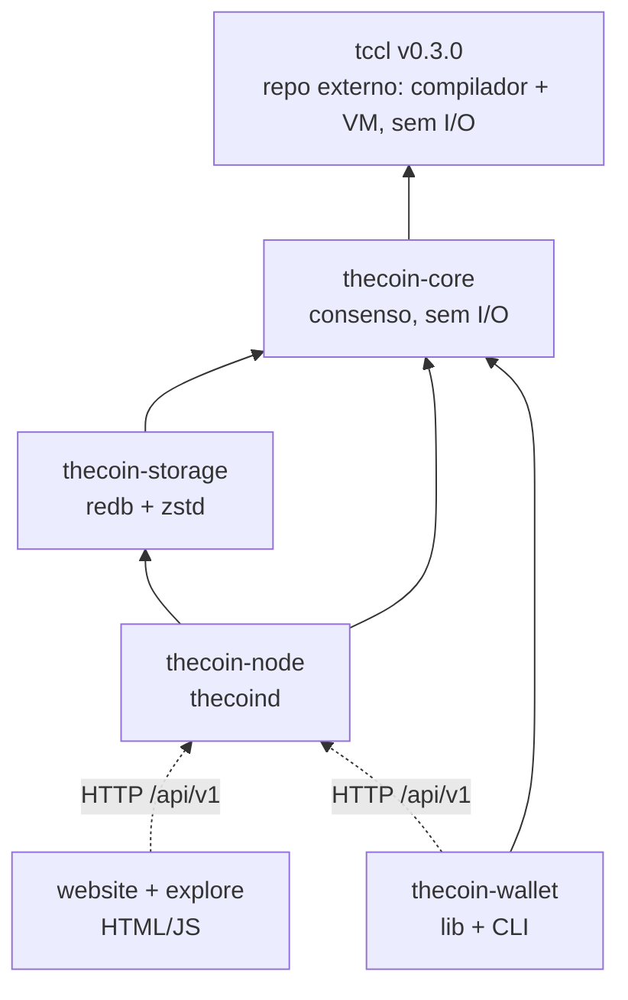
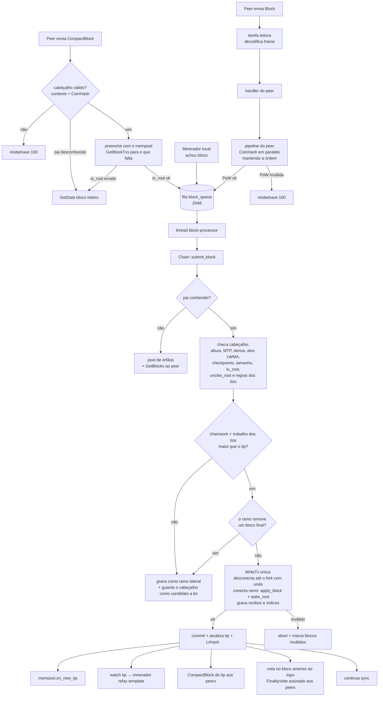
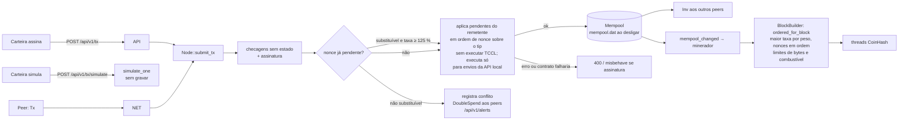

# Arquitetura do código

Visão geral de como o código da The Coin está organizado, como os dados fluem
e como estender o sistema com segurança.

## 1. Workspace

```
thecoin/
├── crates/
│   ├── core/      thecoin-core     consenso puro: tipos, hashes, PoW (RandomX), tios, finalidade, regras de estado, execução TCCL (sem I/O)
│   ├── storage/   thecoin-storage  banco redb: blocos, estado, undo, índices, recibos
│   ├── node/      thecoin-node     binário thecoind: cadeia, mempool, P2P, minerador, finalidade, API
│   └── wallet/    thecoin-wallet   biblioteca + CLI da carteira de referência
├── docs/          especificações e guias (este diretório), tccl/ (linguagem), whitepaper/
├── installer/     install.sh / uninstall.sh / thecoin (comando auxiliar)
├── scripts/       package.sh (releases) · publish-site.sh
├── website/       site estático + configuração nginx
├── explore/       explorador de blocos multi-rede
└── .github/       CI (fmt, clippy, testes) e releases
```

A linguagem **TCCL vive em outro repositório**
([github.com/LucasBolla94/tccl](https://github.com/LucasBolla94/tccl)) e entra aqui
como dependência **fixada por tag** no `Cargo.toml` do workspace:

```toml
tccl = { git = "https://github.com/LucasBolla94/tccl", tag = "v0.3.0" }
```

A tag é consenso: o compilador e a VM decidem se um contrato é válido e quanto
combustível ele gasta, então dois nós só concordam se usarem exatamente a mesma
versão da linguagem. Trocar a tag é hard fork.



**Regra de ouro:** tudo que decide se um bloco é válido fica em `thecoin-core`
e no crate `tccl`, é determinístico e não faz I/O. Isso permite reusar a mesma lógica no
nó, em testes, em carteiras, no simulador `tccl run` e em implementações alternativas.

## 2. Mapa de módulos

### `tccl` (repositório externo, tag `v0.3.0`)

| Módulo | Responsabilidade |
|---|---|
| `parser`, `ast` | código-fonte indentado → árvore sintática (limites de aninhamento, cadeias de operadores e profundidade de expressão) |
| `checker` | verificação de tipos e resolução de nomes → `Program` (`compile`), versão de linguagem 1 ou 2 |
| `program` | formato compilado Borsh (consenso): `Program`, `Function`, `Stmt`, `Expr`, `Value` (decodificação com limite de profundidade), ABI, `LANGUAGE_VERSION = 2` |
| `modules` | biblioteca padrão (módulos embutidos) da versão 2 |
| `vm` | interpretador determinístico com combustível (`fuel`), modos Deploy/Action/View/Upgrade, trait `Host`, chamadas entre contratos por interface (`MAX_CONTRACT_DEPTH = 8`, `MAX_CALL_DEPTH = 16`), recusa de reentrada, limite de memória |
| `upgrade` | `upgrade::check`: compara o programa antigo com o novo e recusa upgrades que quebrem o estado |
| `ops` | aritmética checada e limites de valores/listas |
| `ring` | assinaturas em anel bLSAG (Ristretto255) para `ring_verify` e carteiras |
| `abi` | texto/JSON ↔ `Value` (CLI, API, carteiras) |
| `diagnostics` | mensagens de erro explicadas (pt-BR, en, es) |
| `sim`, `scenario` | `Host` em memória para testes locais (`tccl run`) |
| `v1` | semântica congelada da versão 1 da linguagem (contratos antigos rodam igual) |
| `tccl-cli` | binário `tccl` (`check`, `abi`, `run`, `ring`) — pacote separado no repositório da linguagem |

Versão 2 da linguagem (o que mudou para o consenso): registros, enums com
transições, papéis (`role`), interfaces, módulos, biblioteca padrão e preços de
combustível fixos. Um contrato pode chamar outro por interface **dentro da mesma
transação atômica**: qualquer falha desfaz tudo, reentrada é sempre recusada e a
profundidade máxima de contratos é 8. Contratos da versão 1 continuam rodando
exatamente como na 0.2.0.

### `thecoin-core`

| Módulo | Responsabilidade |
|---|---|
| `hash` | `Hash32`, `tagged_hash` com separação de domínio |
| `crypto` | Ed25519 (assinatura, verificação estrita) |
| `address` | endereços de 20 bytes, bech32m por rede |
| `amount` | motes ↔ TCN decimal sem ponto flutuante |
| `params` | `ChainParams` de mainnet/testnet/regtest, constantes de consenso (bloco de 15 s, `finality_window`, `PowParams`) |
| `emission` | subsídio por altura, halvings, emissão acumulada |
| `pow` | CoinHash (**RandomX** com chave por época), cache/dataset compartilhados, trabalho, conversões U256 |
| `difficulty` | LWMA-1 com aquecimento e limite de ±2× por bloco, median time past |
| `block`, `tx` | formatos Borsh (cabeçalho de 244 bytes, `BlockBody { txs, uncles }`, `flags`), hashes, assinatura, regras e recompensa de tios, peso e taxa por peso |
| `finality` | finalidade assinada pelos mineradores: `FinalityVote`, `vote_message`, peso da janela, 2/3 (`FINALITY_THRESHOLD_BP`), mínimo de 4 assinantes distintos |
| `merkle` | raiz e provas de Merkle (também a raiz dos tios) |
| `state` | chaves/registros do estado (contas, contratos, propostas, recompensas pendentes, programas, `ProgramAdmin`), `Overlay` copy-on-write, `StateReader` |
| `lthash` | compromisso de estado homomórfico (LtHash16) |
| `contracts` | 5 modelos de contrato de pagamento, depósitos de armazenamento, `MultisigClose` |
| `programs` | execução de contratos TCCL: deploy, invoke, views, **upgrade** e autoridade de upgrade, depósitos reembolsáveis (`Host` sobre o `Overlay`, com pilha de contratos) |
| `governance` | propostas, votos, sinalização, apuração, ativação |
| `execution` | função de transição: `required_fee`, `next_congestion`, `apply_tx`, cooldown de recompensas, `apply_block`, `BlockBuilder`, `TxReceipt` |
| `genesis` | bloco e estado gênese |
| `api` | tipos JSON compartilhados pela API, carteira e explorador |
| `error` | `TxError`, `BlockError` |

### `thecoin-storage`

`ChainDb` sobre [redb](https://www.redb.org) (Rust puro, ACID, B-trees
copy-on-write, pouca memória). `ReadTx`/`WriteTx` + trait `DbRead`.
`SCHEMA_VERSION = 2` (bancos da v0.1 precisam ser sincronizados de novo).

| Tabela | Chave | Valor |
|---|---|---|
| `headers` | hash do bloco | `HeaderRecord` (cabeçalho de 244 bytes, chainwork, status, `has_body`, `tx_count`, `size`) |
| `blocks` | hash | `zstd(borsh(BlockBody))` — transações **e tios**; corpos vazios (sem transação e sem tio) não são gravados (implícito por `tx_count == 0 && has_body`) |
| `main` | altura | hash da cadeia principal |
| `state` | chave de estado | registro Borsh |
| `undo` | altura | `zstd(borsh(BlockUndo))` — mudanças de estado + entradas do índice de endereços |
| `txindex` | txid | altura (8 LE) + posição (4 LE) |
| `addrindex` | endereço(20) + altura(8 BE) + posição(4 BE) | vazio (o txid é lido do bloco) |
| `receipts` | txid | `zstd(borsh(TxReceipt))` — resultado, erro, combustível, eventos, retorno, queima |
| `meta` | nome | `tip`, `lthash`, `schema`, `genesis`, `pruned_below` |

Tudo que um bloco altera é gravado em **uma única transação** do banco: estado,
undo, índices, recibos, tip e LtHash. Uma queda de energia nunca deixa um bloco
pela metade. A poda apaga, além do corpo, as entradas de `txindex` e `receipts`
do bloco; nós podados não mantêm `addrindex`. `ChainDb::compact()` (subcomando
`thecoind compact`) reescreve o arquivo para devolver ao sistema o espaço que o
redb pré-alocou.

A **poda vem ligada por padrão** (`[storage] prune = true`,
`prune_keep = 40 320` blocos ≈ uma semana de blocos de 15 s): um nó comum guarda
o estado completo e só os corpos recentes, ficando na casa de poucos GB para
sempre. Exploradores e arquivos instalam com `--archive` (`prune = false`), que é
o único jeito de manter o índice de endereços e servir o histórico inteiro
(veja [ESCALA.md §4](ESCALA.md)).

### `thecoin-node`

| Módulo | Responsabilidade |
|---|---|
| `chain` | validação de cabeçalho (inclusive de cabeçalhos de compact blocks), **validação e escolha de tios**, fork choice por trabalho (o trabalho dos tios conta), reorg atômica que **nunca descarta um bloco final**, poda, órfãos, templates de bloco, locator, recibos, `signer_window` |
| `finality` | `Tally` dos votos dos mineradores: pesos da janela, votos estacionados, banimento de quem assina duas vezes na mesma altura, chave `<data-dir>/finality.key` |
| `mempool` | pool validado contra o estado (nonce, saldo, taxa; código TCCL só é executado para envios pela API do próprio nó), ordenação por taxa por peso, RBF opt-in, registro de conflitos (gasto duplo), níveis de prioridade, limites |
| `protocol` | mensagens e framing P2P (`CompactBlock`, `GetBlockTxs`, `BlockTxs`, `DoubleSpend`, `FinalityVote`) |
| `net` | conexões, handshake, sync, relay por compact blocks, relay e contagem de votos de finalidade, alertas de gasto duplo, pipeline de PoW paralelo, banimento |
| `addrman` | endereços de peers, back-off, persistência |
| `miner` | coordenador de templates + threads de mineração (RandomX em modo leve ou rápido), sinalização de governança |
| `rpc` | API REST (axum), incluindo simulação, programas, views, segurança e alertas |
| `config` | `thecoind.toml` com padrões por rede (`[mining] mode`, `[storage] prune` ligado) |
| `node` | `Node` (estado compartilhado), processador de blocos, voto de finalidade a cada novo tip, broadcast de compact blocks, votos e alertas, persistência do mempool (`mempool.dat`) |
| `main.rs` | CLI `thecoind` (incluindo `--signal`) |

### `thecoin-wallet`

| Módulo | Responsabilidade |
|---|---|
| `keys` | BIP‑39 + SLIP‑0010 (`m/44'/7333'/a'/0'/i'`), chaves de anel (`m/44'/7333'/0'/7'/i'`) |
| `keystore` | arquivo criptografado (Argon2id + ChaCha20-Poly1305) |
| `builder` | construção/assinatura de transações com `FeePolicy` (taxa mínima × prioridade), `flags`, `deploy`/`invoke`/`upgrade`/`set_upgrade_authority`, `with_fee` (bump) |
| `client` | cliente HTTP da API (ureq), incluindo `simulate`, `view`, `program`, `program_code_hash`, `security`, `alerts` |
| `uri` | URIs `thecoin:` |
| `main.rs` | CLI `thecoin-wallet` (envio, prioridade, RBF, contratos nativos e TCCL — inclusive `contract upgrade` e `contract authority` —, privacidade, governança) |

## 3. Fluxo de um bloco



**Tios e finalidade no caminho do bloco** (detalhes em
[PROTOCOL.md](PROTOCOL.md) e no estudo [ESCALA.md](ESCALA.md)):

* um bloco que perde a corrida vira **candidato a tio**; o próximo template pega
  até 2 candidatos com no máximo 6 blocos de idade, cujo pai esteja nesta cadeia
  e que ainda não tenham sido incluídos;
* cada tio recebe `subsídio × (7 − idade) / 24`, **descontado do subsídio** do
  bloco que o inclui — a emissão por bloco e o teto de 50 000 000 TCN não mudam;
* depois de cada novo tip o nó minerador assina um voto para o bloco **anterior**
  ao topo; quando os votos somam 2/3 do peso da janela (`finality_window`) e a
  janela tem ao menos 4 mineradores distintos, o bloco fica **final** e é gravado
  em `meta` — nenhum ramo que o remova é aceito depois disso.

## 4. Fluxo de uma transação



**Mempool (política, não consenso):**

* peso = `size + max_fuel / 100`; ordenação por `fee / peso`;
* até 32 pendentes por remetente, 72 h de validade, `mempool.max_mb` com expulsão
  da transação final (maior nonce) de menor taxa por peso;
* substituição só com `FLAG_REPLACEABLE` e taxa ≥ `taxa + taxa/4`; caso contrário,
  conflito registrado (1 por remetente+nonce, até 512) e alerta `DoubleSpend`;
* a cada novo tip: remove confirmadas, expiradas e inválidas (nonce, saldo), **sem
  executar código de contrato** — executar tudo a cada bloco deixaria qualquer um
  gastar a CPU dos nós de graça; o código roda ao montar o bloco e uma chamada que
  falha ali paga a taxa; transações apenas abaixo da taxa mínima por causa do
  congestionamento **ficam** (com as seguintes do mesmo remetente); transações de
  blocos desconectados voltam;
* níveis de prioridade de `/api/v1/fees` calculados a partir das taxas por peso pendentes;
* ao desligar grava `<data-dir>/mempool.dat` (`"TheCoin mempool v1\n"` +
  `borsh(Vec<Vec<u8>>)` em ordem de bloco); ao iniciar apaga o arquivo e revalida
  cada transação pelo caminho normal de admissão.

## 5. Modelo de threads

Pensado para 1–2 vCPU sem travar:

| Componente | Execução | Por quê |
|---|---|---|
| Rede e API | runtime Tokio com **2 worker threads** | I/O assíncrono, não bloqueia |
| Leitura de banco, simulação de mempool, views | `spawn_blocking` (até 16 threads, pilha de 16 MiB) | redb é síncrono; a VM TCCL é recursiva |
| Verificação de PoW de blocos e cabeçalhos de compact blocks recebidos | `spawn_blocking`, até *núcleos* em paralelo | sync inicial rápido |
| Aplicação de blocos | **1 thread dedicada** `block-processor` (pilha de 16 MiB) | ordem determinística, sem contenção |
| Mineração | `núcleos − 1` threads do SO com **nice 19** | máquina e nó continuam responsivos |
| Contagem de votos de finalidade | `spawn_blocking` (verificação Ed25519) | ~200 verificações por bloco, poucos ms |
| Escrita | `Mutex` interno de `Chain` (um escritor); leitores usam snapshots MVCC do redb | leituras nunca bloqueiam escrita |

**Memória do RandomX.** O CoinHash usa uma chave por época
(`epoch = altura / pow.epoch_blocks`; 2 048 blocos em mainnet/testnet, 64 em
regtest) e a mesma memória é compartilhada por todas as threads:

| Modo | Memória | Quem usa |
|---|---|---|
| Leve (`light`) | **256 MiB** de cache por época (até 2 caches guardados, para não reconstruir na virada de época nem em reorganizações curtas) | todo nó, para **verificar** blocos (≈ 30 ms por bloco) |
| Rápido (`fast`) | **2 GiB** de dataset | apenas mineração, várias vezes mais rápido |

`[mining] mode = auto` (padrão) usa o modo rápido quando a máquina tem ≈ 3 GiB
livres, e cai para o leve se a alocação falhar. Por isso um nó completo hoje
precisa de **~1 GB de RAM no mínimo** (recomendado 2 GB); minerar em modo rápido
pede ~3 GiB livres.

Filas limitadas em toda parte (fila de escrita por peer 4 096 frames / 32 MiB,
fila de blocos 2 048, mensagens por peer 64, 8 compact blocks pendentes por peer):
um peer lento é desconectado em vez de consumir memória. Ao servir blocos, o nó
espera o peer consumir a fila (acima de 4 MiB) em vez de acumular dados.

O custo de CPU dos contratos é limitado pelo consenso: a tabela de combustível
foi calibrada em ≈ 20 ns por unidade numa VPS de 2 vCPU (benchmarks de
combustível no repositório da linguagem e `crates/node/tests/fuel_storage_bench.rs`),
então um bloco cheio (`max_block_fuel` = 50 M) executa em ≈ 1 s no pior caso.

## 6. Estado, undo, recibos e compromisso

* `Overlay` acumula mudanças em memória sobre um `StateReader` (banco ou outro
  overlay). `diff()` gera `StateChange { key, old, new }`. Execuções TCCL rodam
  num overlay filho que é descartado se o contrato falhar.
* O nó aplica o diff ao LtHash (`apply_changes_to_lthash`) e compara com
  `header.state_root`; grava o diff e o guarda como undo.
* Cada transação gera um `TxReceipt` (não é consenso) gravado na tabela
  `receipts`; a API mescla o recibo na visão da transação.
* Reorganização: `revert_state_changes` com o undo, na ordem inversa, e o LtHash
  é revertido pela mesma lista; índices e recibos dos blocos desconectados são apagados.
* Undo é mantido apenas para os últimos `max_reorg_depth + 16` blocos.

## 7. Como estender com segurança

Qualquer mudança nas regras de validação é um **hard fork**. Processo:

1. Discussão pública (issue + proposta `Text` de governança, se relevante).
2. Implementação atrás de uma **altura de ativação** (constante por rede em
   `params.rs`), de modo que blocos antigos continuem validando com as regras antigas.
3. Testes: unitários, `crates/core/tests/execution.rs`, testes de rede e testnet.
4. Release com hash publicado.
5. Proposta de governança `SoftwareUpgrade { version, release_hash }` aprovada
   pelas duas câmaras; a altura de ativação no código deve ser posterior ao
   `activation_height` da proposta.
6. Operadores atualizam durante o `activation_delay`.

As fases do [roteiro de consenso](ROADMAP.md) (híbrido PoW/PoS e PoS) seguem esse mesmo processo.

### 7.1 Nova ação de transação

1. Adicione a variante **no final** de `TxAction` (`core/src/tx.rs`). 🧩
2. Checagens estáticas em `check_tx_context_free` (incluindo limite de tamanho),
   débito/efeito em `apply_tx` e, se reservar combustível, `Transaction::max_fuel`
   (`core/src/execution.rs`); rejeite a variante antes da altura de ativação.
3. `Transaction::max_debit`, `api::ActionView` + `action_view`.
4. Carteira: helper em `wallet/src/builder.rs` e comando na CLI.
5. Documente em `docs/PROTOCOL.md` (§5 e §14) e na API; atualize os vetores em
   `crates/wallet/tests/vectors.rs` se o formato mudar.

### 7.2 Novo modelo de contrato nativo

1. Variante no final de `ContractSpec`, `ContractState` e as chamadas no final de `ContractCall`. 🧩
2. `funding`, `validate_static`, `kind`, `parties`, criação em `contracts::create` (com depósito) e regras em `contracts::call`.
3. Regras de remoção do estado (contrato concluído deve ser apagado e o depósito devolvido).
4. Visões JSON (`ContractSpecView`, `ContractStateView`, `ContractCallView`).
5. Testes cobrindo todos os caminhos e o invariante de supply.

Contratos novos quase sempre podem ser escritos em TCCL sem hard fork; um modelo
nativo só se justifica quando precisa de algo que a VM não oferece.

### 7.3 Novo parâmetro governável

1. Campo em `GovParams` e `GovBounds`, variante **no final** de `GovParamId`
   (e `ALL`, `name`, `get`, `set` — gerados pela macro `gov_params!`). Isto muda o
   formato do registro `ChainGlobal` → exige migração do estado na altura de ativação.
2. Padrões e limites para as três redes (`params.rs`); o teste
   `defaults_within_bounds` deve passar.
3. Use o valor via `state.global()?.params` na regra correspondente.

### 7.4 Mudanças na linguagem TCCL e na VM

A linguagem está **em outro repositório** e entra por uma **tag fixa**
(`tccl = { git = "…/tccl", tag = "v0.3.0" }`). O formato compilado (`program.rs`),
a semântica da VM e a tabela `vm::fuel` são consenso, então:

1. a mudança é feita e testada no repositório da linguagem (novas variantes de
   `Stmt`, `Expr`, `Builtin` e `Type` só **no final**; toda função embutida nova
   precisa de preço de combustível medido por benchmark e de exemplos testados);
2. sobe uma nova versão de linguagem (`LANGUAGE_VERSION`), mantendo as anteriores
   rodando como antes (é o papel do módulo `v1`);
3. **trocar a tag no `Cargo.toml` da The Coin é hard fork** e precisa de altura de
   ativação: dois nós em tags diferentes podem discordar sobre compilar, sobre o
   custo de combustível e sobre o resultado de uma chamada.

Mudanças só no compilador que aceitam programas antes rejeitados também são hard
fork (o código-fonte é compilado por todos os nós).

### 7.5 Mudanças que **não** são de consenso

API REST, mensagens P2P novas (no fim do enum `Message`), políticas de
mempool, recibos, carteira, simulador, site e instalador podem mudar sem hard
fork, mantendo compatibilidade com versões anteriores sempre que possível.

## 8. Estratégia de testes

| Onde | O que cobre |
|---|---|
| testes unitários em cada módulo do core | hashes, endereços, valores, emissão (teto de 50 M, 93,75 % em 4 eras), LWMA com aquecimento, Merkle, LtHash, fórmula de taxa e congestionamento, contratos, parâmetros, **cabeçalho de 244 bytes**, chave de época do RandomX, recompensa de tios, votos e quórum de finalidade |
| `crates/core/tests/execution.rs` | transferências, cooldown de recompensas, replay, taxas e queima, flags, assinatura, expiração, batch, os 5 contratos e depósitos, contratos TCCL (sucesso, falha com taxa, depósitos, destroy, upgrade e autoridade), governança nas duas câmaras, queima de depósito; **invariante de supply e LtHash recalculado a cada bloco** |
| `crates/core/tests/bench.rs` (ignorado) | desempenho de validação de blocos grandes |
| `crates/core/tests/pow_bench.rs` (ignorado) | custo do CoinHash (RandomX) nos modos leve e rápido |
| repositório da linguagem `tccl` | parser (entradas hostis), checker, VM, anel bLSAG, ABI, exemplos, versão 2 (chamadas entre contratos, reentrada, atomicidade, upgrades) e calibração da tabela de combustível |
| `crates/node/tests/fuel_storage_bench.rs` (ignorado) | custo de combustível do armazenamento |
| `crates/storage` | tabelas, prefixos, histórico, undo |
| `crates/wallet` | vetores oficiais SLIP‑0010, mnemônico, keystore, URI, política de taxa |
| `crates/wallet/tests/vectors.rs` | vetores publicados (chaves, anel, transferência, substituível, `Invoke`, ids, gênese) |
| `crates/node/src/protocol.rs` | framing e rejeições |
| `crates/node/tests/network.rs` | nós reais em localhost: sync, relay de transação e compact blocks, mineração, **convergência após reorganização** entre mineradores concorrentes |
| `crates/node/tests/uncles.rs` | o bloco perdedor vira tio, seu minerador é pago e o trabalho dele conta; regras de tio recusadas |
| `crates/node/tests/finality.rs` | quatro nós mineradores chegam à finalidade: com 2/3 dos votos, todos marcam o mesmo bloco como final |
| `crates/node/tests/storage_bench.rs`, `storage_growth.rs` (ignorados) | medidas de disco |
| CI (`.github/workflows/ci.yml`) | `cargo fmt --check`, `clippy -D warnings`, `cargo test --workspace --locked`, sintaxe dos scripts do instalador |

Rodar:

```bash
cargo test --workspace
cargo test -p thecoin-wallet --test vectors -- --nocapture
cargo test -p thecoin-core --release --test bench -- --ignored --nocapture
cargo test -p thecoin-core --release --test pow_bench -- --ignored --nocapture
cargo test -p thecoin-node --release --test fuel_storage_bench -- --ignored --nocapture
```
