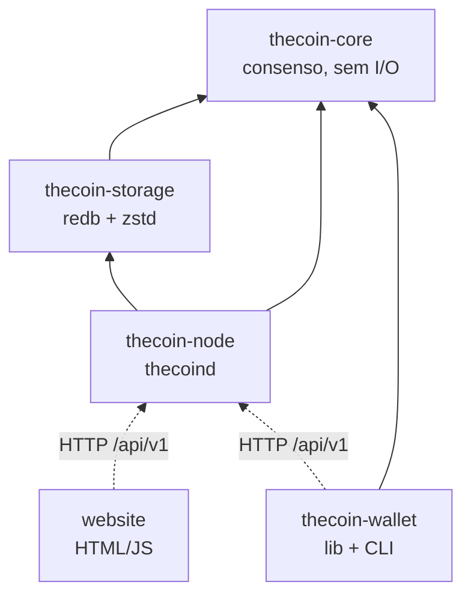
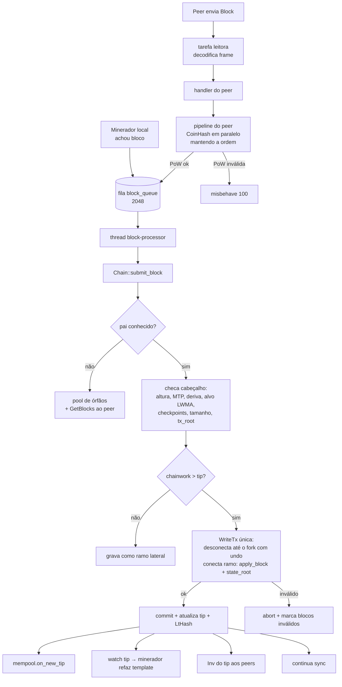
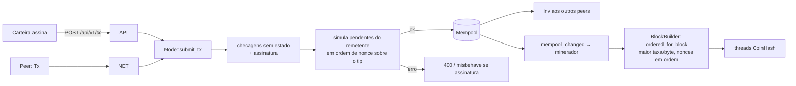

# Arquitetura do código

Visão geral de como o código da The Coin está organizado, como os dados fluem
e como estender o sistema com segurança.

## 1. Workspace

```
thecoin/
├── crates/
│   ├── core/      thecoin-core     consenso puro: tipos, hashes, PoW, regras de estado (sem I/O)
│   ├── storage/   thecoin-storage  banco redb: blocos, estado, undo, índices
│   ├── node/      thecoin-node     binário thecoind: cadeia, mempool, P2P, minerador, API
│   └── wallet/    thecoin-wallet   biblioteca + CLI da carteira de referência
├── docs/          especificações e guias (este diretório)
├── installer/     install.sh / uninstall.sh
├── scripts/       package.sh (empacotamento de releases)
├── website/       site estático + configuração nginx
└── .github/       CI (fmt, clippy, testes) e releases
```



**Regra de ouro:** tudo que decide se um bloco é válido fica em `thecoin-core`,
é determinístico e não faz I/O. Isso permite reusar a mesma lógica no nó, em
testes, em carteiras e em implementações alternativas.

## 2. Mapa de módulos

### `thecoin-core`

| Módulo | Responsabilidade |
|---|---|
| `hash` | `Hash32`, `tagged_hash` com separação de domínio |
| `crypto` | Ed25519 (assinatura, verificação estrita) |
| `address` | endereços de 20 bytes, bech32m por rede |
| `amount` | motes ↔ TCN decimal sem ponto flutuante |
| `params` | `ChainParams` de mainnet/testnet/regtest, constantes de consenso |
| `emission` | subsídio por altura, halvings, emissão acumulada |
| `pow` | CoinHash (Argon2id), trabalho, conversões U256 |
| `difficulty` | LWMA-1 e median time past |
| `block`, `tx` | formatos Borsh, hashes, assinatura |
| `merkle` | raiz e provas de Merkle |
| `state` | chaves/registros do estado, `Overlay` copy-on-write, `StateReader` |
| `lthash` | compromisso de estado homomórfico (LtHash16) |
| `contracts` | 5 modelos de contrato de pagamento |
| `governance` | propostas, votos, sinalização, apuração, ativação |
| `execution` | função de transição: `apply_tx`, `apply_block`, `BlockBuilder` |
| `genesis` | bloco e estado gênese |
| `api` | tipos JSON compartilhados pela API, carteira e explorador |
| `error` | `TxError`, `BlockError` |

### `thecoin-storage`

`ChainDb` sobre [redb](https://www.redb.org) (Rust puro, ACID, B-trees
copy-on-write, pouca memória). `ReadTx`/`WriteTx` + trait `DbRead`.

| Tabela | Chave | Valor |
|---|---|---|
| `headers` | hash do bloco | `HeaderRecord` (cabeçalho, chainwork, status, `has_body`, `tx_count`, `size`) |
| `blocks` | hash | `zstd(borsh(Vec<Transaction>))` — **corpos vazios não são gravados** (implícito por `tx_count == 0 && has_body`) |
| `main` | altura | hash da cadeia principal |
| `state` | chave de estado | registro Borsh |
| `undo` | altura | `zstd(borsh(BlockUndo))` — mudanças de estado + entradas do índice de endereços |
| `txindex` | txid | altura (8 LE) + posição (4 LE) |
| `addrindex` | endereço(20) + altura(8 BE) + posição(4 BE) | txid |
| `meta` | nome | `tip`, `lthash`, `schema`, `genesis` |

Tudo que um bloco altera é gravado em **uma única transação** do banco: estado,
undo, índices, tip e LtHash. Uma queda de energia nunca deixa um bloco pela metade.
`ChainDb::compact()` (subcomando `thecoind compact`) reescreve o arquivo para liberar páginas.

### `thecoin-node`

| Módulo | Responsabilidade |
|---|---|
| `chain` | validação de cabeçalho, fork choice por trabalho, reorg atômica, poda, órfãos, templates de bloco, locator |
| `mempool` | pool validado por simulação, RBF, limites, ordenação por taxa |
| `protocol` | mensagens e framing P2P |
| `net` | conexões, handshake, sync, relay, pipeline de PoW paralelo, banimento |
| `addrman` | endereços de peers, back-off, persistência |
| `miner` | coordenador de templates + threads de mineração |
| `rpc` | API REST (axum) |
| `config` | `thecoind.toml` com padrões por rede |
| `node` | `Node` (estado compartilhado), processador de blocos, inicialização |
| `main.rs` | CLI `thecoind` |

### `thecoin-wallet`

| Módulo | Responsabilidade |
|---|---|
| `keys` | BIP‑39 + SLIP‑0010 (`m/44'/7333'/a'/0'/i'`) |
| `keystore` | arquivo criptografado (Argon2id + ChaCha20-Poly1305) |
| `builder` | construção/assinatura de transações com taxa exata |
| `client` | cliente HTTP da API (ureq) |
| `uri` | URIs `thecoin:` |
| `main.rs` | CLI `thecoin-wallet` |

## 3. Fluxo de um bloco



## 4. Fluxo de uma transação



## 5. Modelo de threads

Pensado para 1–2 vCPU sem travar:

| Componente | Execução | Por quê |
|---|---|---|
| Rede e API | runtime Tokio com **2 worker threads** | I/O assíncrono, não bloqueia |
| Leitura de banco na API/P2P | `spawn_blocking` (até 16 threads) | redb é síncrono |
| Verificação de PoW de blocos recebidos | `spawn_blocking`, até *núcleos* em paralelo | sync inicial rápido |
| Aplicação de blocos | **1 thread dedicada** `block-processor` | ordem determinística, sem contenção |
| Mineração | `núcleos − 1` threads do SO com **nice 19** | máquina e nó continuam responsivos |
| Escrita | `Mutex` interno de `Chain` (um escritor); leitores usam snapshots MVCC do redb | leituras nunca bloqueiam escrita |

Filas limitadas em toda parte (fila de escrita por peer 4 096 frames / 32 MiB,
fila de blocos 2 048, mensagens por peer 64): um peer lento é desconectado em
vez de consumir memória. Ao servir blocos, o nó espera o peer consumir a fila
(acima de 4 MiB) em vez de acumular dados.

## 6. Estado, undo e compromisso

* `Overlay` acumula mudanças em memória sobre um `StateReader` (banco ou outro
  overlay). `diff()` gera `StateChange { key, old, new }`.
* O nó aplica o diff ao LtHash (`apply_changes_to_lthash`) e compara com
  `header.state_root`; grava o diff e o guarda como undo.
* Reorganização: `revert_state_changes` com o undo, na ordem inversa, e o LtHash
  é revertido pela mesma lista.
* Undo é mantido apenas para os últimos `max_reorg_depth + 16` blocos.

## 7. Como estender com segurança

Qualquer mudança nas regras de validação é um **hard fork**. Processo:

1. Discussão pública (issue + proposta `Text` de governança, se relevante).
2. Implementação atrás de uma **altura de ativação** (constante por rede em
   `params.rs`), de modo que blocos antigos continuem validando com as regras antigas.
3. Testes: unitários, `crates/core/tests/execution.rs`, testes de rede e testnet.
4. Release com hash publicado.
5. Proposta de governança `SoftwareUpgrade { version, release_hash }` aprovada
   pelas duas câmaras; a altura de ativação no código deve ser posterior ao
   `activation_height` da proposta.
6. Operadores atualizam durante o `activation_delay`.

### 7.1 Nova ação de transação

1. Adicione a variante **no final** de `TxAction` (`core/src/tx.rs`). 🧩
2. Checagens estáticas em `check_tx_context_free` e débito/efeito em `apply_tx`
   (`core/src/execution.rs`); rejeite a variante antes da altura de ativação.
3. `Transaction::max_debit`, `api::ActionView` + `action_view`.
4. Carteira: helper em `wallet/src/builder.rs` e comando na CLI.
5. Documente em `docs/PROTOCOL.md` (§5 e §14) e na API.

### 7.2 Novo modelo de contrato

1. Variante no final de `ContractSpec`, `ContractState` e as chamadas no final de `ContractCall`. 🧩
2. `funding`, `validate_static`, `kind`, `parties`, criação em `contracts::create` e regras em `contracts::call`.
3. Regras de remoção do estado (contrato concluído deve ser apagado).
4. Visões JSON (`ContractSpecView`, `ContractStateView`, `ContractCallView`).
5. Testes cobrindo todos os caminhos e o invariante de supply.

### 7.3 Novo parâmetro governável

1. Campo em `GovParams` e `GovBounds`, variante **no final** de `GovParamId`
   (e `ALL`, `name`, `get`, `set`). Isto muda o formato do registro
   `ChainGlobal` → exige migração do estado na altura de ativação.
2. Padrões e limites para as três redes (`params.rs`); o teste
   `defaults_within_bounds` deve passar.
3. Use o valor via `state.global()?.params` na regra correspondente.

### 7.4 Mudanças que **não** são de consenso

API REST, mensagens P2P novas (no fim do enum `Message`), políticas de
mempool, carteira, site e instalador podem mudar sem hard fork, mantendo
compatibilidade com versões anteriores sempre que possível.

## 8. Estratégia de testes

| Onde | O que cobre |
|---|---|
| testes unitários em cada módulo do core | hashes, endereços, valores, emissão (teto de 50 M, 93,75 % em 4 eras), LWMA, Merkle, LtHash, contratos, parâmetros |
| `crates/core/tests/execution.rs` | transferências, recompensas imaturas, replay, taxas, assinatura, expiração, batch, os 5 contratos, governança nas duas câmaras, queima de depósito; **invariante de supply e LtHash recalculado a cada bloco** |
| `crates/core/tests/bench.rs` (ignorado) | desempenho de validação de blocos grandes |
| `crates/storage` | tabelas, prefixos, histórico, undo |
| `crates/wallet` | vetores oficiais SLIP‑0010, mnemônico, keystore, URI, taxa |
| `crates/node/src/protocol.rs` | framing e rejeições |
| `crates/node/tests/network.rs` | nós reais em localhost: sync, relay de transação, mineração, **convergência após reorganização** entre mineradores concorrentes |
| `crates/node/tests/storage_bench.rs` | medidas de disco |
| CI (`.github/workflows/ci.yml`) | `cargo fmt --check`, `clippy -D warnings`, `cargo test --workspace --locked`, sintaxe dos scripts do instalador |

Rodar:

```bash
cargo test --workspace
cargo test -p thecoin-core --release --test bench -- --ignored --nocapture
cargo test -p thecoin-core --release -- --ignored bench_pow --nocapture
```
