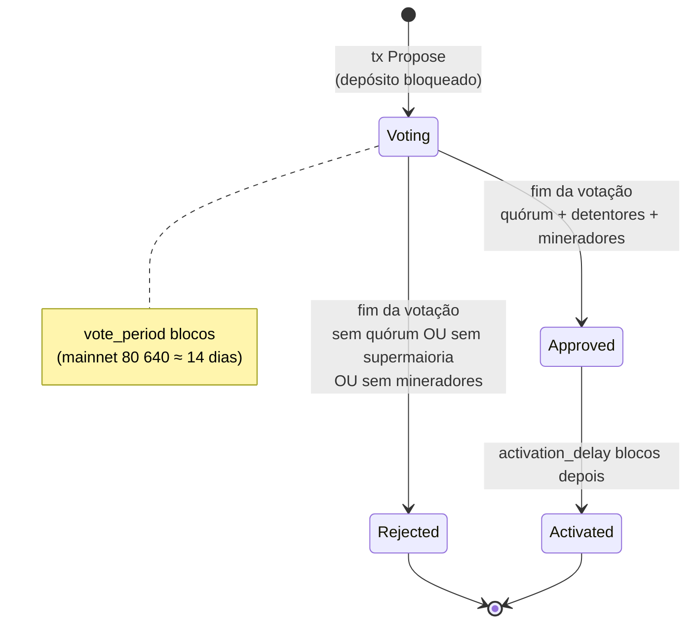

# Governança on-chain da The Coin

A The Coin muda de regras por **votação registrada na própria blockchain**.
Nenhuma empresa, desenvolvedor ou grupo de mineradores consegue alterar a rede
sozinho: toda mudança precisa passar pelas **duas câmaras**.

| Câmara | Quem | Como vota | Precisa de |
|---|---|---|---|
| **Detentores** | quem tem TCN | transação `Vote` bloqueando moedas (1 TCN = 1 voto) | quórum + supermaioria |
| **Mineradores** | quem produz blocos | bit de sinalização no cabeçalho de cada bloco | % mínima dos blocos do período |

Especificação exata: [PROTOCOL.md §18](PROTOCOL.md#18-governança).
Código: `crates/core/src/governance.rs`. As próximas grandes mudanças de consenso
(PoW → híbrido PoW/PoS → PoS) também passam por este processo: veja o
[roteiro de consenso](ROADMAP.md).

## 1. Ciclo de vida



1. **Proposta** — alguém envia `Propose` pagando o **depósito** (mainnet: 100 TCN).
   A proposta recebe um `signal_bit` (0–31) e fica `voting` por `vote_period` blocos.
2. **Votação** — detentores votam `yes`, `no` ou `abstain` com um peso em TCN;
   mineradores ligam o bit da proposta nos blocos que produzem.
3. **Apuração** — no bloco `end_height` o resultado é calculado automaticamente.
4. **Depósito** — devolvido se houve quórum (aprovada ou não); **queimado** se
   não houve quórum (anti-spam).
5. **Ativação** — propostas aprovadas ativam `activation_delay` blocos depois
   (mainnet: 2 880 ≈ 12 horas), dando tempo para os operadores atualizarem.

## 2. Limiares (mainnet)

Todos os prazos abaixo contam **blocos de 15 segundos** (4 blocos por minuto,
5 760 por dia).

| Parâmetro | Valor padrão | Significado |
|---|---|---|
| `proposal_deposit` | 100 TCN | depósito para abrir proposta |
| `vote_period` | 80 640 blocos (≈ 14 dias) | duração da votação |
| `quorum_bp` | 1 000 (10 %) | votos totais (sim+não+abstenção) ≥ 10 % do supply circulante |
| `approval_bp` | 6 667 (66,67 %) | `sim / (sim + não)` ≥ 2/3 |
| `miner_approval_bp` | 6 000 (60 %) | blocos sinalizando ≥ 60 % dos blocos do período |
| `activation_delay` | 2 880 blocos (≈ 12 horas) | espera entre aprovação e ativação |

Abstenções contam para o quórum mas não para a aprovação. No máximo **32
propostas** podem estar em votação ao mesmo tempo.

Testnet usa valores mais curtos (votação de 5 760 blocos ≈ 1 dia, ativação em
720 blocos ≈ 3 horas, depósito 10 TCN, quórum 5 %, mineradores 50 %). Regtest
vota em 20 blocos e ativa em 5, com depósito de 1 TCN.

## 3. O que pode e o que não pode mudar

**Pode (dentro de limites fixos no código):**

| Parâmetro | Padrão (mainnet) | Faixa permitida (mainnet e testnet) |
|---|---|---|
| `max_block_bytes` — tamanho máximo do bloco | 1 000 000 bytes | 250 000 – 8 000 000 bytes |
| `max_block_fuel` — combustível máximo (Σ `max_fuel`) por bloco | 50 000 000 | 5 000 000 – 500 000 000 |
| `base_fee` — parte fixa da taxa de toda transação | 1 000 motes (0,00001 TCN) | 0 – 10 000 000 motes |
| `fee_per_kb` — taxa por 1 000 bytes de transação | 10 000 motes (10 motes/byte) | 1 – 100 000 000 motes |
| `fee_per_kfuel` — taxa por 1 000 de combustível reservado | 1 000 motes | 1 – 100 000 000 motes |
| `storage_deposit_per_kb` — depósito reembolsável por kB de estado de contrato | 100 000 motes (0,001 TCN) | 0 – 1 000 000 000 motes |
| `proposal_deposit` | 100 TCN | 1 – 1 000 000 TCN |
| `vote_period` | 80 640 blocos (≈ 14 dias) | 5 760 – 806 400 blocos (≈ 1 dia – 140 dias) |
| `quorum_bp` | 1 000 (10 %) | 1 % – 50 % |
| `approval_bp` | 6 667 (66,67 %) | 50,01 % – 95 % |
| `miner_approval_bp` | 6 000 (60 %) | 50 % – 95 % |
| `activation_delay` | 2 880 blocos (≈ 12 horas) | 720 – 172 800 blocos (≈ 3 horas – 30 dias) |

Taxas e depósitos são cotados em **motes**: se o TCN valorizar muito, a
comunidade pode reduzir `base_fee`, `fee_per_kb`, `fee_per_kfuel` e
`storage_deposit_per_kb` por votação para manter pagamentos e contratos baratos
(ver [CONTRACTS.md §6.5](CONTRACTS.md#65-por-que-continua-barato-se-o-preço-da-moeda-subir)).
O **multiplicador de congestionamento** (1× a 1000×) não é um parâmetro: ele se
ajusta sozinho a cada bloco, e a parte acima de 1× é queimada.
Valores de testnet e regtest: [PROTOCOL.md §20](PROTOCOL.md#20-parâmetros-por-rede).

Além disso:

* **`Text`** — decisões sem efeito automático (roadmap, prioridades, uso de recursos da comunidade).
* **`SoftwareUpgrade`** — aprova uma versão de software (ex.: `0.3.0`) e o hash
  do pacote. Após a ativação, nós mais antigos passam a informar
  `software_upgrade_required` em `/api/v1/status`. É assim que *hard forks*
  (novas regras de contrato, a fase híbrida PoW/PoS do [roteiro](ROADMAP.md),
  etc.) são coordenados.

**Não pode — nunca, por votação:**

* o **supply máximo de 50 milhões** de TCN e a curva de emissão (halvings);
* o tempo de bloco (15 s), o algoritmo de prova de trabalho (CoinHash = RandomX com
  chave por época) e o ajuste de dificuldade;
* as regras de tios (até 2 por bloco, `(7 − idade)/24` do subsídio) e a finalidade
  assinada pelos mineradores (2/3 da janela de 200 blocos);
* o cooldown das recompensas (25 % após 400 blocos, o resto após 4 000) e a
  profundidade máxima de reorganização (2 880 blocos ≈ 12 horas);
* a tabela de combustível da VM TCCL e os limites absolutos de transação, programa e bloco;
* saldos de qualquer pessoa.

Esses valores estão fixos no código de consenso; mudá-los exigiria que cada
operador de nó instalasse, por vontade própria, um software diferente.

## 4. Como participar

Os exemplos usam a carteira de referência `thecoin-wallet` (mainnet). Adicione
`--network testnet` para testar primeiro.

### 4.1 Ver propostas

```bash
thecoin-wallet gov list
thecoin-wallet gov show <id_da_proposta>
```

Ou pela API/site: `GET /api/v1/governance/proposals`, página *Governança* em https://the-coin.cloud.

### 4.2 Criar uma proposta

1. Escreva o texto completo e publique (ex.: em `https://the-coin.cloud/governance/…`).
2. Registre o hash do texto na proposta para que ele não possa ser editado depois:

```bash
# Mudança de parâmetro: taxa por kB de 10 000 para 5 000 motes (5 motes/byte)
thecoin-wallet gov propose \
  --title "Reduzir fee_per_kb para 5 000 motes" \
  --url https://the-coin.cloud/governance/reduzir-taxa \
  --text-file proposta.md \
  --set-param fee_per_kb=5000

# Proposta de texto
thecoin-wallet gov propose --title "Roadmap: fase 2 híbrida PoW/PoS" --url https://… --text-file roadmap.md

# Atualização de software
thecoin-wallet gov propose --title "Ativar The Coin 0.3.0" --url https://… \
  --upgrade-version 0.3.0 --release-hash <sha256_do_pacote>
```

O id da proposta aparece em `thecoin-wallet tx <txid>` (campo `created`) após a confirmação.

### 4.3 Votar (detentores)

```bash
thecoin-wallet gov vote <id_da_proposta> yes 1500      # sim, com 1 500 TCN
thecoin-wallet gov vote <id_da_proposta> no 200
thecoin-wallet gov vote <id_da_proposta> abstain 50
```

Regras importantes:

* É possível votar logo após propor: o voto pode entrar no mesmo bloco da proposta, desde que venha depois dela (a carteira e o mempool já tratam a ordem pelo nonce).
* **Um voto por endereço por proposta.** Não dá para mudar o voto. Para votar
  com moedas de vários endereços, vote de cada um (`--from N`).
* As moedas do peso ficam **bloqueadas até o fim da votação** (`locked` /
  `locked_until` em `thecoin-wallet balance`). Isso impede votar, transferir
  para outro endereço e votar de novo com as mesmas moedas.
* As mesmas moedas podem votar em propostas **diferentes**; o bloqueio vale
  pelo maior peso até o fim da última votação.
* Votar só custa a taxa da transação; as moedas continuam suas.

### 4.4 Sinalizar (mineradores)

Há três formas equivalentes; todas fazem os blocos minerados por este nó ligarem
o `signal_bit` da proposta.

**Nó instalado pelo instalador (`thecoin`):**

```bash
thecoin signals             # propostas que seus blocos apoiam + propostas abertas
sudo thecoin signal <id>    # passa a apoiar (grava em [mining] signal e reinicia o nó)
sudo thecoin unsignal <id>  # deixa de apoiar
```

**Linha de comando do `thecoind`** (repetível; soma-se ao que está no arquivo de configuração):

```bash
thecoind --miner-address tc1... --signal b591295daf4fd9f4eaa12bf428d25bcd02ec893751bbc8f4ddac8d8500fb39bb
```

**Arquivo de configuração:**

```toml
# /etc/thecoin/thecoind.toml
[mining]
signal = ["b591295daf4fd9f4eaa12bf428d25bcd02ec893751bbc8f4ddac8d8500fb39bb"]
```

```bash
sudo systemctl restart thecoind
curl -s http://127.0.0.1:7334/api/v1/mining    # "signal_proposals" lista os ids
```

Um id inválido (que não seja hex de 64 caracteres) impede o nó de iniciar.

Cada bloco minerado enquanto a proposta está em votação conta a favor. Ids de
propostas que não estão em votação são ignorados automaticamente. Blocos sem o
bit contam como "não apoia" (o total é todos os blocos do período).

## 5. Exemplo numérico

Situação na apuração (mainnet):

| Dado | Valor |
|---|---|
| Supply circulante | 8 000 000 TCN |
| Votos sim / não / abstenção | 700 000 / 250 000 / 50 000 TCN |
| Blocos no período | 80 640, dos quais 52 000 sinalizaram |

1. **Quórum:** 700 000 + 250 000 + 50 000 = 1 000 000 TCN = 12,5 % ≥ 10 % ✅
2. **Detentores:** 700 000 / (700 000 + 250 000) = 73,7 % ≥ 66,67 % ✅
3. **Mineradores:** 52 000 / 80 640 = 64,5 % ≥ 60 % ✅

→ **Aprovada.** Depósito de 100 TCN devolvido. Com `end_height = 2 000 000`, ativa
no bloco 2 000 000 + 2 880 = 2 002 880; o novo valor vale a partir do bloco 2 002 881.

Se apenas 44 000 blocos tivessem sinalizado (54,6 %), a proposta seria
**rejeitada** mesmo com apoio dos detentores (depósito devolvido, pois houve
quórum). Se só 600 000 TCN tivessem votado (7,5 %), seria rejeitada **e** o
depósito queimado.

## 6. Acompanhamento em tempo real

Enquanto a proposta está em votação, `GET /api/v1/governance/proposal/{id}`
traz `projection`:

```json
"projection": {
  "quorum_needed": 80000000000000,
  "quorum_progress_bp": 7500,
  "approval_bp": 7368,
  "approval_needed_bp": 6667,
  "miner_approval_bp": 6448,
  "miner_approval_needed_bp": 6000,
  "blocks_left": 1200
}
```

(`bp` = pontos-base: 10 000 = 100 %.) O site usa esses campos para as barras de progresso.

## 7. Boas práticas

* Discuta a proposta publicamente **antes** de gastar o depósito.
* Para mudanças de consenso, publique o código, o pacote e o hash (`--release-hash`) e use testnet primeiro.
* Operadores de nó: acompanhem `software_upgrade_required` e atualizem durante o `activation_delay`.
