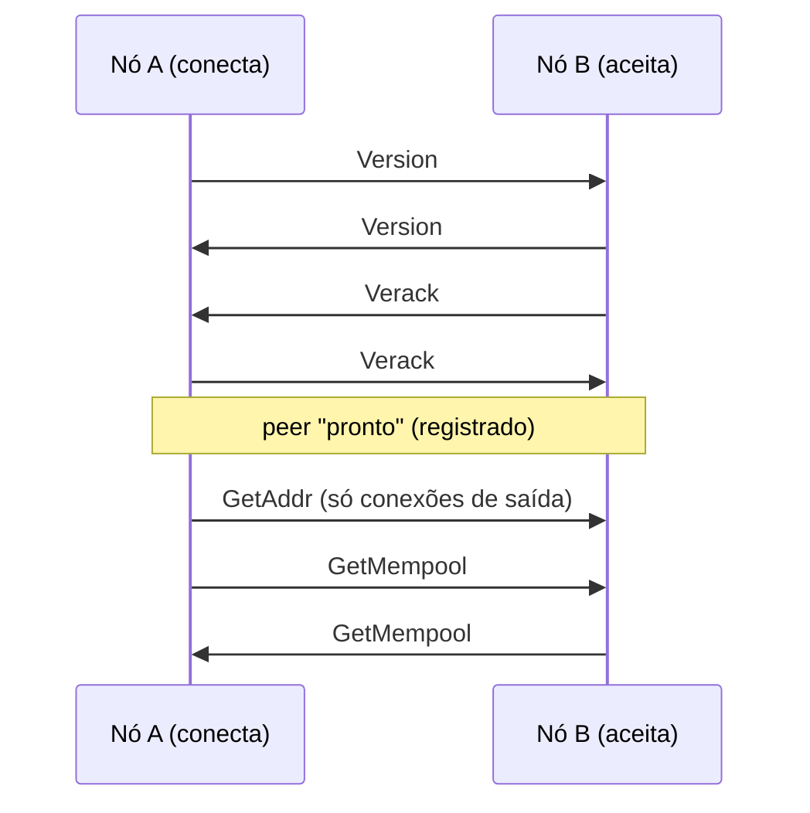
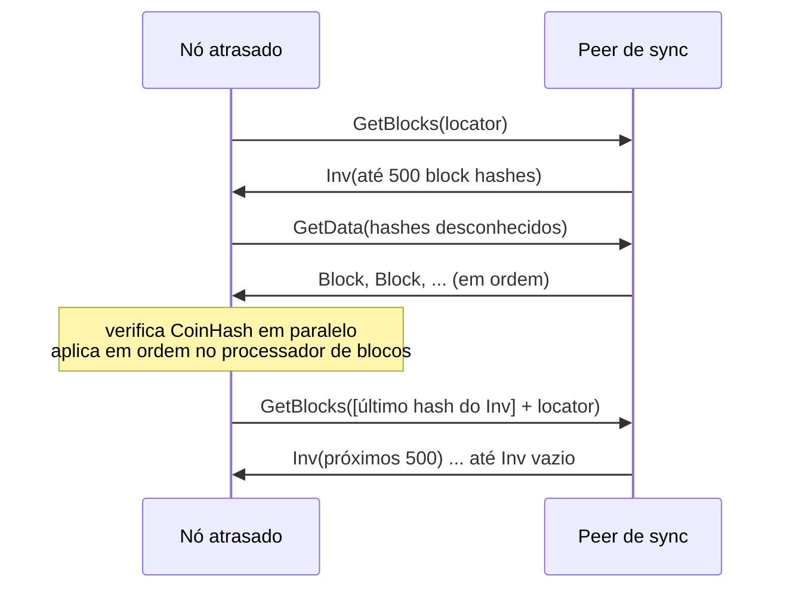

# The Coin — Protocolo Peer-to-Peer (versão 1)

Especificação do protocolo de rede entre nós `thecoind`
(`crates/node/src/protocol.rs`, `net.rs`, `addrman.rs`). Diferente das regras
de consenso ([PROTOCOL.md](PROTOCOL.md)), o protocolo P2P pode evoluir com
compatibilidade (novas mensagens no fim do enum, bits de serviço).

## 1. Transporte e framing

* TCP, `TCP_NODELAY` ligado. Porta padrão: **7333** (mainnet), 17333 (testnet), 27333 (regtest).
* Sem criptografia na v0.1 (dados são públicos e autenticados por PoW/assinaturas). Transporte cifrado (estilo BIP‑324) está no roadmap.

Cada mensagem é um frame:

```
+-----------+----------------+--------------+----------------------+
| magic (4) | length (4, LE) | checksum (4) | payload (length)     |
+-----------+----------------+--------------+----------------------+
checksum = primeiros 4 bytes de tagged_hash("p2p", payload)
payload  = borsh(Message)
```

| Rede | magic |
|---|---|
| mainnet | `TCN1` (`54 43 4e 31`) |
| testnet | `TCNT` |
| regtest | `TCNR` |

Regras de rejeição (desconexão imediata, sem banimento):

* magic diferente da rede;
* `length > MAX_FRAME_BYTES` = 9 MiB (9 × 1024 × 1024);
* checksum inválido;
* payload que não decodifica como `Message`;
* violação de limites estruturais (tabela §3).

## 2. Mensagens

`Message` é um enum Borsh — o byte inicial do payload é o índice. **Append-only.**

| Índice | Mensagem | Conteúdo | Semântica |
|---|---|---|---|
| 0 | `Version` | `VersionMsg` | primeira mensagem de cada lado |
| 1 | `Verack` | — | confirma o `Version` recebido |
| 2 | `Ping` | `u64` nonce | pede `Pong` com o mesmo nonce |
| 3 | `Pong` | `u64` nonce | resposta ao `Ping` |
| 4 | `GetAddr` | — | pede endereços de peers |
| 5 | `Addr` | `Vec<NetAddr>` | endereços conhecidos (≤ 1000) |
| 6 | `Inv` | `Vec<InvItem>` | anuncia blocos/transações (≤ 2000) |
| 7 | `GetData` | `Vec<InvItem>` | pede os objetos (≤ 2000) |
| 8 | `NotFound` | `Vec<InvItem>` | objetos pedidos que não existem |
| 9 | `GetBlocks` | `locator: Vec<Hash32>`, `stop: Hash32` | pede até 500 hashes de blocos da cadeia principal |
| 10 | `Block` | `Block` | bloco completo |
| 11 | `Tx` | `Transaction` | transação |
| 12 | `GetMempool` | — | pede um `Inv` do mempool do peer |

```rust
struct VersionMsg {
    protocol: u32,        // 1
    genesis: Hash32,      // hash do gênese da rede
    height: u64,          // altura do tip de quem envia
    tip: Hash32,
    services: u64,        // bits: 1 = ARCHIVE (tem todos os blocos), 2 = INDEX (índice de endereços)
    user_agent: String,   // ex. "/thecoind:0.1.0/" (≤ 256 bytes)
    listen_port: u16,     // porta em que aceita conexões (0 = nenhuma)
    nonce: u64,           // aleatório; detecta conexão consigo mesmo
    timestamp: u64,
}

enum InvKind { Tx = 0, Block = 1 }
struct InvItem { kind: InvKind, hash: Hash32 }     // hash = txid ou block hash

struct NetAddr { ip: [u8; 16], port: u16 }        // IPv6; IPv4 como ::ffff:a.b.c.d
```

## 3. Limites

| Limite | Valor |
|---|---|
| frame | 9 MiB |
| itens em `Inv` / `GetData` / `NotFound` | 2 000 |
| endereços em `Addr` | 1 000 |
| entradas no locator | 64 |
| hashes por resposta a `GetBlocks` | 500 |
| `user_agent` | 256 bytes |
| fila de escrita por peer | 4 096 frames **e** 32 MiB de dados não enviados (acima disso o peer é desconectado) |
| envio de blocos em massa (`GetData`) | pausa enquanto houver > 4 MiB na fila do peer; após 60 s sem o peer ler, desconecta |
| conexões de entrada | `p2p.max_inbound` (32) |
| conexões de saída | `p2p.max_outbound` (8) |
| entradas por IP (IPs roteáveis) | 4 |
| cache de itens conhecidos por peer | 8 192 hashes |

## 4. Handshake



1. Ao conectar, **ambos** enviam `Version` imediatamente.
2. A primeira mensagem recebida deve ser `Version` (timeout 15 s). O nó
   desconecta se: `nonce` igual ao próprio (conexão consigo mesmo), `genesis`
   diferente (outra rede) ou `protocol < 1`.
3. Responde `Verack` e espera o `Verack` do outro lado (timeout 15 s).
4. Só então o peer é registrado. Conexões de entrada com `listen_port != 0`
   têm `ip:listen_port` adicionado ao gerenciador de endereços; conexões de
   saída marcam o endereço como bem-sucedido e enviam `GetAddr`.
5. Ambos enviam `GetMempool`. Se o peer anuncia altura maior, inicia-se a sincronização.

`Version`/`Verack` repetidos depois do handshake contam como mau comportamento.

## 5. Manutenção da conexão

* `Ping` a cada 60 s com nonce aleatório; `Pong` com nonce correto atualiza o último pong.
* Sem `Pong` válido há mais de 180 s → desconexão.
* Escrita que demore mais de 60 s → desconexão.

## 6. Sincronização de blocos

### 6.1 Locator

Lista de hashes da cadeia principal, do tip para trás: as 10 primeiras alturas
consecutivas (`tip, tip−1, …`), depois o passo dobra a cada entrada
(2, 4, 8, …), e sempre termina com o hash do gênese.

### 6.2 `GetBlocks`

Quem recebe procura o **primeiro** hash do locator que esteja na sua cadeia
principal (se nenhum, usa o gênese) e responde **sempre** com um `Inv` contendo
até 500 hashes de blocos da cadeia principal a partir da altura seguinte,
parando no `stop` (inclusivo) se ele aparecer. `stop = 0x00…00` significa "sem
limite". O `Inv` pode ser vazio.

### 6.3 Algoritmo



1. **Início** (`maybe_start_sync`): se não há sync ativo, escolhe o peer pronto
   com maior altura conhecida acima da local e envia `GetBlocks(locator)`.
   Roda na conexão de peers, a cada 10 s e após desconexões.
2. **`Inv` do peer de sync:**
   * vazio → sincronização concluída;
   * senão, guarda `last_request` = último hash do `Inv` e pede com `GetData`
     os que não conhece. Se já conhecia todos, continua imediatamente.
3. **Continuação:** após cada bloco processado, se o cabeçalho de
   `last_request` já está no banco, envia `GetBlocks([last_request] + locator)`
   (truncado a 64).
4. **Travamento:** sem progresso por 90 s → o peer de sync recebe **50 pontos** de mau comportamento, é desconectado e outro é escolhido.
5. **Pipeline de verificação:** blocos recebidos de um peer têm o CoinHash
   verificado em paralelo (até `núcleos` tarefas) mantendo a ordem de chegada,
   e seguem para uma única thread de processamento. PoW inválida → pontuação 100.
6. **Órfãos:** bloco cujo pai é desconhecido fica no pool de órfãos (até 256)
   e o nó envia `GetBlocks(locator)` ao remetente (no máximo 1 a cada 5 s por peer).

Um nó é considerado *syncing* somente quando há um peer de sync que anuncia
altura maior que `altura_local + 1` **e** entregou um bloco que estendeu a
cadeia nos últimos 30 s. Assim, um peer que apenas *afirma* ter uma cadeia
maior não consegue pausar a mineração. Durante o sync, o minerador pausa e
anúncios de transações (`Inv` de tx) são ignorados.

## 7. Relay

### Blocos
Quando o tip muda, o nó envia `Inv([tip])` a todos os peers prontos que não
conhecem o hash, exceto a origem — se o bloco foi minerado localmente ou se o
timestamp do tip está a menos de 1 hora (evita inundar a rede durante o sync).
Quem recebe pede com `GetData`; lacunas são resolvidas pelo fluxo de órfãos.

### Transações
Transação aceita no mempool (via P2P ou API) é anunciada com `Inv` a todos os
peers prontos que não a conhecem, exceto a origem. Itens anunciados/recebidos
são marcados como conhecidos por peer (cache de 8 192).

### `GetData`
Blocos são servidos do banco (qualquer bloco armazenado com corpo); transações
do mempool. Itens ausentes voltam em `NotFound`. Nós podados não servem blocos
antigos (não anunciam o bit `ARCHIVE`).

## 8. Mau comportamento e banimento

| Evento | Pontos |
|---|---|
| bloco inválido (consenso) | 100 |
| bloco com timestamp além da deriva futura | 0 (pode ser apenas diferença de relógio; o bloco é recusado sem punir o peer) |
| peer de sync sem progresso por 90 s | 50 (e desconexão) |
| bloco com PoW inválida | 100 |
| transação com assinatura inválida | 10 |
| erro ao tratar mensagem (ex.: `Version` duplicado) | 20 |

Ao atingir **100 pontos** o peer é desconectado; se o IP for roteável
(público), fica **banido por 24 h** (conexões de entrada recusadas e sem
tentativas de saída). IPs privados/loopback são apenas desconectados.

## 9. Gerenciador de endereços

(`addrman.rs`) Arquivo `peers.json` no diretório de dados (salvo a cada ~5 min
e ao desligar).

* Até 5 000 endereços; quando cheio remove o pior (mais falhas, mais antigo).
* Endereços privados/loopback/link-local e porta 0 são ignorados, a menos que
  `p2p.allow_private = true` (padrão em regtest). Seeds configuradas entram sempre.
* **Seleção para saída:** embaralha, prioriza endereços já conectados com
  sucesso (`tried`) e com menos falhas, respeitando *back-off* de
  `30 s × 2^min(falhas, 10)` desde a última tentativa.
* Endereço nunca conectado com mais de 10 falhas é removido.
* **Compartilhamento (`Addr`):** até 1 000 endereços com menos de 3 falhas e
  vistos nos últimos 7 dias.
* **Seeds:** resolvidas por DNS (`seed1.the-coin.cloud:7333`,
  `seed2.the-coin.cloud:7333` na mainnet, mais `p2p.seeds`) quando o
  gerenciador está vazio, ou quando não há conexões de saída e passou 1 min
  desde a última consulta.
* Com `p2p.connect` não vazio, o nó conecta **somente** a esses endereços.
* O laço de conexões de saída roda a cada 5 s; tentativas têm timeout de 10 s.

## 10. Timeouts (resumo)

| Item | Valor |
|---|---|
| handshake (cada etapa) | 15 s |
| intervalo de ping | 60 s |
| sem pong | 180 s |
| escrita de frame | 60 s |
| conexão TCP de saída | 10 s |
| sync sem progresso | 90 s |
| "syncing" exige bloco do peer de sync há menos de | 30 s |
| resolução DNS de seed | 10 s |
| banimento | 24 h |
