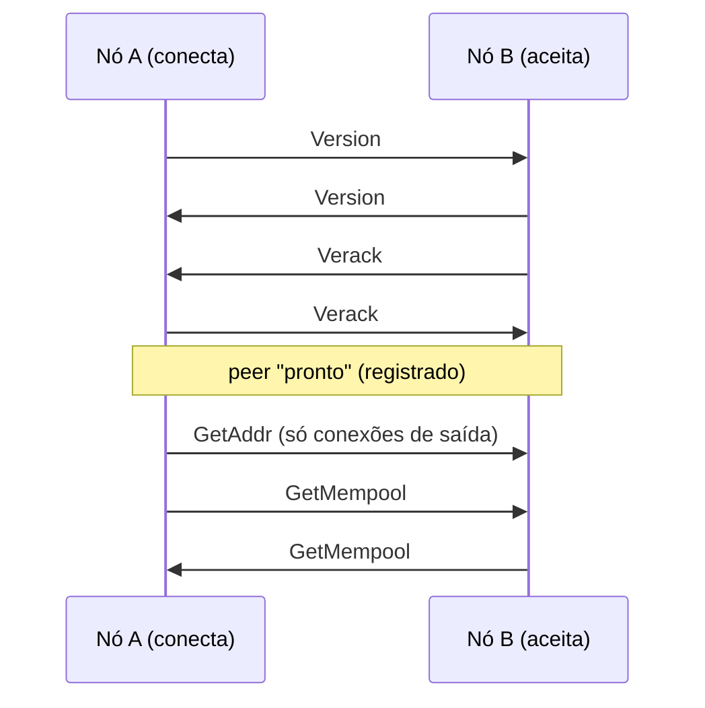
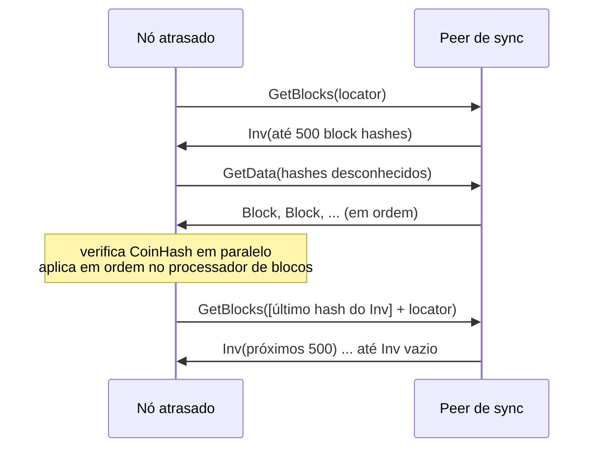

# The Coin — Protocolo Peer-to-Peer (versão 1)

Especificação do protocolo de rede entre nós `thecoind`
(`crates/node/src/protocol.rs`, `net.rs`, `addrman.rs`). Diferente das regras
de consenso ([PROTOCOL.md](PROTOCOL.md)), o protocolo P2P pode evoluir com
compatibilidade (novas mensagens no fim do enum, bits de serviço).

## 1. Transporte e framing

* TCP, `TCP_NODELAY` ligado. Porta padrão: **7333** (mainnet), 17333 (testnet), 27333 (regtest).
* Sem criptografia na v0.2 (dados são públicos e autenticados por PoW/assinaturas). Transporte cifrado (estilo BIP‑324) está no roadmap.
* A versão do protocolo continua `1`, mas nós v0.1 não entendem as mensagens 13–17 (nem as regras de consenso da v0.2): as duas versões não formam a mesma rede.

> **Mudança de numeração na v0.2:** a mensagem `FinalityVote` entrou no índice
> **14**, entre `CompactBlock` e `GetBlockTxs`, e empurrou `GetBlockTxs`,
> `BlockTxs` e `DoubleSpend` para 15, 16 e 17. Como o consenso da v0.2 já é
> incompatível com o da v0.1 (gênese e regras diferentes), as duas versões nunca
> conversam — mas implementações independentes precisam usar os índices desta
> tabela, não os da v0.1.

Cada mensagem é um frame:

```
+-----------+----------------+--------------+----------------------+
| magic (4) | length (4, LE) | checksum (4) | payload (length)     |
+-----------+----------------+--------------+----------------------+
checksum = primeiros 4 bytes de tagged_hash("p2p", payload)
payload  = borsh(Message)
```

| Rede | magic |
|---|---|
| mainnet | `TCN1` (`54 43 4e 31`) |
| testnet | `TCNT` |
| regtest | `TCNR` |

Regras de rejeição (desconexão imediata, sem banimento):

* magic diferente da rede;
* `length > MAX_FRAME_BYTES` = 9 MiB (9 × 1024 × 1024);
* checksum inválido;
* payload que não decodifica como `Message`;
* violação de limites estruturais (tabela §3).

## 2. Mensagens

`Message` é um enum Borsh — o byte inicial do payload é o índice. **Append-only.**

| Índice | Mensagem | Conteúdo | Semântica |
|---|---|---|---|
| 0 | `Version` | `VersionMsg` | primeira mensagem de cada lado |
| 1 | `Verack` | — | confirma o `Version` recebido |
| 2 | `Ping` | `u64` nonce | pede `Pong` com o mesmo nonce |
| 3 | `Pong` | `u64` nonce | resposta ao `Ping` |
| 4 | `GetAddr` | — | pede endereços de peers |
| 5 | `Addr` | `Vec<NetAddr>` | endereços conhecidos (≤ 1000) |
| 6 | `Inv` | `Vec<InvItem>` | anuncia blocos/transações (≤ 2000) |
| 7 | `GetData` | `Vec<InvItem>` | pede os objetos (≤ 2000) |
| 8 | `NotFound` | `Vec<InvItem>` | objetos pedidos que não existem |
| 9 | `GetBlocks` | `locator: Vec<Hash32>`, `stop: Hash32` | pede até 500 hashes de blocos da cadeia principal |
| 10 | `Block` | `Block` | bloco completo |
| 11 | `Tx` | `Transaction` | transação |
| 12 | `GetMempool` | — | pede um `Inv` do mempool do peer |
| 13 | `CompactBlock` | `CompactBlock` | novo bloco anunciado como cabeçalho + ids curtos das transações (§7.1) |
| 14 | `FinalityVote` | `FinalityVote` | assinatura de um minerador recente dizendo que um bloco é a cadeia (§7.5) |
| 15 | `GetBlockTxs` | `block: Hash32`, `indexes: Vec<u32>` | pede as transações de um compact block que faltam no mempool |
| 16 | `BlockTxs` | `block: Hash32`, `txs: Vec<Transaction>` | resposta a `GetBlockTxs`, na ordem dos índices pedidos |
| 17 | `DoubleSpend` | `first: Transaction`, `second: Transaction` | alerta de gasto duplo: duas transações do mesmo remetente e nonce (§7.3) |

```rust
struct VersionMsg {
    protocol: u32,        // 1
    genesis: Hash32,      // hash do gênese da rede
    height: u64,          // altura do tip de quem envia
    tip: Hash32,
    services: u64,        // bits: 1 = ARCHIVE (tem todos os blocos), 2 = INDEX (índice de endereços)
    user_agent: String,   // ex. "/thecoind:0.2.0/" (≤ 256 bytes)
    listen_port: u16,     // porta em que aceita conexões (0 = nenhuma)
    nonce: u64,           // aleatório; detecta conexão consigo mesmo
    timestamp: u64,
}

enum InvKind { Tx = 0, Block = 1 }
struct InvItem { kind: InvKind, hash: Hash32 }     // hash = txid ou block hash

struct NetAddr { ip: [u8; 16], port: u16 }        // IPv6; IPv4 como ::ffff:a.b.c.d

struct CompactBlock {
    header: BlockHeader,              // 244 bytes (PROTOCOL.md §6)
    short_ids: Vec<[u8; 6]>,          // short_id(block_hash, txid) de cada transação, na ordem do bloco
    prefilled: Vec<(u32, Transaction)>, // transações enviadas inteiras: (índice, tx); o nó de referência envia vazio
    uncles: Vec<BlockHeader>,         // tios do bloco (≤ 2 × 244 bytes), sempre inteiros — nunca reconstruídos
}

short_id(block_hash, txid) = tagged_hash("short-id", block_hash(32) || txid(32))[0..6]

struct FinalityVote {                 // 136 bytes
    height: u64,                      // altura do bloco votado
    block: Hash32,                    // hash do bloco votado
    signer: [u8; 32],                 // chave pública anunciada pelo minerador no campo `signer` dos blocos que minerou
    signature: [u8; 64],              // Ed25519 sobre vote_message(...)
}

vote_message(chain_id, height, block) =
    tagged_hash("finality-vote", chain_id(4 LE) || height(8 LE) || block(32))
id(voto) =
    tagged_hash("finality-vote-id", signer(32) || height(8 LE) || block(32))
```

Codificação Borsh de exemplo: `CompactBlock` = `0x0d || header(244) || u32_le(n) || n × 6 bytes || u32_le(k) || k × (u32_le(índice) || Transaction) || u32_le(u) || u × header(244)`;
`FinalityVote` = `0x0e || u64_le(height) || block(32) || signer(32) || signature(64)`;
`GetBlockTxs` = `0x0f || block(32) || u32_le(m) || m × u32_le(índice)`;
`BlockTxs` = `0x10 || block(32) || u32_le(m) || m × Transaction`;
`DoubleSpend` = `0x11 || Transaction || Transaction` (`Box<T>` é codificado como `T`).

A mensagem `Block` (índice 10) carrega o bloco inteiro — `header`, `txs` **e**
`uncles` (`Block { header, txs, uncles }`, [PROTOCOL.md §6](PROTOCOL.md)). No banco
o corpo é gravado como `BlockBody { txs, uncles }`.

## 3. Limites

| Limite | Valor |
|---|---|
| frame | 9 MiB |
| itens em `Inv` / `GetData` / `NotFound` | 2 000 |
| endereços em `Addr` | 1 000 |
| entradas no locator | 64 |
| hashes por resposta a `GetBlocks` | 500 |
| `short_ids` em `CompactBlock` / índices em `GetBlockTxs` | 65 536 (e `prefilled` ≤ `short_ids`) |
| `uncles` em `CompactBlock` | sem limite na decodificação (só o frame de 9 MiB); o consenso recusa mais de 2 e o cabeçalho é validado antes (§7.1) |
| compact blocks aguardando transações, por peer | 8 (o mais antigo é descartado) |
| alertas de gasto duplo guardados | 512, no máximo 1 por (remetente, nonce) |
| votos de finalidade "estacionados" (bloco ainda desconhecido) | 512 (o mais antigo é descartado) |
| distância máxima de um voto até o topo | 64 blocos (`MAX_VOTE_DISTANCE`) |
| `user_agent` | 256 bytes |
| fila de escrita por peer | 4 096 frames **e** 32 MiB de dados não enviados (acima disso o peer é desconectado) |
| envio de blocos em massa (`GetData`) | pausa enquanto houver > 4 MiB na fila do peer; após 60 s sem o peer ler, desconecta |
| conexões de entrada | `p2p.max_inbound` (32) |
| conexões de saída | `p2p.max_outbound` (8) |
| entradas por IP (IPs roteáveis) | 4 |
| cache de itens conhecidos por peer | 8 192 hashes |

## 4. Handshake



1. Ao conectar, **ambos** enviam `Version` imediatamente.
2. A primeira mensagem recebida deve ser `Version` (timeout 15 s). O nó
   desconecta se: `nonce` igual ao próprio (conexão consigo mesmo), `genesis`
   diferente (outra rede) ou `protocol < 1`.
3. Responde `Verack` e espera o `Verack` do outro lado (timeout 15 s).
4. Só então o peer é registrado. Conexões de entrada com `listen_port != 0`
   têm `ip:listen_port` adicionado ao gerenciador de endereços; conexões de
   saída marcam o endereço como bem-sucedido e enviam `GetAddr`.
5. Ambos enviam `GetMempool`. Se o peer anuncia altura maior, inicia-se a sincronização.

`Version`/`Verack` repetidos depois do handshake contam como mau comportamento.

## 5. Manutenção da conexão

* `Ping` a cada 60 s com nonce aleatório; `Pong` com nonce correto atualiza o último pong.
* Sem `Pong` válido há mais de 180 s → desconexão.
* Escrita que demore mais de 60 s → desconexão.

## 6. Sincronização de blocos

### 6.1 Locator

Lista de hashes da cadeia principal, do tip para trás: as 10 primeiras alturas
consecutivas (`tip, tip−1, …`), depois o passo dobra a cada entrada
(2, 4, 8, …), e sempre termina com o hash do gênese.

### 6.2 `GetBlocks`

Quem recebe procura o **primeiro** hash do locator que esteja na sua cadeia
principal (se nenhum, usa o gênese) e responde **sempre** com um `Inv` contendo
até 500 hashes de blocos da cadeia principal a partir da altura seguinte,
parando no `stop` (inclusivo) se ele aparecer. `stop = 0x00…00` significa "sem
limite". O `Inv` pode ser vazio.

### 6.3 Algoritmo



1. **Início** (`maybe_start_sync`): se não há sync ativo, escolhe o peer pronto
   com maior altura conhecida acima da local e envia `GetBlocks(locator)`.
   Roda na conexão de peers, a cada 10 s e após desconexões.
2. **`Inv` do peer de sync:**
   * vazio → sincronização concluída;
   * senão, guarda `last_request` = último hash do `Inv` e pede com `GetData`
     os que não conhece. Se já conhecia todos, continua imediatamente.
3. **Continuação:** após cada bloco processado, se o cabeçalho de
   `last_request` já está no banco, envia `GetBlocks([last_request] + locator)`
   (truncado a 64).
4. **Travamento:** sem progresso por 90 s → o peer de sync recebe **50 pontos** de mau comportamento, é desconectado e outro é escolhido.
5. **Pipeline de verificação:** blocos recebidos de um peer têm o CoinHash
   verificado em paralelo (até `núcleos` tarefas) mantendo a ordem de chegada,
   e seguem para uma única thread de processamento. PoW inválida → pontuação 100.
6. **Órfãos:** bloco cujo pai é desconhecido fica no pool de órfãos (até 256)
   e o nó envia `GetBlocks(locator)` ao remetente (no máximo 1 a cada 5 s por peer).

Um nó é considerado *syncing* somente quando há um peer de sync que anuncia
altura maior que `altura_local + 1` **e** entregou um bloco que estendeu a
cadeia nos últimos 30 s. Assim, um peer que apenas *afirma* ter uma cadeia
maior não consegue pausar a mineração. Durante o sync, o minerador pausa e
anúncios de transações (`Inv` de tx) são ignorados.

## 7. Relay

### 7.1 Blocos (compact blocks)

Quando o tip muda — se o bloco foi minerado localmente ou se o timestamp do tip
está a menos de 1 hora (evita inundar a rede durante o sync) — o nó envia o
novo bloco como `CompactBlock` (cabeçalho + um id curto de 6 bytes por
transação + os cabeçalhos dos **tios**) a todos os peers prontos que não conhecem
o hash, exceto a origem. Os tios vão **inteiros** (no máximo 2 × 244 bytes) porque
não estão no mempool e não há como reconstruí-los.
Se o último bloco conectado não for o próprio tip, envia `Inv([tip])` como antes.

Os ids curtos usam o **hash do bloco como sal** (`tagged_hash("short-id", …)`),
então um atacante não consegue pré-calcular colisões para um bloco que ainda
não existe. Quem recebe:

```mermaid
sequenceDiagram
    participant A as Nó que minerou/recebeu
    participant B as Peer
    A->>B: CompactBlock(header, short_ids, uncles)
    Note over B: 1. cabeçalho já conhecido → ignora<br/>2. valida contexto (altura, MTP, alvo LWMA, checkpoints) e CoinHash<br/>3. preenche slots com transações do mempool
    alt faltam transações
        B->>A: GetBlockTxs(block, índices)
        A->>B: BlockTxs(block, txs)
    end
    Note over B: monta o bloco; tx_root e uncles_root conferem → pipeline normal<br/>algum dos dois não confere → GetData(Block) (bloco inteiro)
```

1. Marca o hash como conhecido pelo peer.
2. **Valida o cabeçalho antes de alocar qualquer coisa:** alvo acima de
   `pow_limit` → inválido; cabeçalho já armazenado → ignora; pai desconhecido →
   pede o bloco inteiro com `GetData` (fluxo de órfãos); bloco mais de
   `max_reorg_depth` blocos (2 880 na mainnet/testnet, 720 na regtest)
   abaixo do tip → ignora; checagens de contexto de cabeçalho
   ([PROTOCOL.md §19.1](PROTOCOL.md#191-checagens-de-cabeçalho--antes-de-aplicar-o-corpo)
   itens 1–5) e **prova de trabalho**. Cabeçalho inválido → 100 pontos de mau
   comportamento, exceto *timestamp* no futuro (possível diferença de relógio: ignorado sem punição).
3. Coloca as transações `prefilled` nos seus índices e procura as demais no
   mempool comparando `short_id(hash, txid)`.
4. Se não falta nada, monta o bloco. Senão guarda o compact block pendente (até 8
   por peer) e envia `GetBlockTxs` com os índices que faltam.
5. `GetBlockTxs`: quem recebe responde `BlockTxs` com as transações nesses índices
   do bloco armazenado; índice fora do intervalo é erro (20 pontos); bloco
   desconhecido → `NotFound([Block])`.
6. `BlockTxs`: preenche os slots vazios na ordem; se sobrar ou faltar
   transação, pede o bloco inteiro (`GetData`).
7. Bloco montado: se o `tx_root` **ou** o `uncles_root` não conferem (colisão de
   id curto, transação errada ou tios errados), pede o bloco inteiro; senão o
   bloco entra no mesmo pipeline dos blocos completos (verificação de PoW e
   processamento em ordem). As regras de consenso dos tios (no máximo 2, idade
   ≤ 6, PoW válida, pai na cadeia) são verificadas na aplicação do bloco, não
   aqui — ver [PROTOCOL.md](PROTOCOL.md).

Blocos completos continuam sendo servidos por `GetData` (sincronização, órfãos e fallback).

### 7.2 Transações

Transação aceita no mempool (via P2P ou API) é anunciada com `Inv` a todos os
peers prontos que não a conhecem, exceto a origem. Itens anunciados/recebidos
são marcados como conhecidos por peer (cache de 8 192).

### 7.3 Alertas de gasto duplo (`DoubleSpend`)

Quando o mempool recusa uma transação porque já existe outra **não
substituível** do mesmo remetente com o mesmo nonce (via API ou `Tx` de um
peer), o nó registra o conflito (`GET /api/v1/alerts`, campo `conflict` em
`/api/v1/tx`) e envia `DoubleSpend { first: pendente, second: nova }` a todos os
peers prontos, exceto a origem. Só o **primeiro** conflito de cada
(remetente, nonce) é registrado e anunciado.

Ao receber `DoubleSpend`, o nó:

1. exige mesmo remetente, mesmo nonce, txids diferentes e as duas transações
   válidas sem estado (formato, flags, limites e **assinaturas**) — senão é erro
   de mensagem (20 pontos);
2. ignora silenciosamente se a conta do remetente não existe, se
   `balance < min(fee_1, fee_2)` ou se o nonce não está em
   `[nonce da conta, nonce da conta + 32)` (chaves novas não custam nada e poderiam inundar a rede);
3. registra o conflito (no máximo um por remetente e nonce, 512 no total) e,
   se for novo, retransmite a todos os outros peers.

Lojistas que aceitam pagamentos sem confirmação recebem o aviso em segundos,
mesmo que a segunda transação nunca chegue ao seu mempool.

### 7.4 `GetData`
Blocos são servidos do banco (qualquer bloco armazenado com corpo); transações
do mempool. Itens ausentes voltam em `NotFound`. Nós podados (padrão desde a
v0.2, [OPERATIONS.md §10](OPERATIONS.md)) não servem blocos antigos e não anunciam
o bit `ARCHIVE`.

### 7.5 Votos de finalidade (`FinalityVote`)

Cada nó tem uma chave de assinatura (`<data-dir>/finality.key`) e publica a chave
pública no campo `signer` dos blocos que minera. Os **eleitores** de um bloco são
os mineradores dos `finality_window` blocos anteriores a ele (200 na mainnet e na
testnet, 20 na regtest), com peso igual ao número de blocos que mineraram nessa
janela. As regras de consenso estão em [PROTOCOL.md](PROTOCOL.md) e o desenho em
[ESCALA.md §3.3](ESCALA.md); aqui está só o que trafega na rede.

**Quando um nó emite um voto.** Sempre que aceita um novo tip, o nó vota no
**bloco anterior ao tip** (`altura = tip − 1`), nunca no próprio tip: com um bloco
de trabalho em cima, todos já concordam sobre ele, então os votos não perseguem
blocos que estão perdendo uma corrida. O nó só vota se:

* o bloco votado está na **sua** cadeia principal;
* a chave pública dele aparece na janela (senão o voto não teria peso);
* ele ainda não votou nessa altura — **um voto por altura**, mesmo depois de uma
  reorganização. O contador da última altura votada vive em memória: um nó
  reiniciado volta a poder votar em alturas antigas, e por isso não se deve
  reiniciar um minerador repetidamente durante uma reorganização
  ([OPERATIONS.md §9.1](OPERATIONS.md)).

O voto é enviado a todos os peers prontos.

**Ao receber um `FinalityVote`:**

1. O bloco votado precisa ser conhecido **e** estar na cadeia principal do
   receptor. Se for desconhecido, o voto é *estacionado* (no máximo 512, o mais
   antigo sai) — só depois de verificar a assinatura — e recontado quando o bloco
   chegar. Se o bloco é conhecido mas a altura do voto não bate com a do bloco, o
   voto é ignorado sem retransmissão.
2. A janela de eleitores é lida da cadeia: as chaves `signer` dos
   `finality_window` blocos que terminam no **pai** do bloco votado (blocos sem
   `signer` não entram).
3. O voto é recusado (e **não** retransmitido) se:
   * a altura está a mais de 64 blocos do topo, ou acima de `topo + 1`
     (`MAX_VOTE_DISTANCE`);
   * a altura já é menor ou igual à última finalizada;
   * o assinante não está na janela (voto sem peso);
   * é repetição de um voto já contado;
   * o assinante já foi banido por **equívoco**.
4. **Equívoco:** assinar dois blocos diferentes na mesma altura bane a chave para
   sempre naquele nó e apaga todos os votos dela.
5. Assinatura inválida → erro de mensagem (**20 pontos**, §8).
6. Voto válido e novo → contado e retransmitido a todos os outros peers.
7. Quando os votos somam **≥ 2/3 do peso da janela**
   (`ceil(blocos_da_janela × 6667 / 10000)`) **e** a janela está cheia com pelo
   menos **4 mineradores diferentes**, o bloco é gravado como final
   (`finalized_height` na API) e nenhum ramo que o remova é aceito depois disso.

Nada disso trava a cadeia: sem votos suficientes ela continua pelo peso de
trabalho, apenas sem o carimbo de finalidade.

## 8. Mau comportamento e banimento

| Evento | Pontos |
|---|---|
| bloco inválido (consenso) | 100 |
| cabeçalho de `CompactBlock` inválido (contexto ou PoW) | 100 |
| bloco com timestamp além da deriva futura | 0 (pode ser apenas diferença de relógio; o bloco é recusado sem punir o peer) |
| peer de sync sem progresso por 90 s | 50 (e desconexão) |
| bloco com PoW inválida | 100 |
| transação com assinatura inválida | 10 |
| erro ao tratar mensagem (ex.: `Version` duplicado, `DoubleSpend` inválido, `FinalityVote` com assinatura inválida, índice fora do intervalo em `GetBlockTxs`) | 20 |

Ao atingir **100 pontos** o peer é desconectado; se o IP for roteável
(público), fica **banido por 24 h** (conexões de entrada recusadas e sem
tentativas de saída). IPs privados/loopback são apenas desconectados.

## 9. Gerenciador de endereços

(`addrman.rs`) Arquivo `peers.json` no diretório de dados (salvo a cada ~5 min
e ao desligar).

* Até 5 000 endereços; quando cheio remove o pior (mais falhas, mais antigo).
* Endereços privados/loopback/link-local e porta 0 são ignorados, a menos que
  `p2p.allow_private = true` (padrão em regtest). Seeds configuradas entram sempre.
* **Seleção para saída:** embaralha, prioriza endereços já conectados com
  sucesso (`tried`) e com menos falhas, respeitando *back-off* de
  `30 s × 2^min(falhas, 10)` desde a última tentativa.
* Endereço nunca conectado com mais de 10 falhas é removido.
* **Compartilhamento (`Addr`):** até 1 000 endereços com menos de 3 falhas e
  vistos nos últimos 7 dias.
* **Seeds:** resolvidas por DNS (`seed1.the-coin.cloud:7333`,
  `seed2.the-coin.cloud:7333` na mainnet, mais `p2p.seeds`) quando o
  gerenciador está vazio, ou quando não há conexões de saída e passou 1 min
  desde a última consulta.
* Com `p2p.connect` não vazio, o nó conecta **somente** a esses endereços.
* O laço de conexões de saída roda a cada 5 s; tentativas têm timeout de 10 s.

## 10. Timeouts (resumo)

| Item | Valor |
|---|---|
| handshake (cada etapa) | 15 s |
| intervalo de ping | 60 s |
| sem pong | 180 s |
| escrita de frame | 60 s |
| conexão TCP de saída | 10 s |
| sync sem progresso | 90 s |
| "syncing" exige bloco do peer de sync há menos de | 30 s |
| resolução DNS de seed | 10 s |
| banimento | 24 h |
